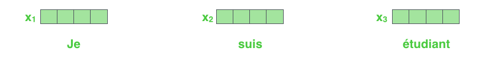
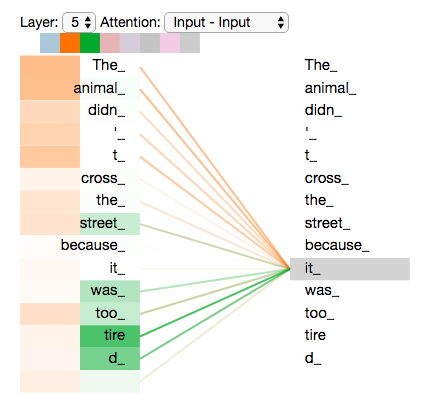
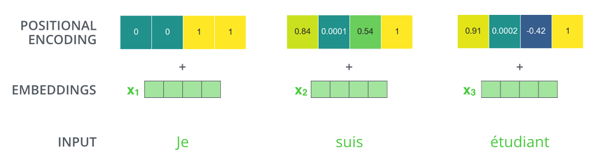

# Attention & Transformer

## Seq2seq


简单来说，seq2seq由两个RNN组成，一个是encoder，一个是decoder。拿MT举例子，比如我们要把源语言“我爱中国”翻译成目标语言“I love China”，那么定义输入序列：

$$X=(x_0,x_1,x_2,x_3)$$，其中$$x_0=“我”$$，$$x_1=“爱”$$，$$x_2=“中”$$，$$x_2=“国”$$。

另外定义目标序列：$$T=(t_0,t_1,t_2)="I\ love\ China"$$。

通过encoder，把$$X=(x_0,x_1,x_2,x_3)$$映射为一个隐层状态$$h$$，再经由decoder将$$h$$映射为$$Y=(y_0,y_1,y_2)$$（注意这里向量长度可以发生变化，即与输入长度不同）；最后将$$Y$$与$$T$$做loss（通常为交叉熵），训练网络。

## Attention

同样是在MT问题中，在seq2seq的基础上提出了attention机制（Bahadanau attention）。现在由于性能相对没有attention的原始模型太优越，现在提到的seq2seq一般都指加入了attention机制的模型。同样上面的问题，通过encoder，把$$X=(x_0,x_1,x_2,x_3)$$映射为一个隐层状态$$H=(h_0,h_1,h_2,h_3)$$，再经由decoder把$$H=(h_0,h_1,h_2,h_3)$$映射为$$Y=(y_0,y_1,y_2)$$。这里精妙的地方就在于，**Y中的每一个元素都与H中的所有元素相连（严格来说，应该是解码器S中每个元素都和H中所有元素相连，这就是attention的特点）**，而**每个元素通过不同的权值给与Y不同的贡献**。


上图是Bahadanau attention的示意图。**J理解为上图自己画的红线位置，也有图中下部分的encoder的hidden state输入。此外y就表示输出词语，比如“I”，而s则表示decoder的隐状态。**

1. 关键在于红框里面的部分，即attention，后面再讲。
2. 红框下面是encoder，输入$$X=(x_0,x_1,x_2,...,x_{T_x})$$，通过一个双向LSTM得到两组$$h^\leftarrow$$和 $$h^\rightarrow$$（向左和向右），然后concat起来得到最终的 $$H=(h_0,h_1,h_2,..., h_{T_x})$$。
3. 红框上面是decoder。以$$t$$时刻为例，输入共有三个：$$s_{t-1}$$，$$y_{t-1}$$，$$c_t$$。其中$$s_{t-1}$$是上一个时刻的hidden state（一般用$$h$$表示encoder的hidden state，用$$s$$表示decoder的hidden state）； $$y_{t-1}$$是上一个时刻的输出，用来当做这个时刻的输入；$$c_t$$在图中没有，就是红框里得到的加权和，叫做context，即**由所有的encoder output（即$$h$$，不定长）得到一个定长的向量，代表输入序列的全局信息**，作为当前decoder step的context（上下文）。计算方法为：$$c_i=\sum_{j=1}^{T_x}\alpha_{ij}h_j$$，其中$$\alpha_{ij}$$是权重，又称为**alignment**；$$h$$就是encoder所有step的hidden state，又叫做**value**或者**memory**；$$i$$代表decoder step，$$j$$代表encoder step。

那么，这个权重$$\alpha_{ij}$$如何计算呢？直接上公式：$$\alpha_{ij}=\frac{\exp(e_{ij})}{\sum_{k=1}^{T_x}\exp(e_{ik})}$$，其中$$e_{ij}=a(s_{i-1},h_j)$$ 。看上去有点复杂，先说第一个公式，其实就是一个softmax，因为我们要算一组权重，这组权重的和为1。那这个$$e_{ij}$$又是什么呢？是通过某种度量$$a(\bullet)$$计算出来的$$s_{i-1}$$和$$h_j$$的**相关程度**。即对于某个既定的decoder step，计算上个时刻的hidden state和所有encoder step的输出的相关程度，并且用softmax归一化；这样，相关度大的$$h$$权重就大，在整个context里占得比重就多，decoder在当前step做解码的时候就越重视它（这就是attention的思想）。

那最后一个问题，这个度量$$a(\bullet)$$怎么算呢？很神奇的是这部分论文里没说……可能是我看的论文少，大家其实都已经心知肚明了吧……根据tf里的代码，一般来说分为这么几步：

1. 对$$s_{i-1}$$做一个线性映射，得到的向量叫做**query**，记做$$q_i$$；
2. 对$$h_j$$做一个线性映射，得到的向量叫做**key**，记做$$k_j$$；
3. $$e_{ij}=v^T \cdot (q_i+k_j)$$。$$k_j$$和$$q_i$$的维度必须相同，记为$$d$$；$$v$$是一个$$d \times 1$$的向量。

注意线性映射的定义（也可以见下面2.2.1.1中是如何做线性映射的）：


上面三步中，**前两步的线性映射**和**第三步的$$v$$** 都是**可以训练**的。所以用下面这张图大概表示一下**query与key的计算相关性继而得到权重, 并且用这个权重对value计算加权和**的过程:


多说几点：

1. 上面第三步中，query和key是做的加法，然后通过一个权重矩阵变为一个标量，被称为“加性attention”；相对的，可以直接通过向量乘法得到一个标量，叫做“乘性attention”；
2. 后来出现了一种升级版，叫做local sensitive attention，思想是相邻$$\alpha_{ij}$$之间的关系会相对较大，因此为了捕捉这种关系对alignment进行卷积。
3. query由很多种，这里是上个decode step的hidden state，也有论文里用的是当前的hidden state（$$s_i$$），还有把$$s_{i-1}$$和当前时刻的输入$$y_{i-1}$$concat起来一起用的。我做的tts，如果加入$$y_{i-1}$$的话就很难work，原因可能是二者不在同一个空间里，强行concat会干扰训练，所以还是具体情况具体分析啦。

总结一下，attention就是算一个encoder output的加权和，叫做context；计算方法为，query和key计算相关程度，然后归一化得到alignment，即权重；然后用alignment和memory算加权和，得到的向量就是context。

## Transformer

讲了那么多，终于说完了attention，可以进入到transformer部分了。Transformer就是一个升级版的seq2seq，也是由一个encoder和一个decoder组成的；encoder对输入序列进行编码，即$$X=(x_0,x_1,x_2,...,x_{T_x})$$变成$$H=(h_0,h_1,h_2,...,h_{T_x})$$；decoder对$$H=(h_0,h_1,h_2,...,h_{T_x})$$进行解码，得到$$Y=(y_0,y_1,y_2,...,y_{T_y})$$。但是神奇的是，encoder和decoder都不用RNN，而且换成了多个attention。

### **1. Transformer 与 Sequence to Sequence**

- Transformer是端到端的Seq2Seq结构，其包含两个组成部分：Encoder 和 Decoder，

Encoder负责理解源文，Decoder负责产出译文。如图


其Transformer Encoder 和 Transformer Decoder结构分别如下图：


- Transformer是可以堆叠的（上图中的N× 就是堆叠N个的意思），其思路是越高层的Transformer能够学习到越高级更抽象的信息（类似CNN的堆叠）**J注意此处的堆叠的N就是**`num_hidden_layers: Number of hidden layers in the Transformer encoder.`


在论文中堆叠了6个。其中第六层的 Transformer Encoder Output 作为部分输入传递给每一层的 Transformer Decoder里（具体后面在Transformer Decoder部分会进步展开）

无论是Transformer Encoder, 还是Transformer Decoder,它们都由两个小模块组成，分别是：

- **Multi-Head Attention Layer**（Decoder会对它微调以符合逐字翻译出译文的特点）
- **Feed-Forward Layer**

（小模块的作用会在下面的Transformer Encoder部分展开）

------

### **2. Transformer Encoder**

笔者通过Transformer Encoder来介绍各个小模块的结构及功能，首先来看下Encoder的结构：


在这之前首先要介绍是论文中连接个各个小模块的一个关键技巧：Add & Norm 操作

#### **2.1 Add & Layer Normalization 操作**

Add操作借鉴了ResNet模型的结构，其主要作用是使得transformer的多层叠加而效果不退化

Layer Normalization操作对向量进行标准化，可以简化学习难度

论文中Add & Layer Normalization 操作的结构为：

$$Output=LayerNorm\left( x+Sublayer\left( x\right) \right) \tag{2.1}$$

在tensorflow/models的代码实现中与论文略有不同：

$$Output=x+Sublayer\left( LayerNorm\left( x \right) \right) \tag{2.2}$$

（其中 $$Sublayer$$) 就是前面说的小模块）

> 笔者感觉后者（式2.2）的确更合理，这样可以使得之后在Multi-Head Attention Layer中Scaled Dot-Product Attention的scale操作的假设与实际情况更接近（后面会在Scaled Dot-Product Attention还会提到）

#### **2.2 Multi-Head Attention Layer**

首先看下Multi-Head Attention Layer的结构图：

图2.2

从图中可以看到Multi-head体现为是由**h**个Scaled Dot-Product Attention组成。

为了把结构说的尽可能明白，这里先不做Multi-head，把Scaled Dot-Product Attention拿出来单独讲

##### **2.2.1 Scaled Dot-Product Attention**

Encoder里的Scaled Dot-Product Attention可以理解为对token向量进行信息提炼的过程，其结构图如下：


这里为了更清晰的阐述，先解释Scaled Dot-Product Attention如何对一个token向量进行提炼，再拓展到其同时并行地对每个token向量提炼信息

###### **2.2.1.1 Scaled Dot-Product Attention 对某一token向量进行提炼（<u>其实就是上面attention中提到的概念，只不过这里换了种说法来解释</u>）**

> 笔者的感性理解：Scaled Dot-Product Attention 可以抽象为一个简答的单轮问答过程。比如你想要了解一个人，于是你准备了一个想要了解他的问题，然后你不仅对他问这个问题，你还对其他可能了解他的人问同样的问题，你根据得到的所有回答汇总出一个答案，这个答案使得你更了解了他
> Scaled Dot-Product Attention与上面的生活例子唯一的不同就是：每个token的回答都是事先就自己准备好了，你得自己去看各个token的回答是否匹配你问的那个问题，不匹配就扔掉，匹配就收集起来，最后将所有收集的回答汇总得到的答案就是这个token提炼好的新向量

这里笔者以提炼第一个位置的token向量举例，展示Scaled Dot-Product Attention的具体步骤：

**1.** 对第一位置的token向量提炼出一个关于它的问题(query)（**<u>J注意：这里与上面定义的attention的计算不一致，因为这里只用输入值，而不是解码器decoder的隐状态s，因为这里的编码器和解码器就是attention，不需要隐状态了。</u>**）

$$q_{1}=W_{q}x_{1} \tag{2.3}$$

**2.** 每个位置的token向量（包括第一位置的token自己）都会事先准备好自己的回答（key, value) （**<u>J注意：这里与上面定义的attention的计算不一致，因为这里只用输入值，而不是编码器encoder的隐状态h，因为这里的编码器和解码器就是attention，不需要隐状态了</u>**）（这里准备好的回答是属于一次生成，到处使用，即之后轮到提炼第二个位置的token向量时，参考的回答还是这套回答集$$ \left( K~, ~ V \right)$$

$$\begin{aligned}k_{i}=&W_{k}x_{i}~~~~~,~i=1,2,\ldots ,n   \\ K=&\begin{bmatrix} k_{1} & k_{2} & \ldots & k_{n} \end{bmatrix}\end{aligned} \tag{2.4}$$

$$\begin{aligned}v_{i}=&W_{v}x_{i}~~~~~,~i=1,2,\ldots ,n   \\ V=&\begin{bmatrix} v_{1} & v_{2} & \ldots & v_{n} \end{bmatrix}\end{aligned} \tag{2.5}$$

> 这里笔者感性的将value理解为回答的完整内容，而key理解为回答的摘要

这里可以发现每个token向量在准备各自回答的时候，是不知道query内容的，即(key, value)的生成与query是解耦的，这也是后面可以并行对每个token向量同时提炼的基础（2.2.1.2）

**3.** 根据每个位置token向量的回答摘要(key)与问题(query)通过点积来判断，其回答与问题有多少相关

$$score(q_1, k_i)=\langle q_1, k_i\rangle~ / \sqrt{d}~~~~~,~i=1,2,\ldots ,n \tag{2.6}$$

$$a_{1i}=\dfrac {\exp^{score\left( q_{1},k_{i}\right) }}{\sum ^{n}_{j=1}\exp^{score\left( q_{1},k_{j}\right) }} \tag{2.7}$$

式2.6中：$$\langle~ ,~\rangle$$为点积操作，$$d$$为query向量的维度，$$a_{1i}$$为相关性系数

这里除以$$\sqrt{d}$$的原因由于softmax（2.7）是一个会饱和的激活函数，为避免输入进入饱和区域，所以对$$\langle q_1, k_i\rangle$$的结果进行标准化（论文中假设$$q, k$$为相互独立的$$\mu=0, {\sigma}^2=1$$) 的向量，这个可以由Layer Normalization 去接近。则$$\langle q_{i},k_{i} \rangle=\sum ^{d}_{j=1}q_{ij}\cdot k_{ij}$$为$$\mu=0, {\sigma}^2=d$$的向量）


```python
# Required Python Packages
import numpy as np
import matplotlib.pyplot as plt
def softmax(inputs):
 “””
 Calculate the softmax for the give inputs (array)
 :param inputs:
 :return:
 “””
 return np.exp(inputs) / float(sum(np.exp(inputs)))
def line_graph(x, y, x_title, y_title):
 “””
 Draw line graph with x and y values
 :param x:
 :param y:
 :param x_title:
 :param y_title:
 :return:
 “””
 plt.plot(x, y)
 plt.xlabel(x_title)
 plt.ylabel(y_title)
 plt.show()
graph_x = range(0, 21)
graph_y = softmax(graph_x)
print (“Graph X readings: {}”.format(graph_x))
print (“Graph Y readings: {}”.format(graph_y))
line_graph(graph_x, graph_y, “Inputs”, “Softmax Scores”)
```


**4.** 将每个token向量的回答根据上一步得到的相关性系数$$a_{1i}$$进行汇总得到最终答案，即经过信息提炼后第一位置的token的新向量
$$x_{1}^{'}=\sum ^{n}_{i=1}a_{1i}\times v_{i} \tag{2.8}$$

**关于在图2.3中Scaled Dot-Product Attention的Mask操作：**

因为训练时基本是使用mini batch的方式，这就需要对token数量较少的sequence用<PAD>在尾部填充使得batch里的每个句子长度相同
在Encoder环节去除<PAD>对句子中其他token的影响是在Scaled Dot-Product 结束后紧跟一个mask操作（即对<PAD>的score减去一个极大值---e.g. 1E+9，使得softmax输出的<PAD>token的相关性系数接近 0，如图像中的softmax的饱和区（左侧））

对于没有<PAD>填充的句子则Mask操作就可以忽略，所以Mask操作是optional的

> 笔者个人感性理解Encoder里的mask操作：即保证<PAD>token在提炼过程中：
> <PAD>不会对其他token向量的信息提炼产生影响
> 对<PAD>向量再怎么信息提炼还是<PAD>向量

###### **2.2.1.2 Scaled Dot-Product Attention 并行对每个token向量同时提炼**

**若每个位置上token依次使用Scaled Dot-Product Attention进行信息提炼，即是串行**。**（J注意：这就是并行提炼的意义，对所有位置一起计算。）**

上面已经分析出每个token的所准备的回答(key, value)是事先就准备好的，query和$$\lbrace (k_1,~v_1),\ldots ,(k_n,~v_n) \rbrace$$是解耦的。

**因此可以同时对每个token向量都生成一个与该token向量相对应的问题($$q_i$$)，将这些问题都汇聚起来组成矩阵一起问** (式2.8），公式如下：
$$Q=\begin{bmatrix} q_{1} & q_{2} & \ldots & q_{n} \end{bmatrix}, \tag{2.9}$$

$$Attention \left( Q, K, V \right)=softmax\left( \dfrac {QK^T}{\sqrt {d}}\right) V \tag{2.10}$$

$$Attention \left( Q, K, V \right)$$的结果即是各token向量经过提炼后的新向量集$$\begin{bmatrix} x_1^{'}, \dots , x_n^{'} \end{bmatrix}$$

上**面操作和2.2.1.1中展示的单例情况完全一样，只是这里式多个一起算所以用的是矩阵操作**

##### **2.2.2 Multi-Head Attention**

**J注意下图中的h就是**`num_attention_heads: Number of attention heads for each attention layer in the Transformer encoder.`

上面Scaled Dot-Product Attention例子已经实现了将**每个token所对应的1个query并行计算，从而达到同时对每个token向量进行信息提炼**。（**J理解就是输入的token向量因为有很多组成：句子、词义等，所以就将分成多个子空间进行计算不同query（但实际其实各个子空间都是一样的维度，看下文的transformer译文就可以知道了！），注意这就是multi-head的意义，见下面章节的“多头巨兽”，特别是其中的图片解释，类似其他一些系统，比如FFM中的领域隐变量方法。**）

Multi-Head更近了一步：**可以实现将每个token所对应的h个queries并行计算，从而达到同时对每个token向量进行多方面的信息提炼**。


Multi-Head思路：从token向量的不同子空间来提取多个问题（Scaled Dot-Product Attention），而每个位置的token向量也是在其子空间内事先准备好回答(key, value)，这样h个$$Q$$，就对应了h组$$\left( K, V \right)$$

最后将各个子空间得到的最终答案进行拼接（concat），再经过一个线性变换映射到该token向量原来的空间里。该操作对应的公式如下：
$$\begin{aligned}Multihead\left( Q,K,V\right) =&~Concat\left(head_{1},\ldots ,head_{h}\right) W^{o}\\ where head_{i}=&~Attention\left( QWi^{Q},KWi^{V},VW^{V}_{i}\right) \end{aligned} \tag{2.11}$$

> 关于Multi-Head我的臆想是：对一个token的不同子空间的提问，就比如我对它提了多个问题（比如有些问题是关于指代关系的， 有些是关于句法的，有些是关于语义的等等），而这些问题只是要提取token的部分信息所以使用子空间。同时既然是对其包含的一部分信息进行提问的话，那用token的部分信息来回答也是显得顺理成章

##### **2.3 Feed-Forward Layer**

**J注意下图中的更大的空间的长度就是**`intermediate_size: The size of the "intermediate" (i.e., feed-forward) layer in the Transformer encode`

这里就是将Multi-Head Attention得到的提炼好的向量再投影到一个更大的空间（论文里将空间放大了4倍）在那个大空间里可以更方便地提取需要的信息（使用Relu激活函数），最后再投影回token向量原来的空间


对应的公式：
$$FFN\left( x\right) =ReLU\left( xW_{1}+b_{1}\right) W_{2}+b_{2} \tag{2.12}$$

> 这个可以借鉴SVM来理解：SVM对于比较复杂的问题通过将特征其投影到更高维的空间使得问题简单到一个超平面就能解决。这里token向量里的信息通过Feed Forward Layer被投影到更高维的空间，在高维空间里向量的各类信息彼此之间更容易区别，即使像ReLU这样的弟中弟也可以完成提取信息的任务。

### **3. Position Embedding**

其实到目前为止为了方便叙述，一直没有提及一个问题：transformer 无法将token的次序位置信息学习到并编码进向量中。

如果细看为什么大多数Seq2Seq都使用RNN去建模，最主要的原因：通过将token按次序依次将其传入RNN，RNN可以隐含的将token所在的次序位置信息编码进其隐藏状态里

而从Multi-Head Attention结构可以看出来token向量的信息提取是通过Attention机制完成的，无法像RNN一样去隐含的将次序位置信息编码进去

那总不能撒手不管了咯，Google团队的解决方法就是压根不打算在Transformer模块里去学习次序位置信息~(￣▽￣)~*，而是在还没开始前就把这个问题给干掉，即token向量还没进入Transformer Encoder / Decoder 的时候就将次序位置信息编码成向量并直接加到token向量上去，如公式3.1

$$TokenVector = WE\left( token\right) + PE\left( token\right) \tag{3.1}$$

(WE: word embedding, PE: position embedding)

位置信息使用下面公式进行编码：

$$\begin{aligned}PE\left( pos,2i\right) &=\sin \left( pos/10000^{2i/d_{model}}\right) \\ PE\left( pos,2i+1\right) &=\cos \left( pos/10000^{2i/d_{model}}\right) \\ i &=1,2,\ldots ,d_{model}/2\end{aligned} \tag{3.2}$$

其中$$pos$$为token在sequence里的位置，$$d_{model }$$为Embedding的维度，$$2i, ~2i+1$$为Embedding中的某一对应维度。

> 这里我感觉该PE编码即是将位置信息编码进一个$$d_{model}$$维度的三角函数系中去，每个位置pos对应到这个三角函数系中的一个点。
> 对$$PE\left( pos + k, i \right)$$通过三角函数的和差化积操作后可以被$$PE\left( pos, i  \right)$$线性表示

在论文也提及他们希望该编码不仅能编码绝对位置信息，还能学习到相对位置信息，这么看感觉还是有那么点意思的。

------

### **4. Transformer Decoder**

首先给出Transformer Decoder的结构：


Transformer Decoder由三个模块组成：

- Masked Multi-head Attention Layer
- Enc-Dec Multi-head Attention Layer
- Feed-Forward Layer

这里看似引出了两个新的Attention Layer，大家不要慌其实这两个Attention Layer和Transformer Encoder里的Multi-head Attention layer结构是一摸一样，只是在某些操作上略有不同（之后会展开）

由于在训练时，我们已经知道需要翻译的译文内容，而在实际翻译时，译文是无法知晓的。所以Transformer Decoder在训练阶段与实际翻译阶段的操作略有不同（原理相同）

为叙述更可能清晰这里将其分开来讲，这里先从实际翻译阶段开始讲述原理，后在training部分再说明其不同之处

#### **4.1 Transformer Decoder in translation**

大致流程：在translate阶段，最开始都从同一个起始token开始（这里使用<S>来表示该起始符），之后每次向后预测一个token，如果预测的token为<E>的话就结束翻译。一般情况下还会定义一个最长翻译长度，只要超出这个长度，即使<E>还没出现，也会被强制完成翻译

Transformer Decoder的翻译过程遵循自回归的特性(即在已知翻译出$$i-1$$个token的情况下，预测第$$i$$个位置的token）

这里以图1.3中翻译knowledge is power为例（如果不想翻回去看的话，可以看下图4.2）

在t-1时刻已经预测出了 **力** 这个token，图中显示的是在t时刻预测token **力** 紧接的next token是哪个。


Transformer Decoder预测next token可以理解为两步走：

1. 首先询问之前已经预测出的每个译文token（即[**知 识 就 是 力]**），了解next token应该具有哪些信息（由Masked Multi-head Attention layer负责）
2. 再问下已经信息提炼好的源文（即Encoder outputs）进步了解next token应该具有哪些信息（由Enc-Dec Multi-head Attention layer负责）

下面笔者依次进行展开：

##### **4.1.1 Masked Multi-head Attention Layer**

在这个模块里query的提问对象是之前所有time step已经预测出的各token向量，这里还是拿图4.2说话，具体步骤：

a. 由前一time step预测出来的$$token_{t-1}$$ （即**力**）来生成一个关于next token的**h**个问题$$Q_i$$(h即是head的个数)，同时再生成$$token_{t-1}$$对应的**h**个回答$$\left( k_i~,~v_i \right)$$，注意这里$$token_{t-1}$$的回答和query仍是解耦的

b. 将a.中$$token_{t-1}$$（力）生成的**h**个回答$$\left( k_i~,~v_i \right)$$添加进之前已经预测得到的译文token向量所对应的回答集合A里$$\left( K_i~,~V_i \right)$$，用a.得到的queries（$$Q_i$$）去提问A里的每个token向量，随后步骤和Encoder里的Multi-head Attention Layer一样

在translate阶段 Masked Multi-head Attention Layer中的Mask并没有作用（mask作用主要是为decoder在training阶段服务的），即Masked Multi-head Attention Layer在training和translate阶段的行为略有不同（就比如dropout在训练和预测阶段行为不同）

> 该layer得到的输出结果 $$v$$向量笔者感性地理解为经过咨询已经译出的每个译文token的意见，初步了解next token应该具有哪些信息

##### **4.1.2 Enc-Dec Multi-head Attention Layer**

在这个模块里query的提问对象是已经对源文各token提炼好信息的Encoder outputs，具体流程：

**a.** 由4.1.1得到的输出 $$v$$ 向量生成关于next token的新的**h**个问题 $$Q_i$$

**b.** 由Encoder outputs中每个源文token $$\hat{x}_i$$ 向量通过线性变换生成其对应的回答集$$\left( K_i, V_i \right)$$，将a.得到的queries（ $$Q_i$$ ）向回答集$$\left( K_i ,V_i \right)$$提问，随后步骤和Encoder里的Multi-head Attention Layer一样

其中：Encoder outputs里<PAD>的回答仍会在Enc-Dec Multi-head Attention Layer中子结构Scaled Dot-Product Attention的Softmax操作之前被mask掉， 即**源文中的<PAD>也不会在对翻译next token产生影响**）

> 该layer得到的输出结果$$v^{'}$$向量笔者感性地理解为经过咨询源文的每个token的意见，进步知道这下一个该译出的token应该具有哪些信息

**c.** 最后的Feed-Forward Layer和Transformer Encoder里的Feed-Forward Layer完全一样

如此经过多层Transformer Decoder后，将最后一层得到的结果向量通过一个线性变换映射到译文的词库大小，用softmax去找哪个译文token和该向量最匹配就得到了next token的预测了。

> 注：上面例子展示的是transformer Decoder在翻译中的步骤，而在实际翻译中并不会使用这么vanilla的操作，基本会使用beam search方法来降低逐字翻译而产生的exposure bias。因为这个技巧和Transformer无直接关联，本文就不做介绍了，感兴趣的可以自行深入了解

#### **4.2 Transformer Decoder in training**

Transformer Decoder在训练阶段和翻译阶段其原理是一样的，只是使用了一个巧妙的技巧实现了并行训练（Transformer Decoder在翻译阶段每次只向后预测一个token，是串行）

在training阶段由于已经事先知道了正确的译文内容，因此可以同时模拟已知预测出前 $$i-1$$ 个译文token情况下，训练decoder去预测第 $$i$$ 个译文token是哪个的任务（ $$i=1,\dots,n$$ )


*（图4.3是为了更直观的方式来展现该技巧要达到的效果所以将Mask操作表现为在transformer decoder外部。实际Mask操作是发生在Transformer Decoder的Masked Multi-head Attention Layer里）*

图中每个模拟中必须对该模拟环境中该时刻应该“未知”的译文token 进行mask操作（就比如4.1的例子在图4.3里就是把 **量** 给mask掉）

Masked Multi-head Attention Layer里的mask操作和Transformer Encoder里隐去<PAD>的Mask操作非常像：

具体：将模拟中不该出现的“未来”token在Scaled Dot-Product Attention的softmax操作之前，对这些“未来”token对应的score减去一个极大数，使得这些“未来”token在预测next token是发挥不了作用

> 这里可以感性地理解学生在做练习卷的时候不把对应的答案泄露给学生

除此之外，在后面的Enc-Dec Multi-head Attention Layer 和 Feed Forward Layer里Transformer Decoder表现与翻译阶段并无不同，只是通过矩阵操作将Transformer Decoder预测逐个位置的译文token的任务变成了并行版本。

到此整个Transformer的介绍就结束啦

------

## Transformer网上参考文章（其中对于self attention的计算很值得看，主要看J注意部分）

 [在之前的博文里，我们介绍了注意力机制](https://jalammar.github.io/visualizing-neural-machine-translation-mechanics-of-seq2seq-models-with-attention/) - 一种在现代深度学习模型中很普遍的方法。 Attention 是一个提升自然语言处理应用性能的概念。在这篇文章中，我们将会介绍 **Transformer** - 一个使用注意力机制加快训练速度的模型。在特定的任务上Transformer优于Google机器翻译模型。然而，最大的好处来自于Transformer如何为并行化做出贡献。事实上，Google Cloud建议使用The Transformer作为参考模型来使用他们的 [Cloud TPU](https://cloud.google.com/tpu/) 产品。所以让我们通过模型的内部结构来看它是怎么工作的。

Transformer在论文 [Attention is All You Need](https://arxiv.org/abs/1706.03762)  中被发布。在 [Tensor2Tensor](https://github.com/tensorflow/tensor2tensor)包中可以看到TensorFlow实现。

哈佛大学的NLP小组创建了一个用PyTorch实现注释论文的[指南](http://nlp.seas.harvard.edu/2018/04/03/attention.html)。在这篇文章中，我会试着让事情变简单点并逐一介绍这些概念让没有专业背景的人能很容易就能理解。

### 概述

首先让我们把这个模型看做一个黑箱。在机器翻译应用中，它接收一种语言的语句，将它翻译为另一种语言。	


打开这个神奇的机器，我们看到一个编码组件、一个解码组件，以及他们之间的联系。


编码模块由多个编码器堆叠在一起(图中有六个编码器互相堆叠， 只是图中有六个)。解码模块也是由一系列解码器堆叠组成。


这些编码器在结构上是完全相同的(但是他们不共享权重)。每一个都分为两个子层：


编码器的输入流首先经过一个   self-attention   层 - 使编码器在处理文本中的单词时能够获取其他单词的信息。我们会在下面更详细地介绍   self-attention   机制。

   self-attention   层的输出将会进入反馈神经网络。反馈神经网络会对每个权重都产生影响。

解码器也有这样两层网络，但是在这两层之间还有一个  Attention  层来使解码器关注输入语句的相应部分(类似于 [seq2seq](https://jalammar.github.io/visualizing-neural-machine-translation-mechanics-of-seq2seq-models-with-attention/) 模型的  Attention  )。（**J注意，这里解码器还有多一部分Attention**）


### 将张量引入图片

接下来是模型的主要部分，让我们开始研究各种向量/张量，以及它们如何在这些组件之间流动，从而将经过训练的模型的输入转换为输出。

首先是NLP应用中普遍的操作，使用 [embedding](https://medium.com/deeper-learning/glossary-of-deep-learning-word-embedding-f90c3cec34ca) 算法把输入的词语转化成向量



> ​		每个单词都 embedding 到大小为512的向量中。我们将用这些简单的框表示这些向量

embedding 只发生在最底层的编码器。所有编码器接收的都是一个包含大小为512的向量的向量列表 - 在底层编码器作为单词的 embedding，但是在其他编码器作为编码器的输出。这个列表的长度可以通过超参数来这顶 - 一般被设置为训练集中最长的句子的长度。

输入序列中的单词 embedding 之后会流过编码器的两层网络。


接下来我们来看 Transformer 的核心属性，流过编码器的每一个单词都有独立的权重。   self-attention   层的权重之间存在依赖关系。 feed-forward 层中的权重不互相依赖，因此数据流经 feed-forward 层时可以并行计算。

Next，我们选择一个简短的句子来解释编码器的每个子层是怎么运作的。

### 现在开始编码!

正如我们提到的，一个编码器接收一个向量列表作为输入。通过把这些向量放入 ‘self-attention’  层来处理这个列表，随后进入反馈神经网络，之后输出到上层编码器。


### Self-Attention 概述

不要因为这里出现了很多 “self-attention” 就觉得每个人都应该熟悉这个概念。在我读过论文 Attention is All You Need 之前从来没听过这个概念。后面详细介绍它是怎么工作的。

把后面这句我们想翻译的句子作为输入：

”`The animal didn't cross the street because it was too tired`”

这句话中 “it” 指什么？它指代街道还是动物？对人类来说这是个很简单的问题 ，但是对于一个算法来说并不简单。

当模型在处理 “it” 这个单词时，self-attention 将会把 “it” 和 “animal” 联系在一起。

当模型处理每个单词时( 输入序列的每个位置 )， 为了更好地编码这个单词 self-attention 会把它跟输入序列中其他位置联系起来来获得更多信息。

如果你很熟悉RNN，那应该清楚在处理当前单词时隐藏层是怎么获取处理过的单词的信息。Self-attention 是 Transformer 用来将其他相关词语的“理解”转化为我们目前正在处理的词语的方法。


在 [Tensor2Tensor notebook](https://colab.research.google.com/github/tensorflow/tensor2tensor/blob/master/tensor2tensor/notebooks/hello_t2t.ipynb) 中可以加载 Transformer 模型，以及使用可视化方法来检测结果。

### 细说 Self-Attention 

首先介绍使用 向量怎么计算 self-attention ，然后实际中怎么使用矩阵实现。

计算 self-attention 的**第一步**是根据编码器的输入向量( 每个单词 embedding 的结果 )创建三个向量。对于每一个输入向量，我们分别创建 Query 向量、Key 向量、Value 向量。这些向量是用 embedding  结果乘以训练过程中训练出来的三个矩阵得到的。

值得注意的是最后得到的向量维度比  embedding 向量小。它的维度为64， embedding 和编码器输入/输出向量的维度都为512.他们并没有变小，这只是一种架构选择使得 multiheaded attention ( 大多数 ) 的计算保持不变。


> X~1~ 乘以 权重矩阵WQ 得到 q~1~ , 即与词向量相关的"query" 向量。最后我们得到输入序列中每个单词的 "query", "key", "value" 投影。

 "query", "key", "value" 向量是什么？

它们是为了帮助计算和理解 attention 设计的抽象。接下来你会读到怎么计算 attention，并且弄清楚这三个向量到底扮演什么角色。

计算 self-attention 的**第二步**是计算分值。这里我们计算第一个单词的 self-attention作为示例，“Thinking”。我们需要根据这个词对输入文本的每个单词进行评分。这个分数代表我们在处理一个单词时对输入文本的其他部分的注意力是多少。

每个单词的分数是通过 query 向量和 key 向量点乘得到的。所以我们如果要计算位置为#1的单词的 self-attention，score~1~ = q~1~ ***dot*** k~1~ ( 点乘 ) ,score~2~ = q~1~ ***dot*** k~2~ 。


**第三、四步**为将 score 除以8 ( 本文的 key 向量使用的维度 - 64 的平方根。这会让梯度更稳定。这里可以使用其他值，这里使用的是默认值)，然后结果经过 softmax 操作。Softmax 归一化之后的分数都为正且和为1。


这个 softmax分数 代表每个单词在这个位置表达的信息量。显然这个位置的单词的 softmax分数 是最高的，但是它能够有效地把当前单词与相关联的其他单词联系起来。

**第五步**是用 softmax分数 乘以 Value 向量( 准备对它们求和 )。主要是为了保证这些单词信息的完整性，并去掉不相关的单词( 通过乘以一个非常小的数字，比如0.001 )。

**第六步**是与 Value 向量相加。这就是 self-attention 层的输出( 第一个单词对应的输出 )。


这就是 self-attention 的计算过程。我们可以把这个结果向量发送给反馈神经网络。然而在具体实现中，为了加快速度，这个计算使用矩阵形式进行。现在我们从单词层面来探究计算思想。

### Self-Attention 的矩阵运算

**第一步**是计算 Query、Key 和 Value 矩阵。我们将嵌入的数据组装成矩阵 X，然后乘以我们训练出来的权重 矩阵(  WQ、WK、WV )。


> X 矩阵的每一行都对应属于语句中的一个单词。在这可以看到词向量和*q\k\v*大小的不同( 词向量512维 图中4方格、*q\k\v* 64维 图中3方格)

**最后**，我们来处理矩阵，我们用 一个公式将两步组合在一起来计算 self-attention 层的输出。


### 多头巨兽

通过引入 “multi-headed” 注意力机制，进一步增强了 self-attention 层。可以通过两种方式来提升 attention 层的性能：

1. 通过关注不同位置来扩展模型能力。比如，z1 包含一点其他编码，但是它可以被单词本身所控制。如果我们翻译一个句子它会很有效，比如 “ The animal didn’t cross the street because it was too tired ”，我们会想知道 “it” 指代什么。
2. 它能够使 attention 层具有多重 “抽象子空间”。接下来我们会详细介绍，我们不只有一个 multi-headed attention，而是有多个 Query\Key\Value 权重矩阵集合( Transformer 使用八个attention，所以每个encoder\decoder最后会得到八个结果集 )。这些集合都会随机初始化。通过训练，这些集合会在不同的向量子空间作用在输入的词向量上。


> 在 multi-headed attention 下，我们为每个head单独维护一个 Q\K\V 权重矩阵，从而产生不同的 Q\K\V 矩阵。在做这些之前，通过用 X 乘以 WQ\WK\WV 矩阵来得到  Q\K\V矩阵。

如果我们使用前面介绍的 self-attention 计算方法在不同的权重矩阵下计算八次，最后我们会得到八个不同的 Z 矩阵。


这让我们遇到了一点小困难。 feed-forward 层的输入是一个矩阵而不是八个矩阵。所以我们需要把这八个矩阵组合成单个矩阵。

我们该怎么做？把这八个矩阵拼接起来然后乘以额外的特征矩阵 WO。（**~~J注意这就是前向网络的作用~~。<u>我本以为是结果发现是送进去到feed-forward前的数据维度准备</u>。**）


这些就是 multi-headed self-attention。确实是很难搞的一堆矩阵，我觉得。让我们把它们放到一张图里看看。


既然我们已经摸到了点 attention heads 的门道，那么让我们重新回顾一下以前的例子，看看在我们的示例句中，当我们编码“it”这个词时，不同的注意力集中在哪里：



> 在我们编码“it”这个词时，其中一个 attention head 注意力集中在 “ the animal ”上，另一个集中在“ tired “上--从某种意义上说，这个模型对” it “的表示在“ animal “和” tired “中都有体现。

但是我们将所有 attention heads 放到一起就很难解释了：


### 使用位置编码表示序列的顺序

我们介绍的模型还缺少解释单词在输入序列中顺序的方法。

为了解决这个问题，Transformer 给每个输入的词向量加上了一个向量。这些向量遵循模型学习的特定模式，用来帮助确定单词的位置，或者序列中不同单词的差异性。这里是想在词向量映射到 Q\K\V 向量和做 attention 点乘时提供一个有意义的词向量间的距离。


> 为了让 模型能感知单词的顺序，我们增加了定位编码向量 -- 它的值遵循特定模式。

假定词向量的维数是4，那么实际的定位编码就是这样：



那么这个模式是什么？（**J注意，这里就是用三角函数生成的位置向量，比较粗糙。。竟然第一个词就是从第一个位置，第二个词就是往外面移动一点。。bert中不采用三角函数生成**）

在下面的图片里，每一行都对应一个向量的定位编码。所以这里第一个向量会加到输入序列的第一个单词的词向量上。每一行包含512个范围在1 到 -1之间的值。下面通过颜色编码可视化了这个模式。 


> 这里是20个词向量为512维的单词的定位编码的真实例子，图像看起来像是从中心向下一分为二。这是因为左右分别使用不同的函数生成( 左sine、右cosine )。图像由所有定位编码向量拼接而成。

定位编码的生成公式在文章中也有描述( 3.5节 )。生成定位编码的代码在 [`get_timing_signal_1d()`](https://github.com/tensorflow/tensor2tensor/blob/23bd23b9830059fbc349381b70d9429b5c40a139/tensor2tensor/layers/common_attention.py)。这也不是唯一生成定位编码的方法。不过这个方法能够处理不定长的序列( e.g. 比如我们的模型去翻译一个比训练集中所有句子都长的句子 )。

### 残差

在这之前，这个编码器的架构中有一个细节需要注意，编码器中的每个子层都有一个连接在 [layer-normalization](https://arxiv.org/abs/1607.06450) 上的额外连接。


下图可视化了向量和 layer-norm 操作与 self-attention 之间的关系：


下图是两层编码器\解码器的 Transformer 的编码器结构图：


### 解码阶段（J注意Bert不需要用解码部分，所以后面暂时不去看）

现在我们已经介绍了编码器的大部分概念，了解解码器的基本作用。现在我们来看他们是怎么协同工作的。

首先编码器处理输入序列。最顶端编码器的输出会转换为一组 attention 向量 K\V。解码器的“ encoder-decoder attention ”用他们来让解码器关注输入序列的适当部分：


> 完成编码阶段之后就会开始解码阶段。解码器每步从输出序列中输出一个元素。

接下来就是重复处理直到 transformer 解码器输出处理完成的特殊符号。每一步的输出会在下一步进入解码器，解码器会像编码器那样讲解码结果冒泡弹出。就像处理编码器输入一样，我们也会给解码器输入嵌入并添加位置编码来指示单词位置。


解码器中的 self-attention 层与编码器中有一些不同：

在解码器中，self-attention 层只关注输出序列中前一个位置。这是通过在 self-attention 计算的 softmax 之前屏蔽未来的位置来实现的( 设置为 -inf )。

 “Encoder-Decoder Attention” 层运行机制与 multiheaded self-attention 相同，除了它会在下面的层中生成 Queries 矩阵，并从编码器堆栈的输出中获取 Key\Value 矩阵。

### The Final Linear and Softmax Layer

解码器堆栈的输出是一个浮点数向量。怎么把它转换成单词？这是 softmax 层之后的 Linear 层的工作。

Linear 层是一个简单的全连接神经网络，它将解码器堆栈产生的向量投影到一个更大的向量中，称作逻辑向量。

现在我们假设我们的模型从训练集中学习到了10,000个不同的单词。那么就会产生一个10,000维大小的逻辑向量 - 每个维对应一个单词的分数。这就是模型中 Linear 层输出的含义。

然后 softmax 层把这些分数转换为概率( 全为正且和为1 )。概率最高的单词就是这一步的输出。


> 上图从底部的解码器输出向量开始，最后输出结果单词。

### 回顾训练

我们已经通过训练一个 Transformer 来介绍正向处理流程，接下来我们来介绍训练模型的思想。

在训练时，未训练的模型会经过完全相同的处理过程。但是在一个有标签的训练集上训练时，我们就可以用输出和真实结果做对比。

假设输出的词汇只包含六个单词( “a”, “am”, “i”, “thanks”, “student”, and “<eos>” ( ‘end of sentence’)的缩写 )，如下图：


> 模型的词汇表在我们训练之前已经创建

我们定义了输出词汇表之后，就可以用一个向量来表示词汇表中的单词。这被称做 one-hot 编码。比如，我们可以用下面这个向量来表示“ am ”：


重新回顾之后让我们来探讨模型的损失函数 - 在训练期间不断优化这个数值来获得更精确的模型。

### 损失函数

在训练我们的模型时，确定损失函数是第一步，我们这里训练一个将“ merci ”翻译为“ thanks ”的简单模型。

这意味着输出的概率分布表示的结果为“ thanks ”。但是现在还没有训练出这个模型。


> 随机初始化模型权重之后产生的概率分布下每个单词的值都是任意的。我们可以与真实输出作对比，通过反向传播算法逐渐调整模型来逼近我们想要的结果。

怎么来比较两个概率分布？简单地将它们相减。如果想了解更多细节，参阅 [cross-entropy](https://colah.github.io/posts/2015-09-Visual-Information/) 和  [Kullback–Leibler divergence](https://www.countbayesie.com/blog/2017/5/9/kullback-leibler-divergence-explained)

但是这个例子太过简单了。为了更加真实，我们用一个句子来举例。e.g. : input: “je suis étudiant” ouput : “i am a student”。也就是说，我们希望模型依次输出概率分布，其中：

- 每个概率分布用大小为 vocab_size 的向量来表示( 这里用6来举例，现实中一般为3,000 到10,000 )
- 第一个概率分布中概率最高的格子对应单词 “ I ”
- 第二个概率分布中概率最高的格子对应单词 “ am ”
- 直到第五个概率分布表示 ‘`<end of sentence>`’，每个位置都能从10,000个元素的词汇表中找到对应的单词。


> 这是我们想要从例句中得到的概率分布

通过一个海量数据集用足够的时间训练出模型后，我们希望得到以下这样的概率分布：


> 我们希望通过训练模型能够输出我们想要的翻译。当然，如果这个单词就在我们的数据集中，那么这不一定是我们想要的结果( see: [交叉验证](https://www.youtube.com/watch?v=TIgfjmp-4BA) )。需要注意的是每个位置都会有一定的概率，即便它不可能是最终输出 -- softmax 的这个属性在训练过程中非常有用。

因为模型每次只产生一个输出，所以我们可以假设模型每次回选择概率最高的那个结果然后把其他的丢掉。其中一个可以实现的方法是( 贪心编码 )。 另一个方法是每次抓取两个概率最高的两个单词( e.g. : " I " 和 " me " )，然后运行这个模型两次 : 第一次假定这个位置的输出是 " I ", 另一次假定它为 " me ",	综合位置#1 和 #2 留下误差小的那一个。在位置#2 和 #3 重复这个步骤...以此类推。这个方法叫做" beam search"，前面的例子中 beam_size 是2( 因为我们在计算之后综合位置#1 和 #2 做对比)，top_beams 也是2( 因为我们取概率top2的单词 )。这些都是可以调节的超参数。


## Reference

- [Attention和Transformer](https://zhuanlan.zhihu.com/p/38485843)
- [Transformer](https://zhuanlan.zhihu.com/p/47510705)
- [动图介绍](https://medium.com/@giacaglia/transformers-141e32e69591)
- [The Illustrated Transformer](https://jalammar.github.io/illustrated-transformer/)
- [【译】图解 Transformer](https://lvsi-china.github.io/2019/01/24/%E5%9B%BE%E8%A7%A3Transformer/?refresh=2712100ccce1e283a43fd48fb1ef7f95)