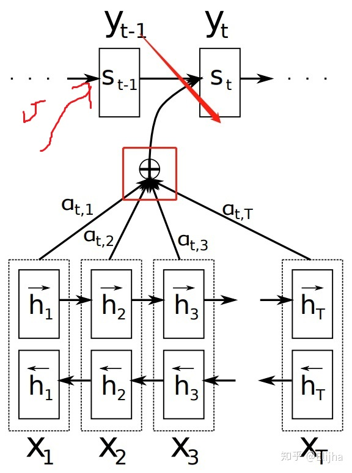

# Attention & Transformer

## Seq2seq

简单来说，seq2seq由两个RNN组成，一个是encoder，一个是decoder。拿MT举例子，比如我们要把源语言“我爱中国”翻译成目标语言“I love China”，那么定义输入序列：

$X=(x_0,x_1,x_2,x_3)$，其中$x_0=“我”$，$x_1=“爱”$，$x_2=“中”$，$x_2=“国”$。

另外定义目标序列：$T=(t_0,t_1,t_2)="I\ love\ China"$。

通过encoder，把$X=(x_0,x_1,x_2,x_3)$映射为一个隐层状态$h$，再经由decoder将$h$映射为$Y=(y_0,y_1,y_2)$（注意这里向量长度可以发生变化，即与输入长度不同）；最后将$Y$与$T$做loss（通常为交叉熵），训练网络。

## Attention

同样是在MT问题中，在seq2seq的基础上提出了attention机制（Bahadanau attention）。现在由于性能相对没有attention的原始模型太优越，现在提到的seq2seq一般都指加入了attention机制的模型。同样上面的问题，通过encoder，把$X=(x_0,x_1,x_2,x_3)$映射为一个隐层状态$H=(h_0,h_1,h_2,h_3)$，再经由decoder把$H=(h_0,h_1,h_2,h_3)$映射为$Y=(y_0,y_1,y_2)$。这里精妙的地方就在于，Y中的每一个元素都与H中的所有元素相连，而**每个元素通过不同的权值给与Y不同的贡献**。

上图是Bahadanau attention的示意图。

1. 关键在于红框里面的部分，即attention，后面再讲。
2. 红框下面是encoder，输入$X=(x_0,x_1,x_2,...,x_{T_x})$，通过一个双向LSTM得到两组$h^\leftarrow$和 $h^\rightarrow$（向左和向右），然后concat起来得到最终的 $H=(h_0,h_1,h_2,..., h_{T_x})$。
3. 红框上面是decoder。以$t$时刻为例，输入共有三个：$s_{t-1}$，$y_{t-1}$，$c_t$。其中$s_{t-1}$是上一个时刻的hidden state（一般用$h$表示encoder的hidden state，用$s$表示decoder的hidden state）； $y_{t-1}$是上一个时刻的输出，用来当做这个时刻的输入；$c_t$在图中没有，就是红框里得到的加权和，叫做context，即**由所有的encoder output（即$h$，不定长）得到一个定长的向量，代表输入序列的全局信息**，作为当前decoder step的context（上下文）。计算方法为：$c_i=\sum_{j=1}^{T_x}\alpha_{ij}h_j$，其中$\alpha_{ij}$是权重，又称为**alignment**；$h$就是encoder所有step的hidden state，又叫做**value**或者**memory**；$i$代表decoder step，$j$代表encoder step。

那么，这个权重$\alpha_{ij}$如何计算呢？直接上公式：$\alpha_{ij}=\frac{\exp(e_{ij})}{\sum_{k=1}^{T_x}\exp(e_{ik})}$，其中$e_{ij}=a(s_{i-1},h_j)$ 。看上去有点复杂，先说第一个公式，其实就是一个softmax，因为我们要算一组权重，这组权重的和为1。那这个$e_{ij}$又是什么呢？是通过某种度量$a(\bullet)$计算出来的$s_{i-1}$和$h_j$的**相关程度**。即对于某个既定的decoder step，计算上个时刻的hidden state和所有encoder step的输出的相关程度，并且用softmax归一化；这样，相关度大的$h$权重就大，在整个context里占得比重就多，decoder在当前step做解码的时候就越重视它（这就是attention的思想）。

那最后一个问题，这个度量$a(\bullet)$怎么算呢？很神奇的是这部分论文里没说……可能是我看的论文少，大家其实都已经心知肚明了吧……根据tf里的代码，一般来说分为这么几步：

1. 对$s_{i-1}$做一个线性映射，得到的向量叫做**query**，记做$q_i$；
2. 对$h_j$做一个线性映射，得到的向量叫做**key**，记做$k_j$；
3. $e_{ij}=v^T \cdot (q_i+k_j)$。$k_j$和$q_i$的维度必须相同，记为$d$；$v$是一个$d \times 1$的向量。

上面三步中，**前两步的线性映射**和**第三步的$v$** 都是**可以训练**的。所以用下面这张图大概表示一下**query与key的计算相关性继而得到权重, 并且用这个权重对value计算加权和**的过程:

多说几点：

1. 上面第三步中，query和key是做的加法，然后通过一个权重矩阵变为一个标量，被称为“加性attention”；相对的，可以直接通过向量乘法得到一个标量，叫做“乘性attention”；
2. 后来出现了一种升级版，叫做local sensitive attention，思想是相邻$\alpha_{ij}$之间的关系会相对较大，因此为了捕捉这种关系对alignment进行卷积。
3. query由很多种，这里是上个decode step的hidden state，也有论文里用的是当前的hidden state（$s_i$），还有把$s_{i-1}$和当前时刻的输入$y_{i-1}$concat起来一起用的。我做的tts，如果加入$y_{i-1}$的话就很难work，原因可能是二者不在同一个空间里，强行concat会干扰训练，所以还是具体情况具体分析啦。

总结一下，attention就是算一个encoder output的加权和，叫做context；计算方法为，query和key计算相关程度，然后归一化得到alignment，即权重；然后用alignment和memory算加权和，得到的向量就是context。

## Transformer

讲了那么多，终于说完了attention，可以进入到transformer部分了。Transformer就是一个升级版的seq2seq，也是由一个encoder和一个decoder组成的；encoder对输入序列进行编码，即$X=(x_0,x_1,x_2,...,x_{T_x})$变成$H=(h_0,h_1,h_2,...,h_{T_x})$；decoder对$H=(h_0,h_1,h_2,...,h_{T_x})$进行解码，得到$Y=(y_0,y_1,y_2,...,y_{T_y})$。但是神奇的是，encoder和decoder都不用RNN，而且换成了多个attention。

### **1. Transformer 与 Sequence to Sequence**

- Transformer是端到端的Seq2Seq结构，其包含两个组成部分：Encoder 和 Decoder，

Encoder负责理解源文，Decoder负责产出译文。如图

其Transformer Encoder 和 Transformer Decoder结构分别如下图：

- Transformer是可以堆叠的（上图中的N× 就是堆叠N个的意思），其思路是越高层的Transformer能够学习到越高级更抽象的信息（类似CNN的堆叠）

在论文中堆叠了6个。其中第六层的 Transformer Encoder Output 作为部分输入传递给每一层的 Transformer Decoder里（具体后面在Transformer Decoder部分会进步展开）

无论是Transformer Encoder, 还是Transformer Decoder,它们都由两个小模块组成，分别是：

- **Multi-Head Attention Layer**（Decoder会对它微调以符合逐字翻译出译文的特点）
- **Feed-Forward Layer**

（小模块的作用会在下面的Transformer Encoder部分展开）

------

### **2. Transformer Encoder**

笔者通过Transformer Encoder来介绍各个小模块的结构及功能，首先来看下Encoder的结构：

在这之前首先要介绍是论文中连接个各个小模块的一个关键技巧：Add & Norm 操作

#### **2.1 Add & Layer Normalization 操作**

Add操作借鉴了ResNet模型的结构，其主要作用是使得transformer的多层叠加而效果不退化

Layer Normalization操作对向量进行标准化，可以简化学习难度

论文中Add & Layer Normalization 操作的结构为：

$Output=LayerNorm\left( x+Sublayer\left( x\right) \right) \tag{2.1}$

在tensorflow/models的代码实现中与论文略有不同：

$Output=x+Sublayer\left( LayerNorm\left( x \right) \right) \tag{2.2}$

（其中 $Sublayer$) 就是前面说的小模块）

> 笔者感觉后者（式2.2）的确更合理，这样可以使得之后在Multi-Head Attention Layer中Scaled Dot-Product Attention的scale操作的假设与实际情况更接近（后面会在Scaled Dot-Product Attention还会提到）

#### **2.2 Multi-Head Attention Layer**

首先看下Multi-Head Attention Layer的结构图：

图2.2

从图中可以看到Multi-head体现为是由**h**个Scaled Dot-Product Attention组成。

为了把结构说的尽可能明白，这里先不做Multi-head，把Scaled Dot-Product Attention拿出来单独讲

##### **2.2.1 Scaled Dot-Product Attention**

Encoder里的Scaled Dot-Product Attention可以理解为对token向量进行信息提炼的过程，其结构图如下：

这里为了更清晰的阐述，先解释Scaled Dot-Product Attention如何对一个token向量进行提炼，再拓展到其同时并行地对每个token向量提炼信息

###### **2.2.1.1 Scaled Dot-Product Attention 对某一token向量进行提炼**

> 笔者的感性理解：Scaled Dot-Product Attention 可以抽象为一个简答的单轮问答过程。比如你想要了解一个人，于是你准备了一个想要了解他的问题，然后你不仅对他问这个问题，你还对其他可能了解他的人问同样的问题，你根据得到的所有回答汇总出一个答案，这个答案使得你更了解了他
> Scaled Dot-Product Attention与上面的生活例子唯一的不同就是：每个token的回答都是事先就自己准备好了，你得自己去看各个token的回答是否匹配你问的那个问题，不匹配就扔掉，匹配就收集起来，最后将所有收集的回答汇总得到的答案就是这个token提炼好的新向量

这里笔者以提炼第一个位置的token向量举例，展示Scaled Dot-Product Attention的具体步骤：

**1.** 对第一位置的token向量提炼出一个关于它的问题(query)

$q_{1}=W_{q}x_{1} \tag{2.3}$

**2.** 每个位置的token向量（包括第一位置的token自己）都会事先准备好自己的回答（key, value) （这里准备好的回答是属于一次生成，到处使用，即之后轮到提炼第二个位置的token向量时，参考的回答还是这套回答集$ \left( K~, ~ V \right)$

$\begin{aligned}k_{i}=&W_{k}x_{i}~~~~~,~i=1,2,\ldots ,n   \\ K=&\begin{bmatrix} k_{1} & k_{2} & \ldots & k_{n} \end{bmatrix}\end{aligned} \tag{2.4}$

$\begin{aligned}v_{i}=&W_{v}x_{i}~~~~~,~i=1,2,\ldots ,n   \\ V=&\begin{bmatrix} v_{1} & v_{2} & \ldots & v_{n} \end{bmatrix}\end{aligned} \tag{2.5}$

> 这里笔者感性的将value理解为回答的完整内容，而key理解为回答的摘要

这里可以发现每个token向量在准备各自回答的时候，是不知道query内容的，即(key, value)的生成与query是解耦的，这也是后面可以并行对每个token向量同时提炼的基础（2.2.1.2）

**3.** 根据每个位置token向量的回答摘要(key)与问题(query)通过点积来判断，其回答与问题有多少相关

$score(q_1, k_i)=\langle q_1, k_i\rangle~ / \sqrt{d}~~~~~,~i=1,2,\ldots ,n \tag{2.6}$

$a_{1i}=\dfrac {\exp^{score\left( q_{1},k_{i}\right) }}{\sum ^{n}_{j=1}\exp^{score\left( q_{1},k_{j}\right) }} \tag{2.7}$

式2.6中：$\langle~ ,~\rangle$为点积操作，$d$为query向量的维度，$a_{1i}$为相关性系数

这里除以$\sqrt{d}$的原因由于softmax（2.7）是一个会饱和的激活函数，为避免输入进入饱和区域，所以对$\langle q_1, k_i\rangle$的结果进行标准化（论文中假设$q, k$为相互独立的$\mu=0, {\sigma}^2=1$) 的向量，这个可以由Layer Normalization 去接近。则$\langle q_{i},k_{i} \rangle=\sum ^{d}_{j=1}q_{ij}\cdot k_{ij}$为$\mu=0, {\sigma}^2=d$的向量）

**4.** 将每个token向量的回答根据上一步得到的相关性系数$a_{1i}$进行汇总得到最终答案，即经过信息提炼后第一位置的token的新向量
$x_{1}^{'}=\sum ^{n}_{i=1}a_{1i}\times v_{i} \tag{2.8}$

**关于在图2.3中Scaled Dot-Product Attention的Mask操作：**

因为训练时基本是使用mini batch的方式，这就需要对token数量较少的sequence用<PAD>在尾部填充使得batch里的每个句子长度相同
在Encoder环节去除<PAD>对句子中其他token的影响是在Scaled Dot-Product 结束后紧跟一个mask操作（即对<PAD>的score减去一个极大值---e.g. 1E+9，使得softmax输出的<PAD>token的相关性系数接近 0）

对于没有<PAD>填充的句子则Mask操作就可以忽略，所以Mask操作是optional的

> 笔者个人感性理解Encoder里的mask操作：即保证<PAD>token在提炼过程中：
> <PAD>不会对其他token向量的信息提炼产生影响
> 对<PAD>向量再怎么信息提炼还是<PAD>向量

###### **2.2.1.2 Scaled Dot-Product Attention 并行对每个token向量同时提炼**

若每个位置上token依次使用Scaled Dot-Product Attention进行信息提炼，即是串行。

上面已经分析出每个token的所准备的回答(key, value)是事先就准备好的，query和$\lbrace (k_1,~v_1),\ldots ,(k_n,~v_n) \rbrace$是解耦的。

因此可以同时对每个token向量都生成一个与该token向量相对应的问题($q_i$)，将这些问题都汇聚起来组成矩阵一起问 (式2.8），公式如下：
$Q=\begin{bmatrix} q_{1} & q_{2} & \ldots & q_{n} \end{bmatrix}, \tag{2.9}$

$Attention \left( Q, K, V \right)=softmax\left( \dfrac {QK^T}{\sqrt {d}}\right) V \tag{2.10}$

$Attention \left( Q, K, V \right)$的结果即是各token向量经过提炼后的新向量集$\begin{bmatrix} x_1^{'}, \dots , x_n^{'} \end{bmatrix}$

上面操作和2.2.1.1中展示的单例情况完全一样，只是这里式多个一起算所以用的是矩阵操作

##### **2.2.2 Multi-Head Attention**

上面Scaled Dot-Product Attention例子已经实现了将每个token所对应的1个query并行计算，从而达到同时对每个token向量进行信息提炼。

Multi-Head更近了一步：可以实现将每个token所对应的**h**个queries并行计算，从而达到同时对每个token向量进行多方面的信息提炼。

Multi-Head思路：从token向量的不同子空间来提取多个问题（Scaled Dot-Product Attention），而每个位置的token向量也是在其子空间内事先准备好回答(key, value)，这样h个$Q$，就对应了h组$\left( K, V \right)$

最后将各个子空间得到的最终答案进行拼接（concat），再经过一个线性变换映射到该token向量原来的空间里。该操作对应的公式如下：
$\begin{aligned}Multihead\left( Q,K,V\right) =&~Concat\left(head_{1},\ldots ,head_{h}\right) W^{o}\\ where head_{i}=&~Attention\left( QWi^{Q},KWi^{V},VW^{V}_{i}\right) \end{aligned} \tag{2.11}$

> 关于Multi-Head我的臆想是：对一个token的不同子空间的提问，就比如我对它提了多个问题（比如有些问题是关于指代关系的， 有些是关于句法的，有些是关于语义的等等），而这些问题只是要提取token的部分信息所以使用子空间。同时既然是对其包含的一部分信息进行提问的话，那用token的部分信息来回答也是显得顺理成章

##### **2.3 Feed-Forward Layer**

这里就是将Multi-Head Attention得到的提炼好的向量再投影到一个更大的空间（论文里将空间放大了4倍）在那个大空间里可以更方便地提取需要的信息（使用Relu激活函数），最后再投影回token向量原来的空间

对应的公式：
$FFN\left( x\right) =ReLU\left( xW_{1}+b_{1}\right) W_{2}+b_{2} \tag{2.12}$

> 这个可以借鉴SVM来理解：SVM对于比较复杂的问题通过将特征其投影到更高维的空间使得问题简单到一个超平面就能解决。这里token向量里的信息通过Feed Forward Layer被投影到更高维的空间，在高维空间里向量的各类信息彼此之间更容易区别，即使像ReLU这样的弟中弟也可以完成提取信息的任务。

### **3. Position Embedding**

其实到目前为止为了方便叙述，一直没有提及一个问题：transformer 无法将token的次序位置信息学习到并编码进向量中。

如果细看为什么大多数Seq2Seq都使用RNN去建模，最主要的原因：通过将token按次序依次将其传入RNN，RNN可以隐含的将token所在的次序位置信息编码进其隐藏状态里

而从Multi-Head Attention结构可以看出来token向量的信息提取是通过Attention机制完成的，无法像RNN一样去隐含的将次序位置信息编码进去

那总不能撒手不管了咯，Google团队的解决方法就是压根不打算在Transformer模块里去学习次序位置信息~(￣▽￣)~*，而是在还没开始前就把这个问题给干掉，即token向量还没进入Transformer Encoder / Decoder 的时候就将次序位置信息编码成向量并直接加到token向量上去，如公式3.1

$TokenVector = WE\left( token\right) + PE\left( token\right) \tag{3.1}$

(WE: word embedding, PE: position embedding)

位置信息使用下面公式进行编码：

$\begin{aligned}PE\left( pos,2i\right) &=\sin \left( pos/10000^{2i/d_{model}}\right) \\ PE\left( pos,2i+1\right) &=\cos \left( pos/10000^{2i/d_{model}}\right) \\ i &=1,2,\ldots ,d_{model}/2\end{aligned} \tag{3.2}$

其中$pos$为token在sequence里的位置，$d_{model }$为Embedding的维度，$2i, ~2i+1$为Embedding中的某一对应维度。

> 这里我感觉该PE编码即是将位置信息编码进一个$d_{model}$维度的三角函数系中去，每个位置pos对应到这个三角函数系中的一个点。
> 对$PE\left( pos + k, i \right)$通过三角函数的和差化积操作后可以被$PE\left( pos, i  \right)$线性表示

在论文也提及他们希望该编码不仅能编码绝对位置信息，还能学习到相对位置信息，这么看感觉还是有那么点意思的。

------

### **4. Transformer Decoder**

首先给出Transformer Decoder的结构：

Transformer Decoder由三个模块组成：

- Masked Multi-head Attention Layer
- Enc-Dec Multi-head Attention Layer
- Feed-Forward Layer

这里看似引出了两个新的Attention Layer，大家不要慌其实这两个Attention Layer和Transformer Encoder里的Multi-head Attention layer结构是一摸一样，只是在某些操作上略有不同（之后会展开）

由于在训练时，我们已经知道需要翻译的译文内容，而在实际翻译时，译文是无法知晓的。所以Transformer Decoder在训练阶段与实际翻译阶段的操作略有不同（原理相同）

为叙述更可能清晰这里将其分开来讲，这里先从实际翻译阶段开始讲述原理，后在training部分再说明其不同之处

#### **4.1 Transformer Decoder in translation**

大致流程：在translate阶段，最开始都从同一个起始token开始（这里使用<S>来表示该起始符），之后每次向后预测一个token，如果预测的token为<E>的话就结束翻译。一般情况下还会定义一个最长翻译长度，只要超出这个长度，即使<E>还没出现，也会被强制完成翻译

Transformer Decoder的翻译过程遵循自回归的特性(即在已知翻译出$i-1$个token的情况下，预测第$i$个位置的token）

这里以图1.3中翻译knowledge is power为例（如果不想翻回去看的话，可以看下图4.2）

在t-1时刻已经预测出了 **力** 这个token，图中显示的是在t时刻预测token **力** 紧接的next token是哪个。

Transformer Decoder预测next token可以理解为两步走：

1. 首先询问之前已经预测出的每个译文token（即[**知 识 就 是 力]**），了解next token应该具有哪些信息（由Masked Multi-head Attention layer负责）
2. 再问下已经信息提炼好的源文（即Encoder outputs）进步了解next token应该具有哪些信息（由Enc-Dec Multi-head Attention layer负责）

下面笔者依次进行展开：

##### **4.1.1 Masked Multi-head Attention Layer**

在这个模块里query的提问对象是之前所有time step已经预测出的各token向量，这里还是拿图4.2说话，具体步骤：

a. 由前一time step预测出来的$token_{t-1}$ （即**力**）来生成一个关于next token的**h**个问题$Q_i$(h即是head的个数)，同时再生成$token_{t-1}$对应的**h**个回答$\left( k_i~,~v_i \right)$，注意这里$token_{t-1}$的回答和query仍是解耦的

b. 将a.中$token_{t-1}$（力）生成的**h**个回答$\left( k_i~,~v_i \right)$添加进之前已经预测得到的译文token向量所对应的回答集合A里$\left( K_i~,~V_i \right)$，用a.得到的queries（$Q_i$）去提问A里的每个token向量，随后步骤和Encoder里的Multi-head Attention Layer一样

在translate阶段 Masked Multi-head Attention Layer中的Mask并没有作用（mask作用主要是为decoder在training阶段服务的），即Masked Multi-head Attention Layer在training和translate阶段的行为略有不同（就比如dropout在训练和预测阶段行为不同）

> 该layer得到的输出结果 $v$向量笔者感性地理解为经过咨询已经译出的每个译文token的意见，初步了解next token应该具有哪些信息

##### **4.1.2 Enc-Dec Multi-head Attention Layer**

在这个模块里query的提问对象是已经对源文各token提炼好信息的Encoder outputs，具体流程：

**a.** 由4.1.1得到的输出 $v$ 向量生成关于next token的新的**h**个问题 $Q_i$

**b.** 由Encoder outputs中每个源文token $\hat{x}_i$ 向量通过线性变换生成其对应的回答集$\left( K_i, V_i \right)$，将a.得到的queries（ $Q_i$ ）向回答集$\left( K_i ,V_i \right)$提问，随后步骤和Encoder里的Multi-head Attention Layer一样

其中：Encoder outputs里<PAD>的回答仍会在Enc-Dec Multi-head Attention Layer中子结构Scaled Dot-Product Attention的Softmax操作之前被mask掉， 即**源文中的<PAD>也不会在对翻译next token产生影响**）

> 该layer得到的输出结果$v^{'}$向量笔者感性地理解为经过咨询源文的每个token的意见，进步知道这下一个该译出的token应该具有哪些信息

**c.** 最后的Feed-Forward Layer和Transformer Encoder里的Feed-Forward Layer完全一样

如此经过多层Transformer Decoder后，将最后一层得到的结果向量通过一个线性变换映射到译文的词库大小，用softmax去找哪个译文token和该向量最匹配就得到了next token的预测了。

> 注：上面例子展示的是transformer Decoder在翻译中的步骤，而在实际翻译中并不会使用这么vanilla的操作，基本会使用beam search方法来降低逐字翻译而产生的exposure bias。因为这个技巧和Transformer无直接关联，本文就不做介绍了，感兴趣的可以自行深入了解

#### **4.2 Transformer Decoder in training**

Transformer Decoder在训练阶段和翻译阶段其原理是一样的，只是使用了一个巧妙的技巧实现了并行训练（Transformer Decoder在翻译阶段每次只向后预测一个token，是串行）

在training阶段由于已经事先知道了正确的译文内容，因此可以同时模拟已知预测出前 $i-1$ 个译文token情况下，训练decoder去预测第 $i$ 个译文token是哪个的任务（ $i=1,\dots,n$ )

*（图4.3是为了更直观的方式来展现该技巧要达到的效果所以将Mask操作表现为在transformer decoder外部。实际Mask操作是发生在Transformer Decoder的Masked Multi-head Attention Layer里）*

图中每个模拟中必须对该模拟环境中该时刻应该“未知”的译文token 进行mask操作（就比如4.1的例子在图4.3里就是把 **量** 给mask掉）

Masked Multi-head Attention Layer里的mask操作和Transformer Encoder里隐去<PAD>的Mask操作非常像：

具体：将模拟中不该出现的“未来”token在Scaled Dot-Product Attention的softmax操作之前，对这些“未来”token对应的score减去一个极大数，使得这些“未来”token在预测next token是发挥不了作用

> 这里可以感性地理解学生在做练习卷的时候不把对应的答案泄露给学生

除此之外，在后面的Enc-Dec Multi-head Attention Layer 和 Feed Forward Layer里Transformer Decoder表现与翻译阶段并无不同，只是通过矩阵操作将Transformer Decoder预测逐个位置的译文token的任务变成了并行版本。

到此整个Transformer的介绍就结束啦

------

## Reference

- [Attention和Transformer](https://zhuanlan.zhihu.com/p/38485843)
- [Transformer](https://zhuanlan.zhihu.com/p/47510705)