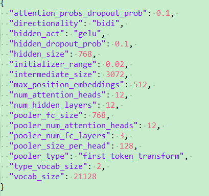

# Bert Code

##BertConfig

```python
bert_config = modeling.BertConfig.from_json_file(FLAGS.bert_config_file)
"""BertConfig: Configuration for `BertModel`."""
"""from_json_file: Constructs a `BertConfig` from a json file of parameters."""

"""Constructs BertConfig.

Args:
  vocab_size: Vocabulary size of `inputs_ids` in `BertModel`.
  hidden_size: Size of the encoder layers and the pooler layer.
  num_hidden_layers: Number of hidden layers in the Transformer encoder.
  num_attention_heads: Number of attention heads for each attention layer in
    the Transformer encoder.
  intermediate_size: The size of the "intermediate" (i.e., feed-forward)
    layer in the Transformer encoder.
  hidden_act: The non-linear activation function (function or string) in the
    encoder and pooler.
  hidden_dropout_prob: The dropout probability for all fully connected
    layers in the embeddings, encoder, and pooler.
  attention_probs_dropout_prob: The dropout ratio for the attention
    probabilities.
  max_position_embeddings: The maximum sequence length that this model might
    ever be used with. Typically set this to something large just in case
    (e.g., 512 or 1024 or 2048).
  type_vocab_size: The vocabulary size of the `token_type_ids` passed into
    `BertModel`.
  initializer_range: The stdev of the truncated_normal_initializer for
    initializing all weight matrices.
"""

{
"attention_probs_dropout_prob": 0.1, #乘法attention时，softmax后dropout概率 
"hidden_act": "gelu", #激活函数 
"hidden_dropout_prob": 0.1, #隐藏层dropout概率 
"hidden_size": 768, #隐藏单元数 
"initializer_range": 0.02, #初始化范围 
"intermediate_size": 3072, #升维维度
"max_position_embeddings": 512, #一个大于seq_length的参数，用于生成position_embedding 
"num_attention_heads": 12, #每个隐藏层中的attention head数 
"num_hidden_layers": 12, #隐藏层数 
"type_vocab_size": 2, #segment_ids类别 [0,1] 
"vocab_size": 30522 #词典中词数
}
```


## model_fn

定义Bert模型

```python
model_fn = model_fn_builder(
    bert_config=bert_config,
    init_checkpoint=FLAGS.init_checkpoint,
    use_tpu=FLAGS.use_tpu,
    use_one_hot_embeddings=FLAGS.use_tpu)
```

这里调用一个高级api，即Estimator可以进行训练评估等。但是其需要一个model

```python
def model_fn_builder(bert_config, init_checkpoint, use_tpu,
                     use_one_hot_embeddings):
  """Returns `model_fn` closure for TPUEstimator."""

  def model_fn(features, mode, params):  # pylint: disable=unused-argument
    """The `model_fn` for TPUEstimator."""

    tf.logging.info("*** Features ***")
    for name in sorted(features.keys()):
      tf.logging.info("  name = %s, shape = %s" % (name, features[name].shape))

    input_ids = features["input_ids"]
    input_mask = features["input_mask"]
    segment_ids = features["segment_ids"]
    masked_lm_positions = features["masked_lm_positions"]
    masked_lm_ids = features["masked_lm_ids"]


    model = modeling.BertModel(
        config=bert_config,
        is_training=False,
        input_ids=input_ids,
        input_mask=input_mask,
        token_type_ids=segment_ids,
        use_one_hot_embeddings=use_one_hot_embeddings)

    masked_lm_example_loss = get_masked_lm_output(
        bert_config, model.get_sequence_output(), model.get_embedding_table(),
        masked_lm_positions, masked_lm_ids)

    tvars = tf.trainable_variables()
    initialized_variable_names = {}
    scaffold_fn = None
    if init_checkpoint:
      (assignment_map, initialized_variable_names
      ) = modeling.get_assignment_map_from_checkpoint(tvars, init_checkpoint)
      if use_tpu:

        def tpu_scaffold():
          tf.train.init_from_checkpoint(init_checkpoint, assignment_map)
          return tf.train.Scaffold()

        scaffold_fn = tpu_scaffold
      else:
        tf.train.init_from_checkpoint(init_checkpoint, assignment_map)

    tf.logging.info("**** Trainable Variables ****")
    for var in tvars:
      init_string = ""
      if var.name in initialized_variable_names:
        init_string = ", *INIT_FROM_CKPT*"
      tf.logging.info("  name = %s, shape = %s%s", var.name, var.shape,
                      init_string)

    output_spec = None
    if mode == tf.estimator.ModeKeys.PREDICT:
      output_spec = tf.contrib.tpu.TPUEstimatorSpec(
          mode=mode, predictions=masked_lm_example_loss, scaffold_fn=scaffold_fn)  # 输出mask_word的score
    return output_spec

  return model_fn
```

