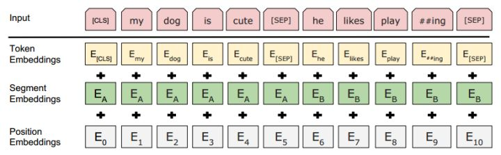
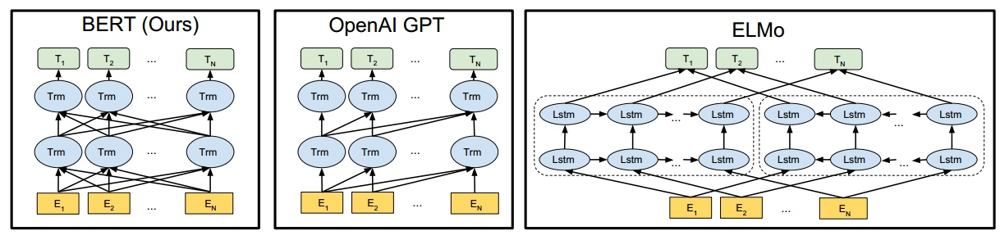
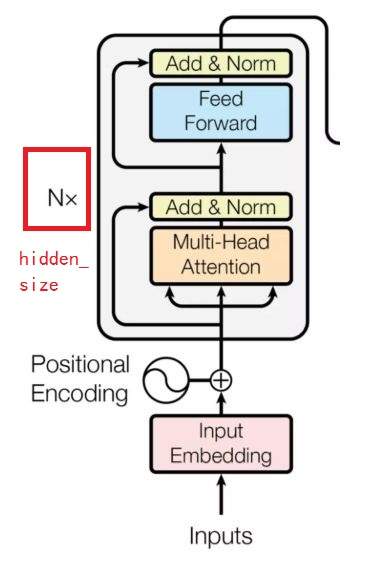
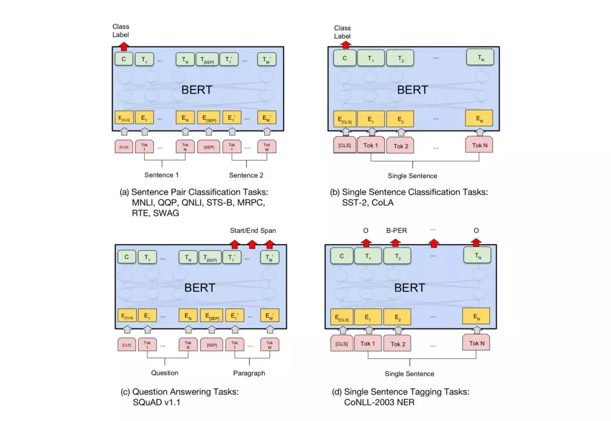
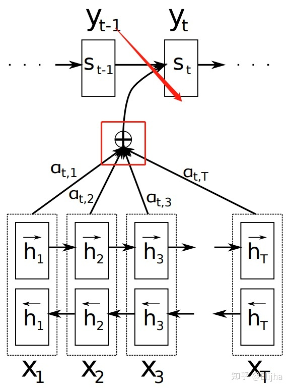

# Bert

##基本概念

### language representation model

作者认为，确实存在通用的语言模型，先用文章预训练通用模型，然后再根据具体应用，用 supervised 训练数据，精加工（fine tuning）模型，使之适用于具体应用。**为了区别于针对语言生成的 Language Model，作者给通用的语言模型，取了一个名字，叫语言表征模型 Language Representation Model**。

###预测方式：unidirectional-bi-directional-deep bi-directional；实现方法：transformer
能实现语言表征目标的模型，可能会有很多种，具体用哪一种呢？作者提议，用 Deep Bidirectional Transformers 模型。假如给一个句子 “能实现语言表征[mask]的模型”，遮盖住其中“目标”一词。从前往后预测[mask]，也就是用“能/实现/语言/表征”，来预测[mask]；或者，从后往前预测[mask]，也就是用“模型/的”，来预测[mask]，称之为单向预测 unidirectional。单向预测，不能完整地理解整个语句的语义。于是研究者们尝试双向预测。把从前往后，与从后往前的两个预测，拼接在一起 [mask1/mask2]，这就是双向预测 bi-directional。细节参阅《Neural Machine Translation by Jointly Learning to Align and Translate》。

BERT 的作者认为，bi-directional 仍然不能完整地理解整个语句的语义，更好的办法是用上下文全向来预测[mask]，也就是用 “能/实现/语言/表征/../的/模型”，来预测[mask]。BERT 作者把上下文全向的预测方法，称之为 deep bi-directional。如何来实现上下文全向预测呢？BERT 的作者建议使用 Transformer 模型。这个模型由《Attention Is All You Need》一文发明。

###具体训练任务
BERT 用了两个步骤，试图去正确地训练模型的参数。第一个步骤是把一篇文章中，15% 的词汇遮盖，让模型根据上下文全向地预测被遮盖的词。假如有 1 万篇文章，每篇文章平均有 100 个词汇，随机遮盖 15% 的词汇，模型的任务是正确地预测这 15 万个被遮盖的词汇。通过全向预测被遮盖住的词汇，来初步训练 Transformer 模型的参数。然后，用第二个步骤继续训练模型的参数。譬如从上述 1 万篇文章中，挑选 20 万对语句，总共 40 万条语句。挑选语句对的时候，其中 2*10 万对语句，是连续的两条上下文语句，另外 2*10 万对语句，不是连续的语句。然后让 Transformer 模型来识别这 20 万对语句，哪些是连续的，哪些不连续。

**这两步训练合在一起，称为预训练 pre-training。训练结束后的 Transformer 模型，包括它的参数，是作者期待的通用的语言表征模型。**


##输入表征

图1 输入表征

图1是输入表征。从图中看，输入序列由三部分相加而成：词嵌入(Token Embedding)、分隔嵌入(Segment Embedding)、位置嵌入(Position embeddings)。

Token Embedding**使用的是Wordpiece模型训练的词向量**；

因为要做NSP任务，后续同时也要完成QA任务，需要将问题和答案放在一起调优，所以添加特殊分隔符[SEP]和Segment Embedding来区别不同的句子。Segment Embedding有两个--Embedding A和Embedding B。当然后面也有单句的调优就直接使用Embedding A。

Position embeddings和self-attention中用不一样，**self-attention中使用的是三角函数，这里通过模型学习得到。**

[CLS]表示的是特殊分类嵌入，它是Transformer的输出。对于句子级分类任务，[CLS]就是输入序列的固定维度的表示(就像词向量直接拼成句向量再输入模型中一样)。对于非分类的任务，则忽略此向量。

##模型架构（BERT里每一个Trm基本上就是self-attention的编码器结构（后来看过源代码，这么说不准确，应该说是每一层中所有的Trim合并起来就是self-attention结构，因为代码中也是这么计算的，不会对多个token都新建一个self-attention，而是一起计算），只不过有N\*，J注意每一个Trm中有hidden_size的输入，而Trm的总数等于seq length，比如第一个Trm得到很多其他Trm的输入，就能计算后面的head，总体本以为是两层Trim结构，其实代表了N=2时的情景）

图2 模型框架

图2是BERT、GPT、EMLo三者的模型架构。从图中可以看到：BERT每一层都使用了双向编码，GPT只使用了从左到右的编码，ELMo独立训练从左到右的编码和从右到左的编码，然后联合起来。**难道直接使用双向的不行吗？**简单地说语言模型要做的是：计算当前面k个词出现时，第k+1个词出现的概率。直接双向模型不就知道了吗还计算预测个什么？原文模型之所以可以同时双向是因为它利用了MLM任务，下文介绍。

原文使用的模型是基于self-attention的编码器部分。如图3所示：



**图3是我直接从self-attention的网络结构中直接摘出来的，应该再加上Segment Embedding就是原文所用的Transformer了。图2中BERT里每一个Trm基本上就是图3的结构。**

## 任务微调

（a）句对关系判断，第一个起始符号[CLS]经过Transformer编码器后，增加简单的Softmax层，即可用于分类；

（b）单句分类任务，具体实现同（a）一样；

（c）问答类任务，譬如SQuAD v1.1，问答系统输入文本序列的question和包含answer的段落，并在序列中标记answer，让BERT模型学习标记answer开始和结束的向量来训练模型；

（d）序列标准任务，譬如命名实体标注NER，识别系统输入标记好实体类别（人、组织、位置、其他无名实体）的文本序列进行微调训练，识别实体类别时，将序列的每个Token向量送到预测NER标签的分类层进行识别。



## 参数解读

```
vocab_size: Vocabulary size of `inputs_ids` in `BertModel`. #词典大小
hidden_size: Size of the encoder layers and the pooler layer.  transformer block中的一层的维度的大小。J决定了词向量的大小。J注意这是上图中一个trm中的大小，然后一个seq_length中的所有词都同时输入到各个trm中，所以图中画了很多歌trm。
num_hidden_layers: Number of hidden layers in the Transformer encoder.就是transformer内堆叠的encoder的个数，看上图中那个N*的意思。注意，bert是双向的transformer模块的连接。本以为上图画了两层trm。但是发现代码中没有两层，所谓的双向就是trm得到所有其他trm的连接而已。
num_attention_heads: Number of attention heads for each attention layer in
the Transformer encoder. 就是attention中的head头数，子空间数
intermediate_size: The size of the "intermediate" (i.e., feed-forward)
layer in the Transformer encoder. 就是前向网络中的维度，放大到多大的维度，然后再转回去。J这里本以为这是要把多头的输出进行整合到固定输出，后来发现不是，有一个W已经在输入feed forward前就把数据维度整合好了，这里只是为了投影到高纬空间，然后使用relu来进行提取信息。
```

## 关于attention的概念总结！！！！！

####传统sequence to sequence

传统的sequence to sequence，通过encoder，把 $$ X=(x_0,x_1,x_2,x_3) $$ 映射为一个隐层状态 $$ h $$ ，再经由decoder将 $$ h $$ 映射为 $$ Y=(y_0,y_1,y_2) $$ （注意这里向量长度可以发生变化，即与输入长度不同）；最后将 $$ Y $$ 与 $$ T $$ 做loss（通常为交叉熵），训练网络。

####attention

而attention则是：通过encoder，把 $$ X=(x_0,x_1,x_2,x_3) $$ 映射为一个隐层状态 $$ H=(h_0,h_1,h_2,h_3) $$ ，再经由decoder把 $$ H=(h_0,h_1,h_2,h_3) $$ 映射为 $$ Y=(y_0,y_1,y_2) $$ 。这里精妙的地方就在于，**Y中的每一个元素都与H中的所有元素相连（严格来说，应该是解码器S中每个元素都和H中所有元素相连，这就是attention的特点）**，而**每个元素通过不同的权值给与Y不同的贡献**。



**J理解为上图自己画的红线位置，也有图中下部分的encoder的hidden state输入。此外y就表示输出词语，比如“I”，而s则表示decoder的隐状态。**

#### transformer

transformer就是一个升级版的seq2seq，也是由一个encoder和一个decoder组成的；encoder对输入序列进行编码，即 $$ X=(x_0,x_1,x_2,...,x_{T_x}) $$ 变成 $$ H=(h_0,h_1,h_2,...,h_{T_x}) $$ ；decoder对 $$ H=(h_0,h_1,h_2,...,h_{T_x}) $$ 进行解码，得到 $$ Y=(y_0,y_1,y_2,...,y_{T_y}) $$ 。但是神奇的是，encoder和decoder都不用RNN，而且换成了多个attention。

**每一个embedding，经过query和key，softmax计算出权重，再乘以value，得到新的向量。这就是 self-attention 层的输出( 第一个单词对应的输出 )。J注意下图最后一步这是对于所有的位置的向量的汇总。**

$$ x_{1}^{'}=\sum ^{n}_{i=1}a_{1i}\times v_{i}$$ 


#### 多头运算及矩阵并行运算

上面是将**每个token所对应的1个query逐一计算**。

矩阵并行运算意味着实现了将**每个token所对应的1个query并行计算，从而达到同时对每个token向量进行信息提炼**。（**J理解就是输入的token向量因为有很多组成：句子、词义等，所以就将分成多个子空间进行计算不同query（但实际其实各个子空间都是一样的维度，看下文的transformer译文就可以知道了！），注意这就是multi-head的意义**）

Multi-Head更近了一步：**可以实现将每个token所对应的h个queries并行计算，从而达到同时对每个token向量进行多方面的信息提炼**。

此外，**J注意这里还有一个将多头的结果合并后重新变换维度到与输入的维度一致hidden_size，但其实在代码中多头合并后已经与输入维度一致了，再进行变化的原因是想让这几个效果混合在一起，而不是单纯的合并。见下图的最右侧，这里不是前向网络！**


#### 全连接加上两次残差和dropout


## Reference

- [bert](https://zhuanlan.zhihu.com/p/46887114)
- [nlp新秀](https://www.jiqizhixin.com/articles/2019-02-18-12)