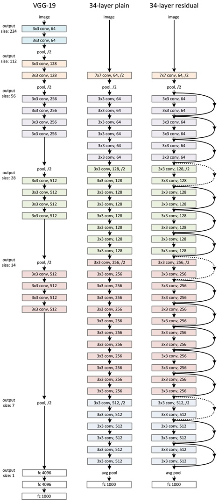

#Inception and Resnet

##Resnet结构

When training a neural network, the goal is to make it model a target function  $$ h(x) $$ .
If you add the input x to the output of the network (i.e., you add a skip connection),
then the network will be forced to model  $$ f(x) = h(x) – x $$  rather than  $$ h(x) $$ . This is
called residual learning.

## 原因

以sigmoid函数为例，我们知道sigmoid函数在x很大或者很小的时候函数值都被压到了+1和-1附近，x的变化不能够引起函数值的变化了。所以算梯度时出现了gradient vanishing的问题，无法更新网络权重。

 $$ \phi(x) = \frac{1}{1+\exp(-x)} $$ 

当x很大时， $$ \phi(x + \Delta(x)) - \phi(x) $$  是趋近于0的。可如果我们构造一个新函数:

 $$ F(x) = \phi(x)- x $$ 

这时，F(x)对x的变化就敏感了。微分不趋于0了，梯度方向有了，迭代可以进行了。

 

 

 

 

 