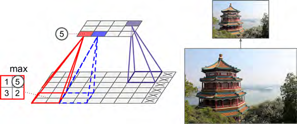

# Convolutional Neural Networks

## Convolutional Layer
**CNN中最重要的构件就是卷积层，特点是非全连接，而只是前一层的一小矩形区域的连接**。
each neuron in the second convolutional layer is connected only to neurons located within a small rectangle in the first layer.


### zero padding（零填充）


###stride（步幅）

**<u>注意到卷积层的计算，采用same方式的话，那其实就是从原图的顶点开始，以该点为中心点产生一个包围着的矩阵，生成一个新图的点，然后再按方向移动，除非中心点不在原图了，就不再移动。因此当stride=1时，往往原图和新图的形状是一样的，但是如果stride=2，则往往会缩小一倍尺寸。</u>**


### 权重组就是filter（过滤器），又称为convolution kernels（卷积核），最终得到feature map（特征图）


### 卷积层实际由多组特征图组成，用3D表示

**<u>每一层卷积层，由多组特征图构成。其中每一组特征图的输出值都是由该组特征图的计算权重与前一层的多组特征图的输出值相乘，再累加而得。</u>**


### 代码

注意参数的类型是`numpy.ndarray。`

**<u>参数的维度，其实类似索引方式，比如多加一个括号，`dataset = np.array([china, flower]`，那么在形状上多一个维度`(2, 427, 640, 3)`</u>**。

<u>Each input image is typically represented as a 3D tensor of shape [height, width, channels]</u>. 

<u>A mini-batch is represented as a 4D tensor of shape [mini-batch size, height, width, channels].</u> 

<u>The weights of a convolutional layer are represented as a 4D tensor of shape [fh, fw, fn, fn′]</u>.

<u>这里的fn表示的是当前层的特征图数；fn'表示的是前一层的特征图数</u>。

<u>而经过`tf.nn.conv2d`返回的张量与输入有同样的类型` [mini-batch size, height, width, channels]`，但是channel变为filter中当前层的特征图数。</u>

```python
import tensorflow as tf
import numpy as np
from sklearn.datasets import load_sample_image

# Load sample images
china = load_sample_image("china.jpg")
flower = load_sample_image("flower.jpg")
dataset = np.array([china, flower], dtype=np.float32)
batch_size, height, width, channels = dataset.shape

# Create 2 filters
filters = np.zeros(shape=(7, 7, channels, 2), dtype=np.float32) #这里与公式中的w的顺序有些不同，其中channel是上一层的特征图数，而第四个参数是这一层的特征图数
filters[:, 3, :, 0] = 1  # vertical line
filters[3, :, :, 1] = 1  # horizontal line
# channel一共有三个值，等于就是在0,1,2三个通道上，把固定位置变成1，就是变亮。
# Create a graph with input X plus a convolutional layer applying the 2 filters
X = tf.placeholder(tf.float32, shape=(None, height, width, channels)) #batch size仍是none
convolution = tf.nn.conv2d(X, filters, strides=[1,2,2,1], padding="SAME")
#conv = tf.layers.conv2d(X, filters=2, kernel_size=7, strides=[2,2], padding="SAME")
with tf.Session() as sess:
    output = sess.run(convolution, feed_dict={X: dataset})
    #output = sess.run(conv, feed_dict={X: dataset})

plt.imshow(output[0, :, :, 1], cmap="gray") # plot 1st image's 2nd feature map
#而经过tf.nn.conv2d返回的张量与输入有同样的类型[mini-batch size, height, width, channels]，但是channel变为filter中当前层的特征图数，即为2。
plt.show()
```

```python
def plot_image(image):
    plt.imshow(image, cmap="gray", interpolation="nearest")
    plt.axis("off")

plot_image(filters[:, :, 0, 0]) #可以看到filter0对于channel为0时的2D权值图
```

### 内存需求

如上所述，**<u>每一层卷积层，由多组特征图构成。其中每一组特征图的输出值都是由该组特征图的计算权重与前一层的多组特征图的输出值相乘，再累加而得。</u>**

因此存在几处需要的内存消耗：filter中的参数及bias参数；计算每层特征图输出值的乘法运算以及输出值的所占空间；多组instances造成的内存消耗；训练时需要保存所有的数据，以方便反向传播时调整。

## Pooling Layer

**CNN中第二个常见的构件就是池化层，与卷积层类似，区别在于并不采用过滤器的权值去乘积累积，只是对于过滤器范围内进行聚合，比如max或mean**。

**<u>注意到池化的计算，采用valid方式的话，那其实就是从原图的顶点开始，生成一个新图的点，然后再按方向移动，当没有数据了，就不再移动，导致新图的尺寸比较小。</u>**



```python
import tensorflow as tf
import numpy as np
from sklearn.datasets import load_sample_image

# Load sample images
china = load_sample_image("china.jpg")
flower = load_sample_image("flower.jpg")
dataset = np.array([china, flower], dtype=np.float32)
batch_size, height, width, channels = dataset.shape

# filters = np.zeros(shape=(7, 7, channels, 2), dtype=np.float32)
# filters[:, 3, :, 0] = 1  # vertical line
# filters[3, :, :, 1] = 1  # horizontal line

X = tf.placeholder(tf.float32, shape=(None, height, width, channels))
max_pool = tf.nn.max_pool(X, ksize=[1,2,2,1], strides=[1,2,2,1],padding="VALID")
# The ksize argument contains the kernel shape along all four dimensions of the input tensor: [batch size, height, width, channels]. 
with tf.Session() as sess:
    output = sess.run(max_pool, feed_dict={X: dataset})

# plt.imshow(output[0].astype(np.uint8))  # plot the output for the 1st image
# plt.show()


plot_color_image(dataset[0])
# save_fig("china_original")
plt.show()
    
plot_color_image(output[0])
# save_fig("china_max_pool")
plt.show()
```

## CNN Architectures

**<u>典型的cnn结构如下图所示</u>**：J<u>猜测a few convolutional layers表示的就是一组特征层；a pooling layer就是对每一个特征层，生成一个池化后的结果，前后数量并不变</u>。

Typical CNN architectures stack <u>a few convolutional layers</u> (each one generally followed by a ReLU layer), then <u>a pooling layer</u>, then another few convolutional layers (+ReLU), then another pooling layer, and so on. The image gets smaller and smaller as it progresses through the network, but it also typically gets deeper and deeper (i.e., with more feature maps) thanks to the convolutional layers. At the top of the stack, a regular feedforward neural network is added, composed of a few fully connected layers (+ReLUs), and the final layer outputs the prediction (e.g., a softmax layer that outputs estimated class probabilities).


##CNN结构的变体

LeNet-5、AlexNet、GoogleNet、ResNet

###关于MNIST的代码（这是作者自己搭的一个神经网络）

CPU可以运行

**<u>minibatch输入到神经网络的张量形状为：[mini-batch size, height, width, channels]</u>**，一起输入的，而不是一个个样本分开输入，所以需要进行reshape下。

**<u>全连接层的输入的张量形状为:[mini-batch size, input]</u>**，所以需要进行reshape下。

```python
import tensorflow as tf
height = 28
width = 28
channels = 1
n_inputs = height * width

conv1_fmaps = 32
conv1_ksize = 3
conv1_stride = 1
conv1_pad = "SAME"

conv2_fmaps = 64
conv2_ksize = 3
conv2_stride = 2
conv2_pad = "SAME"

pool3_fmaps = conv2_fmaps

n_fc1 = 64
n_outputs = 10

reset_graph()

with tf.name_scope("inputs"):
    X = tf.placeholder(tf.float32, shape=[None, n_inputs], name="X") #none表示mini batch中的样本个数
    X_reshaped = tf.reshape(X, shape=[-1, height, width, channels]) #最外围的-1就表示样本个数
    y = tf.placeholder(tf.int32, shape=[None], name="y")
#两个卷积层+Relu激活函数
#因为要求输入的数据格式为： [mini-batch size, height, width, channels]
conv1 = tf.layers.conv2d(X_reshaped, filters=conv1_fmaps, kernel_size=conv1_ksize,
                         strides=conv1_stride, padding=conv1_pad,
                         activation=tf.nn.relu, name="conv1")
conv2 = tf.layers.conv2d(conv1, filters=conv2_fmaps, kernel_size=conv2_ksize,
                         strides=conv2_stride, padding=conv2_pad,
                         activation=tf.nn.relu, name="conv2")
#一个池化层
with tf.name_scope("pool3"):
    pool3 = tf.nn.max_pool(conv2, ksize=[1, 2, 2, 1], strides=[1, 2, 2, 1], padding="VALID")
    pool3_flat = tf.reshape(pool3, shape=[-1, pool3_fmaps * 7 * 7]) #为了便于下一步的全连接，需要将其flat变平成为1行，多少行代表多少样本个数。把第二个卷积层中的64个特征图，经过池化后得到64个池化层，而7*7则是每个池化层的尺寸。
#经过第一层的卷积层，还是28*28，经过第二层的卷积层，由于stride=2，same，所以变成了14*14，经过池化层，因为stide=2，valid，所以变成了7*7。
#全连接网络
with tf.name_scope("fc1"):
    fc1 = tf.layers.dense(pool3_flat, n_fc1, activation=tf.nn.relu, name="fc1")
#这里的n_fc1与之前的64个特征图数量没有关系
with tf.name_scope("output"):
    logits = tf.layers.dense(fc1, n_outputs, name="output")
    Y_proba = tf.nn.softmax(logits, name="Y_proba")
#把输出的logits进行softmax得到概率值，或者直接像下面一样直接用函数计算与y的交叉熵的值
with tf.name_scope("train"):
    xentropy = tf.nn.sparse_softmax_cross_entropy_with_logits(logits=logits, labels=y)
    loss = tf.reduce_mean(xentropy) #计算该批次样本的损失值
    optimizer = tf.train.AdamOptimizer()
    training_op = optimizer.minimize(loss) #进行自动微分进行更新参数

with tf.name_scope("eval"):
    correct = tf.nn.in_top_k(logits, y, 1)#把输出的值与输入的值对比，是否最大值的序号等于y。比如[0.1,0.6,0.4]与[1]
    accuracy = tf.reduce_mean(tf.cast(correct, tf.float32)) #将所有样本的结果进行平均，这里是将true, false变成1,0

with tf.name_scope("init_and_save"):
    init = tf.global_variables_initializer()
    saver = tf.train.Saver()
    

from tensorflow.examples.tutorials.mnist import input_data
mnist = input_data.read_data_sets("/tmp/data/")

n_epochs = 10
batch_size = 100

with tf.Session() as sess:
    init.run()
    for epoch in range(n_epochs):
        for iteration in range(mnist.train.num_examples // batch_size):
            X_batch, y_batch = mnist.train.next_batch(batch_size)
            sess.run(training_op, feed_dict={X: X_batch, y: y_batch})
        acc_train = accuracy.eval(feed_dict={X: X_batch, y: y_batch})
        acc_test = accuracy.eval(feed_dict={X: mnist.test.images, y: mnist.test.labels})
        print(epoch, "Train accuracy:", acc_train, "Test accuracy:", acc_test)

        save_path = saver.save(sess, "./my_mnist_model")
```

```linux
0 Train accuracy: 0.98 Test accuracy: 0.9751
1 Train accuracy: 0.96 Test accuracy: 0.9837
2 Train accuracy: 0.99 Test accuracy: 0.984
3 Train accuracy: 1.0 Test accuracy: 0.9864
4 Train accuracy: 1.0 Test accuracy: 0.9881
5 Train accuracy: 0.98 Test accuracy: 0.9884
6 Train accuracy: 1.0 Test accuracy: 0.9893
7 Train accuracy: 0.99 Test accuracy: 0.9885
8 Train accuracy: 1.0 Test accuracy: 0.9881
9 Train accuracy: 1.0 Test accuracy: 0.9879
```

