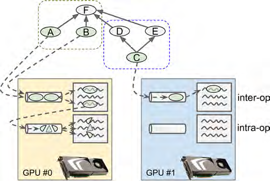

# GPU

## GPU账号
```
ssh dlearning@10.1.173.173
pw:dlearning@kugou

ssh -p 22 usertest1@10.1.173.172
gpu@test
python2.7路径/home/test/anaconda2/bin/python
```

## 查看GPU:nvidia-smi

```shell
nvidia-smi
```

The NVIDIA **System Management Interface** (nvidia-smi) is a command line utility, based on top of the NVIDIA Management Library (NVML), intended to aid in the **management and monitoring** of NVIDIA GPU devices. 

### 训练是查看GPU信息

```
+-----------------------------------------------------------------------------+
| NVIDIA-SMI 390.48                 Driver Version: 390.48                    |
|-------------------------------+----------------------+----------------------+
| GPU  Name        Persistence-M| Bus-Id        Disp.A | Volatile Uncorr. ECC |
| Fan  Temp  Perf  Pwr:Usage/Cap|         Memory-Usage | GPU-Util  Compute M. |
|===============================+======================+======================|
|   0  GeForce GTX 108...  Off  | 00000000:04:00.0 Off |                  N/A |
| 45%   77C    P2   102W / 250W |  10803MiB / 11178MiB |     97%      Default |
+-------------------------------+----------------------+----------------------+
|   1  GeForce GTX 108...  Off  | 00000000:05:00.0 Off |                  N/A |
| 23%   32C    P8     9W / 250W |  10631MiB / 11178MiB |      0%      Default |
+-------------------------------+----------------------+----------------------+
|   2  GeForce GTX 108...  Off  | 00000000:08:00.0 Off |                  N/A |
| 23%   33C    P8     8W / 250W |  10631MiB / 11178MiB |      0%      Default |
+-------------------------------+----------------------+----------------------+
|   3  GeForce GTX 108...  Off  | 00000000:09:00.0 Off |                  N/A |
| 23%   32C    P8     8W / 250W |  10631MiB / 11178MiB |      0%      Default |
+-------------------------------+----------------------+----------------------+
|   4  GeForce GTX 108...  Off  | 00000000:84:00.0 Off |                  N/A |
| 23%   32C    P8     8W / 250W |  10631MiB / 11178MiB |      0%      Default |
+-------------------------------+----------------------+----------------------+
|   5  GeForce GTX 108...  Off  | 00000000:85:00.0 Off |                  N/A |
| 23%   27C    P8     9W / 250W |  10631MiB / 11178MiB |      0%      Default |
+-------------------------------+----------------------+----------------------+
|   6  GeForce GTX 108...  Off  | 00000000:88:00.0 Off |                  N/A |
| 23%   27C    P8     8W / 250W |  10631MiB / 11178MiB |      0%      Default |
+-------------------------------+----------------------+----------------------+
|   7  GeForce GTX 108...  Off  | 00000000:89:00.0 Off |                  N/A |
| 23%   30C    P8     8W / 250W |  10631MiB / 11178MiB |      0%      Default |
+-------------------------------+----------------------+----------------------+
                                                                               
+-----------------------------------------------------------------------------+
| Processes:                                                       GPU Memory |
|  GPU       PID   Type   Process name                             Usage      |
|=============================================================================|
|    0     45479      C   python                                     10791MiB |
|    1     45479      C   python                                     10619MiB |
|    2     45479      C   python                                     10619MiB |
|    3     45479      C   python                                     10619MiB |
|    4     45479      C   python                                     10619MiB |
|    5     45479      C   python                                     10619MiB |
|    6     45479      C   python                                     10619MiB |
|    7     45479      C   python                                     10619MiB |
+-----------------------------------------------------------------------------+
```

没有程序在运行时会显示下列信息：

```
+-----------------------------------------------------------------------------+
| Processes:                                                       GPU Memory |
|  GPU       PID   Type   Process name                             Usage      |
|=============================================================================|
|  No running processes found                                                 |
+-----------------------------------------------------------------------------+
```

### 发现问题，没想到是正常的

top命令发现CPU使用率过高，而GPU使用率很低。

```
  PID USER      PR  NI    VIRT    RES    SHR S  %CPU %MEM     TIME+ COMMAND 
63382 dlearni+  20   0  196.1g   6.5g   1.8g S 704.3  4.1  12:41.44 python  
```

<u>这是因为默认只是使用一个默认GPU啊！需要自己手动指定多GPU才行，使用nvidia smi -l（表示loop）可以看到动态信息不断更新。</u>

Tensorflow by default uses memory power of all GPUs as it allocates maximum memory for your job but not processing speed. <u>To utilize the processing power of all GPUs as well you need to specify tf.device statements where ever you want to do parallel processing in your code.</u> In Tensorflow, you have to manually assign devices on your own and also calculate the overall gradients by collecting output from all devices on your own. <u>But MXNET does this thing automatically and you just need to specify CONTEXT statement indicating list of GPUs available.</u> You dont have to calculate the average loss of your model by yourself. 

## 启动信息

当显示出显卡信息，则表示安装成功了。

其中major主版本，minor副版本：表示CUDA Capability version number 所表示的是你的 CUDA 設備所能支持的計算架構 。

而peer to peer matrix理解为：让同一系统中的多个 GPU 之间能够实现点对点 (P2P) 通信，避免了额外的 CPU 处理时间。 

```shell
>>> import tensorflow as tf
>>> sess = tf.Session()
2018-06-26 14:47:50.580853: I tensorflow/core/platform/cpu_feature_guard.cc:137] Your CPU supports instructions that this TensorFlow binary was not compiled to use: SSE4.1 SSE4.2 AVX AVX2 FMA
2018-06-26 14:47:56.561769: I tensorflow/core/common_runtime/gpu/gpu_device.cc:1030] Found device 0 with properties: 
name: GeForce GTX 1080 Ti major: 6 minor: 1 memoryClockRate(GHz): 1.582
pciBusID: 0000:04:00.0
totalMemory: 10.92GiB freeMemory: 10.76GiB
2018-06-26 14:47:56.759054: I tensorflow/core/common_runtime/gpu/gpu_device.cc:1030] Found device 1 with properties: 
name: GeForce GTX 1080 Ti major: 6 minor: 1 memoryClockRate(GHz): 1.582
pciBusID: 0000:05:00.0
totalMemory: 10.92GiB freeMemory: 10.76GiB
2018-06-26 14:47:56.948706: I tensorflow/core/common_runtime/gpu/gpu_device.cc:1030] Found device 2 with properties: 
name: GeForce GTX 1080 Ti major: 6 minor: 1 memoryClockRate(GHz): 1.582
pciBusID: 0000:08:00.0
totalMemory: 10.92GiB freeMemory: 10.76GiB
2018-06-26 14:47:57.153998: I tensorflow/core/common_runtime/gpu/gpu_device.cc:1030] Found device 3 with properties: 
name: GeForce GTX 1080 Ti major: 6 minor: 1 memoryClockRate(GHz): 1.582
pciBusID: 0000:09:00.0
totalMemory: 10.92GiB freeMemory: 10.76GiB
2018-06-26 14:47:57.373397: I tensorflow/core/common_runtime/gpu/gpu_device.cc:1030] Found device 4 with properties: 
name: GeForce GTX 1080 Ti major: 6 minor: 1 memoryClockRate(GHz): 1.582
pciBusID: 0000:84:00.0
totalMemory: 10.92GiB freeMemory: 10.76GiB
2018-06-26 14:47:57.587687: I tensorflow/core/common_runtime/gpu/gpu_device.cc:1030] Found device 5 with properties: 
name: GeForce GTX 1080 Ti major: 6 minor: 1 memoryClockRate(GHz): 1.582
pciBusID: 0000:85:00.0
totalMemory: 10.92GiB freeMemory: 10.76GiB
2018-06-26 14:47:57.807224: I tensorflow/core/common_runtime/gpu/gpu_device.cc:1030] Found device 6 with properties: 
name: GeForce GTX 1080 Ti major: 6 minor: 1 memoryClockRate(GHz): 1.582
pciBusID: 0000:88:00.0
totalMemory: 10.92GiB freeMemory: 10.76GiB
2018-06-26 14:47:58.052574: I tensorflow/core/common_runtime/gpu/gpu_device.cc:1030] Found device 7 with properties: 
name: GeForce GTX 1080 Ti major: 6 minor: 1 memoryClockRate(GHz): 1.582
pciBusID: 0000:89:00.0
totalMemory: 10.92GiB freeMemory: 10.76GiB
2018-06-26 14:47:58.068368: I tensorflow/core/common_runtime/gpu/gpu_device.cc:1045] Device peer to peer matrix
2018-06-26 14:47:58.068947: I tensorflow/core/common_runtime/gpu/gpu_device.cc:1051] DMA: 0 1 2 3 4 5 6 7 
2018-06-26 14:47:58.068975: I tensorflow/core/common_runtime/gpu/gpu_device.cc:1061] 0:   Y Y Y Y N N N N 
2018-06-26 14:47:58.068990: I tensorflow/core/common_runtime/gpu/gpu_device.cc:1061] 1:   Y Y Y Y N N N N 
2018-06-26 14:47:58.069005: I tensorflow/core/common_runtime/gpu/gpu_device.cc:1061] 2:   Y Y Y Y N N N N 
2018-06-26 14:47:58.069019: I tensorflow/core/common_runtime/gpu/gpu_device.cc:1061] 3:   Y Y Y Y N N N N 
2018-06-26 14:47:58.069035: I tensorflow/core/common_runtime/gpu/gpu_device.cc:1061] 4:   N N N N Y Y Y Y 
2018-06-26 14:47:58.069049: I tensorflow/core/common_runtime/gpu/gpu_device.cc:1061] 5:   N N N N Y Y Y Y 
2018-06-26 14:47:58.069087: I tensorflow/core/common_runtime/gpu/gpu_device.cc:1061] 6:   N N N N Y Y Y Y 
2018-06-26 14:47:58.069110: I tensorflow/core/common_runtime/gpu/gpu_device.cc:1061] 7:   N N N N Y Y Y Y 
2018-06-26 14:47:58.069173: I tensorflow/core/common_runtime/gpu/gpu_device.cc:1120] Creating TensorFlow device (/device:GPU:0) -> (device: 0, name: GeForce GTX 1080 Ti, pci bus id: 0000:04:00.0, compute capability: 6.1)
2018-06-26 14:47:58.069196: I tensorflow/core/common_runtime/gpu/gpu_device.cc:1120] Creating TensorFlow device (/device:GPU:1) -> (device: 1, name: GeForce GTX 1080 Ti, pci bus id: 0000:05:00.0, compute capability: 6.1)
2018-06-26 14:47:58.069219: I tensorflow/core/common_runtime/gpu/gpu_device.cc:1120] Creating TensorFlow device (/device:GPU:2) -> (device: 2, name: GeForce GTX 1080 Ti, pci bus id: 0000:08:00.0, compute capability: 6.1)
2018-06-26 14:47:58.069242: I tensorflow/core/common_runtime/gpu/gpu_device.cc:1120] Creating TensorFlow device (/device:GPU:3) -> (device: 3, name: GeForce GTX 1080 Ti, pci bus id: 0000:09:00.0, compute capability: 6.1)
2018-06-26 14:47:58.069261: I tensorflow/core/common_runtime/gpu/gpu_device.cc:1120] Creating TensorFlow device (/device:GPU:4) -> (device: 4, name: GeForce GTX 1080 Ti, pci bus id: 0000:84:00.0, compute capability: 6.1)
2018-06-26 14:47:58.069280: I tensorflow/core/common_runtime/gpu/gpu_device.cc:1120] Creating TensorFlow device (/device:GPU:5) -> (device: 5, name: GeForce GTX 1080 Ti, pci bus id: 0000:85:00.0, compute capability: 6.1)
2018-06-26 14:47:58.069298: I tensorflow/core/common_runtime/gpu/gpu_device.cc:1120] Creating TensorFlow device (/device:GPU:6) -> (device: 6, name: GeForce GTX 1080 Ti, pci bus id: 0000:88:00.0, compute capability: 6.1)
2018-06-26 14:47:58.069316: I tensorflow/core/common_runtime/gpu/gpu_device.cc:1120] Creating TensorFlow device (/device:GPU:7) -> (device: 7, name: GeForce GTX 1080 Ti, pci bus id: 0000:89:00.0, compute capability: 6.1)
```

## GPU放置

### 全局配置
####终端执行程序时设置使用的GPU
如果电脑有多个GPU，tensorflow默认全部使用。如果想只使用部分GPU，可以设置CUDA_VISIBLE_DEVICES。在调用python程序时，可以使用。
```shell
CUDA_VISIBLE_DEVICES=1
python my_script.py
```

####python代码中设置使用的GPU
如果要在python代码中设置使用的GPU（如使用pycharm进行调试时），可以使用下面的代码（见第二个参考网址中Yaroslav Bulatov的回复）：
```python
import os
os.environ["CUDA_VISIBLE_DEVICES"] = "2"
```

### Simple placement普通放置原则（tf.device）

默认放在GPU #0上或者没有GPU时，放在CPU。

```
• If a node was already placed on a device in a previous run of the graph, it is left
on that device.
• Else, if the user pinned a node to a device (described next), the placer places it on
that device.
• Else, it defaults to GPU #0, or the CPU if there is no GPU.
```

#### 只要有某个node被eval执行，会将所有node都进行放置

Whenever you run a graph, if TensorFlow needs to evaluate a node that is not placed on a device yet, it uses the simple placer to place it, **along with all other nodes that are not placed yet**.

```python
import tensorflow as tf
with tf.device("/cpu:0"):
    a = tf.Variable(3.0, name='a1')
    b = tf.constant(4.0, name='b1')

c = a * b
config = tf.ConfigProto()
config.log_device_placement = True
sess = tf.Session(config=config)
a.initializer.run(session=sess) #会显示所有的放置位置，见下方信息
sess.run(c) #此时不会有log信息显示，因为所有的节点已经被放置好了。
```

```shell
Variable: (VariableV2): /job:localhost/replica:0/task:0/device:CPU:0
2018-06-26 18:29:29.119474: I tensorflow/core/common_runtime/placer.cc:874] Variable: (VariableV2)/job:localhost/replica:0/task:0/device:CPU:0
Variable/read: (Identity): /job:localhost/replica:0/task:0/device:CPU:0
2018-06-26 18:29:29.119540: I tensorflow/core/common_runtime/placer.cc:874] Variable/read: (Identity)/job:localhost/replica:0/task:0/device:CPU:0
mul: (Mul): /job:localhost/replica:0/task:0/device:GPU:0
2018-06-26 18:29:29.119597: I tensorflow/core/common_runtime/placer.cc:874] mul: (Mul)/job:localhost/replica:0/task:0/device:GPU:0
Variable/Assign: (Assign): /job:localhost/replica:0/task:0/device:CPU:0
2018-06-26 18:29:29.119658: I tensorflow/core/common_runtime/placer.cc:874] Variable/Assign: (Assign)/job:localhost/replica:0/task:0/device:CPU:0
Const: (Const): /job:localhost/replica:0/task:0/device:CPU:0
2018-06-26 18:29:29.119718: I tensorflow/core/common_runtime/placer.cc:874] Const: (Const)/job:localhost/replica:0/task:0/device:CPU:0
Variable/initial_value: (Const): /job:localhost/replica:0/task:0/device:CPU:0
2018-06-26 18:29:29.119754: I tensorflow/core/common_runtime/placer.cc:874] Variable/initial_value: (Const)/job:localhost/replica:0/task:0/device:CPU:0
```

### Kernel：implementation of op for the device

For a TensorFlow operation to run on a device, it needs to have an **implementation for that device; this is called a kernel**. Many operations have kernels for both CPUs and GPUs, but not all of them. For example, TensorFlow does not have a GPU kernel for integer variables.

## Parallelized execution of a TensorFlow graph

- 先从`source nodes`开始（即zero dependency），放到`inter_op thread pools`
- 如果`op`有多线程内核，就会放到`intra_op thread pools`
- 然后依赖它们的操作也变成zero dependency，接着进行执行



## Control Dependencies

```python
a = tf.constant(1.0)
b = a + 2.0
with tf.control_dependencies([a, b]):
  x = tf.constant(3.0)
  y = tf.constant(4.0)
z = x + y
```

##Kill进程 

找到进程号PID，kill的信号signal是9，-s 9

```
+-----------------------------------------------------------------------------+
| NVIDIA-SMI 390.25                 Driver Version: 390.25                    |
|-------------------------------+----------------------+----------------------+
| GPU  Name        Persistence-M| Bus-Id        Disp.A | Volatile Uncorr. ECC |
| Fan  Temp  Perf  Pwr:Usage/Cap|         Memory-Usage | GPU-Util  Compute M. |
|===============================+======================+======================|
|   0  GeForce GTX 108...  Off  | 00000000:04:00.0 Off |                  N/A |
| 29%   34C    P0    56W / 250W |      0MiB / 11178MiB |      0%      Default |
+-------------------------------+----------------------+----------------------+
|   1  GeForce GTX 108...  Off  | 00000000:05:00.0 Off |                  N/A |
| 62%   79C    P2   201W / 250W |  10775MiB / 11178MiB |    100%      Default |
+-------------------------------+----------------------+----------------------+
|   2  GeForce GTX 108...  Off  | 00000000:08:00.0 Off |                  N/A |
| 29%   39C    P0    58W / 250W |      0MiB / 11178MiB |      0%      Default |
+-------------------------------+----------------------+----------------------+
|   3  GeForce GTX 108...  Off  | 00000000:09:00.0 Off |                  N/A |
| 29%   34C    P0    56W / 250W |      0MiB / 11178MiB |      0%      Default |
+-------------------------------+----------------------+----------------------+
|   4  GeForce GTX 108...  Off  | 00000000:84:00.0 Off |                  N/A |
| 29%   35C    P0    57W / 250W |      0MiB / 11178MiB |      0%      Default |
+-------------------------------+----------------------+----------------------+
|   5  GeForce GTX 108...  Off  | 00000000:85:00.0 Off |                  N/A |
| 29%   33C    P0    57W / 250W |      0MiB / 11178MiB |      0%      Default |
+-------------------------------+----------------------+----------------------+
|   6  GeForce GTX 108...  Off  | 00000000:88:00.0 Off |                  N/A |
| 29%   24C    P8     8W / 250W |    253MiB / 11178MiB |      0%      Default |
+-------------------------------+----------------------+----------------------+
|   7  GeForce GTX 108...  Off  | 00000000:89:00.0 Off |                  N/A |
| 29%   32C    P0    57W / 250W |      0MiB / 11178MiB |      2%      Default |
+-------------------------------+----------------------+----------------------+
                                                                               
+-----------------------------------------------------------------------------+
| Processes:                                                       GPU Memory |
|  GPU       PID   Type   Process name                             Usage      |
|=============================================================================|
|    1      9704      C   python                                     10761MiB |
|    6     20187      C   /home/test/anaconda2/bin/python              243MiB |
+-----------------------------------------------------------------------------+
```

```
kill -s 9 20187
[1]+  Killed                  /home/test/anaconda2/bin/python new_age_test.py --images "./data/test2" --model_path "./models2" --batch_size 128 --choose_best --cuda
```


