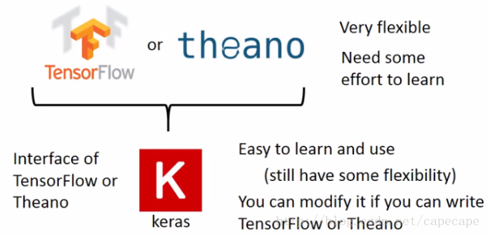

# Keras

- TensorFlow和theano以及Keras都是深度学习框架，TensorFlow和theano比较灵活，也比较难学，它们其实就是一个微分器。

- Keras其实就是TensorFlow和Keras的接口（Keras作为前端，TensorFlow或theano作为后端），它也很灵活，且比较容易学。可以把keras看作为tensorflow封装后的一个API。

  

##资料
参考keras官方文档

##在 Keras 中有两类主要的模型：[Sequential 顺序模型](https://keras.io/zh/models/sequential) 和 [使用函数式 API 的 Model 类模型](https://keras.io/zh/models/model)。 

##最基础的Sequential顺序模型搭建的流程

### 基于多层感知器 (MLP) 的 softmax 多分类：

```
import keras
from keras.models import Sequential
from keras.layers import Dense, Dropout, Activation
from keras.optimizers import SGD

# 生成虚拟数据
import numpy as np
x_train = np.random.random((1000, 20))
y_train = keras.utils.to_categorical(np.random.randint(10, size=(1000, 1)), num_classes=10)
x_test = np.random.random((100, 20))
y_test = keras.utils.to_categorical(np.random.randint(10, size=(100, 1)), num_classes=10)

model = Sequential()
# Dense(64) 是一个具有 64 个隐藏神经元的全连接层。
# 在第一层必须指定所期望的输入数据尺寸：
# 在这里，是一个 20 维的向量。
model.add(Dense(64, activation='relu', input_dim=20))
model.add(Dropout(0.5))
model.add(Dense(64, activation='relu'))
model.add(Dropout(0.5))
model.add(Dense(10, activation='softmax'))

sgd = SGD(lr=0.01, decay=1e-6, momentum=0.9, nesterov=True)
model.compile(loss='categorical_crossentropy',
              optimizer=sgd,
              metrics=['accuracy'])

model.fit(x_train, y_train,
          epochs=20,
          batch_size=128)
score = model.evaluate(x_test, y_test, batch_size=128)
```

### 基于多层感知器的二分类：

```
import numpy as np
from keras.models import Sequential
from keras.layers import Dense, Dropout

# 生成虚拟数据
x_train = np.random.random((1000, 20))
y_train = np.random.randint(2, size=(1000, 1))
x_test = np.random.random((100, 20))
y_test = np.random.randint(2, size=(100, 1))

model = Sequential()
model.add(Dense(64, input_dim=20, activation='relu'))
model.add(Dropout(0.5))
model.add(Dense(64, activation='relu'))
model.add(Dropout(0.5))
model.add(Dense(1, activation='sigmoid'))

model.compile(loss='binary_crossentropy',
              optimizer='rmsprop',
              metrics=['accuracy'])

model.fit(x_train, y_train,
          epochs=20,
          batch_size=128)
score = model.evaluate(x_test, y_test, batch_size=128)
```

### 类似 VGG 的卷积神经网络：

```
import numpy as np
import keras
from keras.models import Sequential
from keras.layers import Dense, Dropout, Flatten
from keras.layers import Conv2D, MaxPooling2D
from keras.optimizers import SGD

# 生成虚拟数据
x_train = np.random.random((100, 100, 100, 3))
y_train = keras.utils.to_categorical(np.random.randint(10, size=(100, 1)), num_classes=10)
x_test = np.random.random((20, 100, 100, 3))
y_test = keras.utils.to_categorical(np.random.randint(10, size=(20, 1)), num_classes=10)

model = Sequential()
# 输入: 3 通道 100x100 像素图像 -> (100, 100, 3) 张量。
# 使用 32 个大小为 3x3 的卷积滤波器。
model.add(Conv2D(32, (3, 3), activation='relu', input_shape=(100, 100, 3)))
model.add(Conv2D(32, (3, 3), activation='relu'))
model.add(MaxPooling2D(pool_size=(2, 2)))
model.add(Dropout(0.25))

model.add(Conv2D(64, (3, 3), activation='relu'))
model.add(Conv2D(64, (3, 3), activation='relu'))
model.add(MaxPooling2D(pool_size=(2, 2)))
model.add(Dropout(0.25))

model.add(Flatten())
model.add(Dense(256, activation='relu'))
model.add(Dropout(0.5))
model.add(Dense(10, activation='softmax'))

sgd = SGD(lr=0.01, decay=1e-6, momentum=0.9, nesterov=True)
model.compile(loss='categorical_crossentropy', optimizer=sgd)

model.fit(x_train, y_train, batch_size=32, epochs=10)
score = model.evaluate(x_test, y_test, batch_size=32)
```

### 基于 LSTM 的序列分类：

```
from keras.models import Sequential
from keras.layers import Dense, Dropout
from keras.layers import Embedding
from keras.layers import LSTM

model = Sequential()
model.add(Embedding(max_features, output_dim=256))
model.add(LSTM(128))
model.add(Dropout(0.5))
model.add(Dense(1, activation='sigmoid'))

model.compile(loss='binary_crossentropy',
              optimizer='rmsprop',
              metrics=['accuracy'])

model.fit(x_train, y_train, batch_size=16, epochs=10)
score = model.evaluate(x_test, y_test, batch_size=16)
```

### 基于 1D 卷积的序列分类：

```
from keras.models import Sequential
from keras.layers import Dense, Dropout
from keras.layers import Embedding
from keras.layers import Conv1D, GlobalAveragePooling1D, MaxPooling1D

model = Sequential()
model.add(Conv1D(64, 3, activation='relu', input_shape=(seq_length, 100)))
model.add(Conv1D(64, 3, activation='relu'))
model.add(MaxPooling1D(3))
model.add(Conv1D(128, 3, activation='relu'))
model.add(Conv1D(128, 3, activation='relu'))
model.add(GlobalAveragePooling1D())
model.add(Dropout(0.5))
model.add(Dense(1, activation='sigmoid'))

model.compile(loss='binary_crossentropy',
              optimizer='rmsprop',
              metrics=['accuracy'])

model.fit(x_train, y_train, batch_size=16, epochs=10)
score = model.evaluate(x_test, y_test, batch_size=16)
```

## 使用函数式 API 的 Model 类模型搭建过程

在函数式 API 中，给定一些输入张量和输出张量，可以通过以下方式实例化一个 `Model`：

```
from keras.models import Model
from keras.layers import Input, Dense

a = Input(shape=(32,))
b = Dense(32)(a)
model = Model(inputs=a, outputs=b)
```

这个模型将包含从 `a` 到 `b` 的计算的所有网络层。

在多输入或多输出模型的情况下，你也可以使用列表：

```
model = Model(inputs=[a1, a2], outputs=[b1, b3, b3])
```

## 结合tfrecord

https://www.dlology.com/blog/how-to-leverage-tensorflows-tfrecord-to-train-keras-model/

https://github.com/keras-team/keras/blob/master/examples/mnist_tfrecord.py


## 常用函数

###`ImageDataGenerator`

