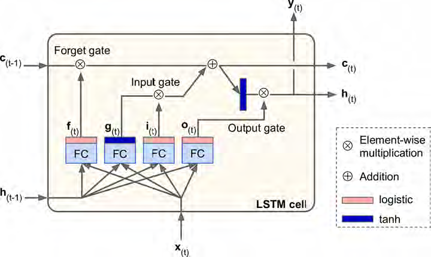
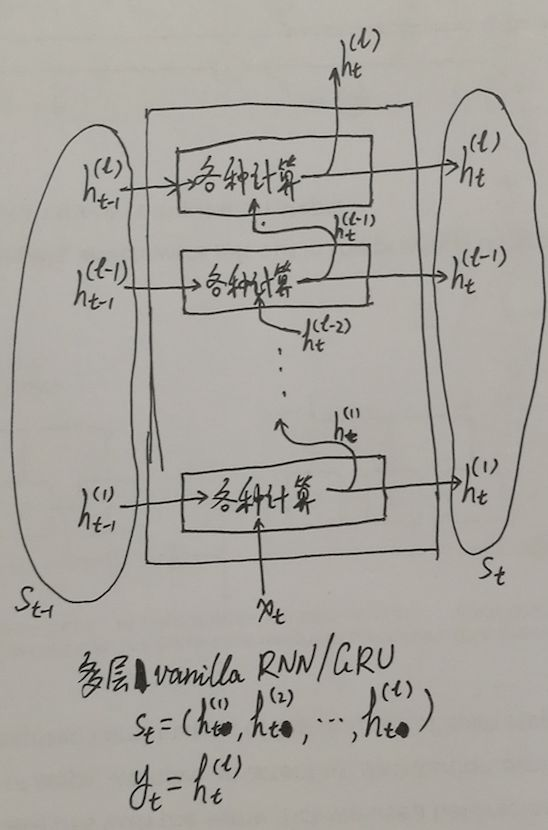
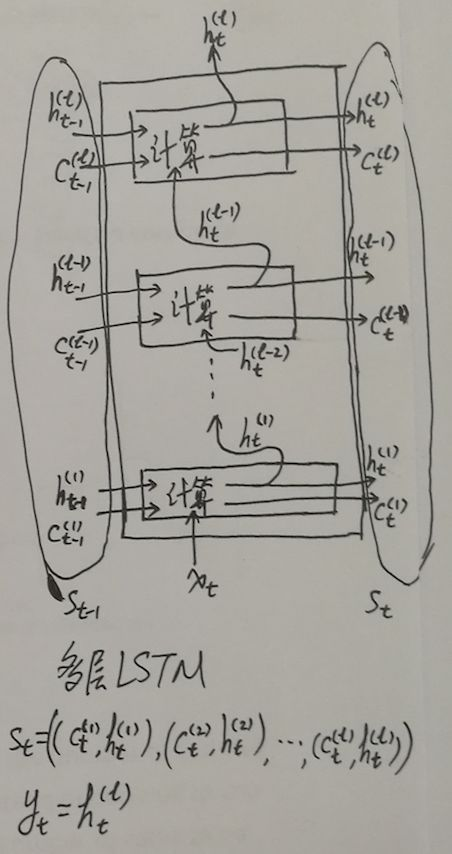
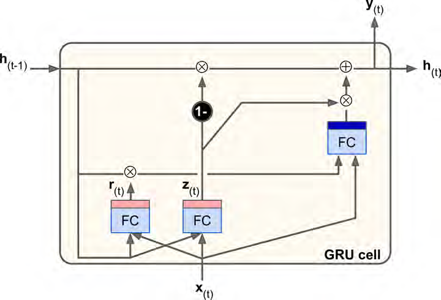

#LSTM

## LSTM是改良的RNN

it will perform much better; training will converge faster and it will detect long-term dependencies in the data.

### 特点（输出两个状态向量）
Long Short-Term Memory 长短期记忆

**Its state is split in two vectors:  $ h(t) $  and  $ c(t) $  (“c” stands for “cell”). You can think of  $ h(t) $  as the short-term state and  $ c(t) $  as the long-term state.**

###结构图和公式




###代码

核心代码是利用`BasicLSTMCell`代替`BasicRNNCell`。

```python
lstm_cells = [tf.contrib.rnn.BasicLSTMCell(num_units=n_neurons)
              for layer in range(n_layers)] #将BasicLSTMCell组成的列表作为参数传入到后面的MultiRNNCell
```


```python
from tensorflow.examples.tutorials.mnist import input_data
mnist = input_data.read_data_sets("/tmp/data/")
X_test = mnist.test.images.reshape((-1, n_steps, n_inputs))
y_test = mnist.test.labels

reset_graph()

lstm_cell = tf.contrib.rnn.BasicLSTMCell(num_units=n_neurons) #J只是演示下，没用
n_steps = 28
n_inputs = 28
n_neurons = 150
n_outputs = 10
n_layers = 3

learning_rate = 0.001

X = tf.placeholder(tf.float32, [None, n_steps, n_inputs])
y = tf.placeholder(tf.int32, [None])

lstm_cells = [tf.contrib.rnn.BasicLSTMCell(num_units=n_neurons)
              for layer in range(n_layers)]
multi_cell = tf.contrib.rnn.MultiRNNCell(lstm_cells)
outputs, states = tf.nn.dynamic_rnn(multi_cell, X, dtype=tf.float32) #同样states则会将每一个单元的输出都会返回。
top_layer_h_state = states[-1][1]
logits = tf.layers.dense(top_layer_h_state, n_outputs, name="softmax")
xentropy = tf.nn.sparse_softmax_cross_entropy_with_logits(labels=y, logits=logits)
loss = tf.reduce_mean(xentropy, name="loss")
optimizer = tf.train.AdamOptimizer(learning_rate=learning_rate)
training_op = optimizer.minimize(loss)
correct = tf.nn.in_top_k(logits, y, 1)
accuracy = tf.reduce_mean(tf.cast(correct, tf.float32))
    
init = tf.global_variables_initializer()

n_epochs = 10
batch_size = 150

with tf.Session() as sess:
    init.run()
    for epoch in range(n_epochs):
        for iteration in range(mnist.train.num_examples // batch_size):
            X_batch, y_batch = mnist.train.next_batch(batch_size)
            X_batch = X_batch.reshape((batch_size, n_steps, n_inputs))
            sess.run(training_op, feed_dict={X: X_batch, y: y_batch})
        acc_train = accuracy.eval(feed_dict={X: X_batch, y: y_batch})
        acc_test = accuracy.eval(feed_dict={X: X_test, y: y_test})
        print("Epoch", epoch, "Train accuracy =", acc_train, "Test accuracy =", acc_test)

```

## `tf.nn.dynamic_rnn`的返回值outputs和state

###多层RNN和GRU的情况

对于`BasicRNNCell`，根据之前定义可知，**<u>一层内有多个神经元组成，每个神经元对于输入都是全连接，而输入则根据时间步将batch中划分为几个instance</u>**，具体可见下面的维度讲解。

```python
X_batch = np.array([
        # t = 0      t = 1 
        [[0, 1, 2], [9, 8, 7]], # instance 1  #最内是3，即input
        [[3, 4, 5], [0, 0, 0]], # instance 2  #次内是2，即n_step，即max_time
        [[6, 7, 8], [6, 5, 4]], # instance 3  #最外是4，即mini batch size，即batch_size
        [[9, 0, 1], [3, 2, 1]], # instance 4
    ])
```



**<u>outputs则是对于每层中神经元每个时间步的输出，J注意与普通的单层不同，这里不是tensor而是tuple。[batch_size, multiple layers, max_time, cell_state_size]</u>**

上面去掉multiple layers就是单层的维度，而多层的话改写为：对于每一个instance，记录每一层的每一个时间步的输出，组成tuple；然后将所有层的输出再组成tuple。

而**<u>state则是只记录每个instance的最后时间步的每层中神经元输出，J注意与普通的单层不同，这里不是tensor而是tuple，[batch_size, multiple layers, cell_state_size]</u>**。

上面去掉multiple layers就是单层的维度，而多层的话改写为：对于每一个instance，记录每一层的最终输出，组成tuple。

比如对于下面的情况：

```python
n_steps = 2
n_inputs = 3
n_neurons = 5
#加上之前的X_batch的数据
#单独一层神经元

#这里较为特殊只是单层神经元层
#outputs：对于batch中的每个样本，记录每一层神经元层，对其每个时间步（也就是对应着分段数据，[0, 1, 2]对应时间步0, [9, 8, 7]对应时间步1），记录输出，这里有5个神经元
outputs
[[[-0.9123188   0.16516446  0.5548655  -0.39159346  0.20846416]
  [-1.          0.956726    0.99831694  0.99970174  0.96518576]]

 [[-0.9998612   0.6702289   0.9723653   0.6631046   0.74457586]
  [ 0.          0.          0.          0.          0.        ]]

 [[-0.99999976  0.8967997   0.9986295   0.9647514   0.93662   ]
  [-0.9999526   0.9681953   0.96002865  0.98706263  0.85459226]]

 [[-0.96435434  0.99501586 -0.36150697  0.9983378   0.999497  ]
  [-0.9613586   0.9568762   0.7132288   0.97729224 -0.0958299 ]]]

#states：则对于outputs中只记录每个样本的每个神经元层的最后一个时间步的输出
states
[[-1.          0.956726    0.99831694  0.99970174  0.96518576]
 [-0.9998612   0.6702289   0.9723653   0.6631046   0.74457586]
 [-0.9999526   0.9681953   0.96002865  0.98706263  0.85459226]
 [-0.9613586   0.9568762   0.7132288   0.97729224 -0.0958299 ]]
```

而对于`LSTMCell`来说，也是每一层有多个神经元组成，每个神经元对于输入也是全连接（**<u>所以看上述代码部分会有输入神经元数目</u>**）。



把多层 LSTM 看成一个整体，这个整体的输出就是最上层 LSTM 的输出： $ y_t = h_t (l) $ ；而这个整体进行循环所依赖的状态则是每一层状态组合成的 tuple，而每一层状态本身又是一个  $ (c, h) $  tuple，所以最后结果就是一个 tuple 的 tuple。 **<u>（所以需要提取state中的最后一个tuple的第2个元素作为输出top_layer_h_state = states[-1][1]）</u>**

**<u>outputs则是对于最后一层中神经元每个时间步的输出。J注意与普通的单层不同，这里不是tensor而是tuple。[batch_size, max_time, (cell_state_size, hidden state size)]</u>**

这里与之前的outputs不同，只记录了最后一层的每个时间步的输出。

而**<u>state则是只记录每个instance的最后时间步的每层中神经元输出，J注意与普通的单层不同，这里不是tensor而是tuple，[batch_size, multiple layers, （cell_state_size，hidden state size）]</u>**。

上面去掉multiple layers就是单层的维度，而多层的话改写为：对于每一个instance，记录每一层的最终输出，组成tuple，由(c,h)组成，然后将每层组合，再形成一个tuple。

##Peephole Connection：另一种版本的LSTM，增加长期记忆对输入的影响

They proposed an LSTM variant with extra connections called peephole connections: the previous long-term state c(t–1) is added as an input to the controllers of the forget gate and the input gate, and the current longterm state c(t) is added as input to the controller of the output gate.

### 代码

```python
lstm_cell = tf.contrib.rnn.LSTMCell(num_units=n_neurons, use_peepholes=True) #即加入一个use_peepholes即可
```

## GRU：非常流行的一种LSTM版本

### 特点(合并成一个状态向量)

*Gated* *Recurrent* *Unit* ：门控循环单元 。

### 结构图和公式




###代码

```python
gru_cell = tf.contrib.rnn.GRUCell(num_units=n_neurons)
```

## Reference

-[学会区分 RNN 的 output 和 state](https://zhuanlan.zhihu.com/p/28919765)