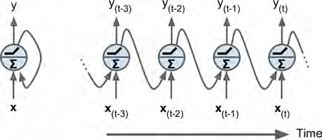
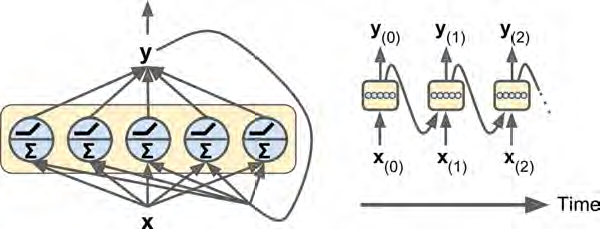
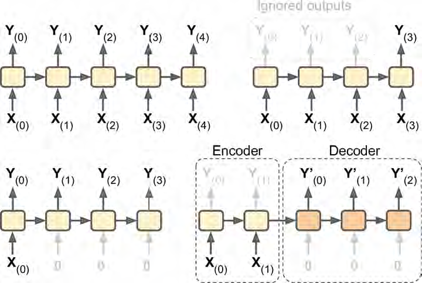
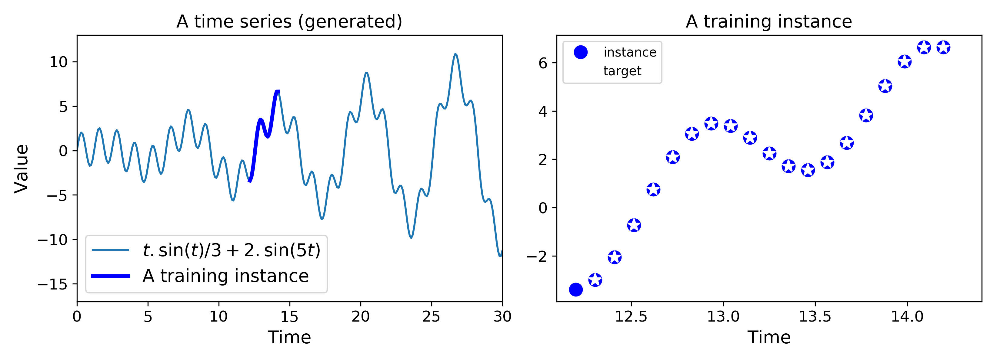
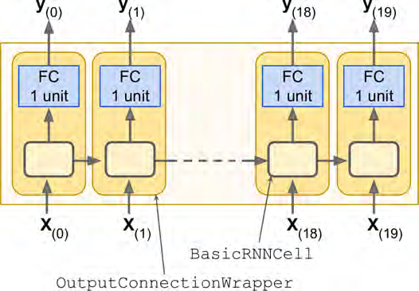
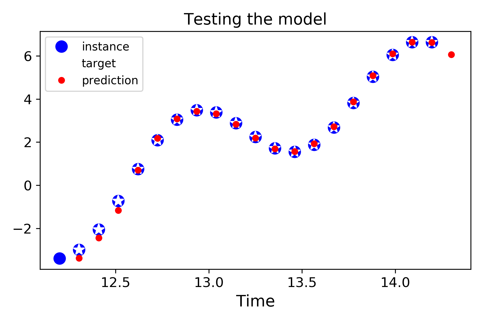
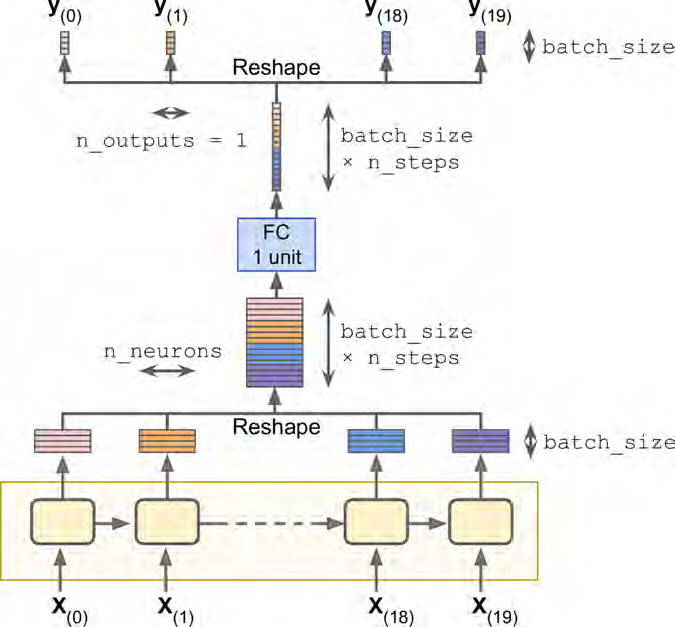
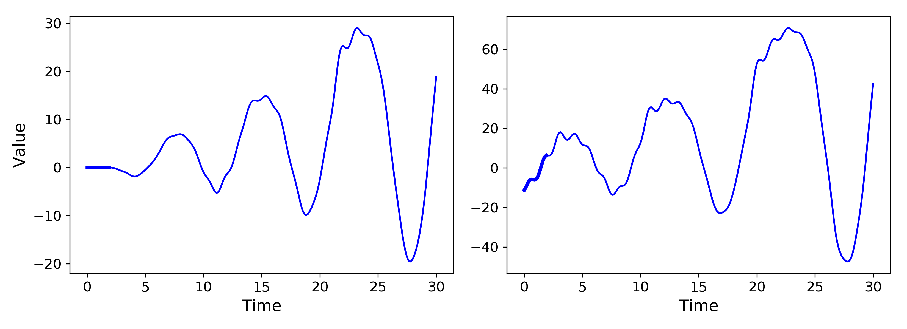
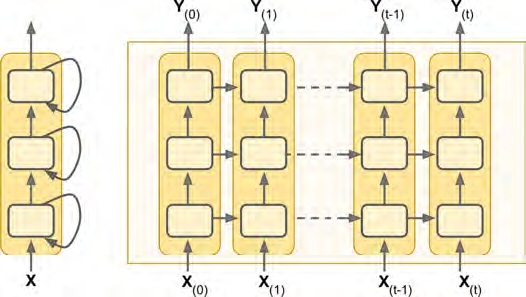

# RNN

## 特点

### 输入任意长度

More generally, they can work on sequences of arbitrary lengths, rather than on fixed-sized inputs like all the nets we have discussed so far.

### 创造性

RNNs can generate music, sentences, image captions, and much more.

## 基础知识

### 循环神经元及time step时间步(又叫frame 帧)

理解为下图右侧的某一个循环神经元的位置，就表示时间步。



### 循环神经元层及按时间展开

<u>注意左侧的每一个循环神经元都是上面的单个循环神经元，而右侧的则是对此单个循环神经元的按时间展开，右侧并非实际的网络结构。</u>




### 公式

这里的公式维度有参考意义，但是下文开始使用$h$代替$y$，因为两者会不相等，会有变化。


### memory cells(记忆单元)

将RNN看做起到了记忆的作用。因此**<u>将单个循环神经元或是循环神经元层成为记忆单元。</u>**而记忆单元的状态记为$h_{(t)}$。下文开始使用$h$代替$y$，因为两者会不相等，会有变化。

### RNN的变体(Sequence/Vector)

####多个输入/输出叫Sequence，单个输入/输出Vector

Seq to seq (top left), seq to vector (top right), vector to seq (bottom left),delayed seq to seq (bottom right).



#### encoder与decoder

将上图中右下角的encoder与decoder之间的横线往上转，就可以看到前一个是seq to veq网络，往下转，就可以看到后一个是veq to seq网络。

Lastly, you could have a sequence-to-vector network, called an encoder, followed by a vector-to-sequence network, called a decoder (see the bottom-right network).

## 构建

### 不用现成函数，只是用代码实现

#### 1.mini batch内的所有instance的意思就是分开送入网络，但这些instance面对的网络的参数是一样的

#### **<u>2.前面的神经网络里mini batch中的instance都是独立的，而RNN的instance之间是有计算依赖关系的，可以看作是一个整体的instance。所以在计算中特地定义两个占位符，以显示计算依赖关系。</u>**

比如下面的0,1,2与9,8,7。

一共五个神经元，每一个都接受3个输入，即1*n_inputs。

```python
import tensorflow as tf
reset_graph()

n_inputs = 3
n_neurons = 5

X0 = tf.placeholder(tf.float32, [None, n_inputs])
X1 = tf.placeholder(tf.float32, [None, n_inputs])

Wx = tf.Variable(tf.random_normal(shape=[n_inputs, n_neurons],dtype=tf.float32))
Wy = tf.Variable(tf.random_normal(shape=[n_neurons,n_neurons],dtype=tf.float32))
b = tf.Variable(tf.zeros([1, n_neurons], dtype=tf.float32))

Y0 = tf.tanh(tf.matmul(X0, Wx) + b)
Y1 = tf.tanh(tf.matmul(Y0, Wy) + tf.matmul(X1, Wx) + b)

init = tf.global_variables_initializer()

import numpy as np

X0_batch = np.array([[0, 1, 2], [3, 4, 5], [6, 7, 8], [9, 0, 1]]) # t = 0
X1_batch = np.array([[9, 8, 7], [0, 0, 0], [6, 5, 4], [3, 2, 1]]) # t = 1
#实际上是如下的形式，只是为了明白是4个instance才这么展开写
#0,1,2
#3,4,5
#6,7,8
#9,0,1
#9,8,7
#0,0,0
#6,5,4
#3,2,1
with tf.Session() as sess:
    init.run()
    Y0_val, Y1_val = sess.run([Y0, Y1], feed_dict={X0: X0_batch, X1: X1_batch})
print(Y0_val)
print(Y1_val)
```

### 使用现成函数

但是之前的方法是自行定义时间步，如果时间步很长，这意味着需要很多占位符，程序就会非常不简洁。

#### 使用static_rnn

<u>将`BasicRNNCell`看成与时间步相对应的一个单元。</u>

#####`static_rnn`的运行原理为根据输入占位符数，如下的`[X0, X1]`，创造出相应个数的copy进行连接。

```python
import tensorflow as tf

n_inputs = 3
n_neurons = 5
reset_graph()

X0 = tf.placeholder(tf.float32, [None, n_inputs])
X1 = tf.placeholder(tf.float32, [None, n_inputs])

basic_cell = tf.contrib.rnn.BasicRNNCell(num_units=n_neurons)
output_seqs, states = tf.contrib.rnn.static_rnn(basic_cell, [X0, X1],
                                                dtype=tf.float32)
Y0, Y1 = output_seqs

init = tf.global_variables_initializer()

X0_batch = np.array([[0, 1, 2], [3, 4, 5], [6, 7, 8], [9, 0, 1]])
X1_batch = np.array([[9, 8, 7], [0, 0, 0], [6, 5, 4], [3, 2, 1]])

with tf.Session() as sess:
    init.run()
    Y0_val, Y1_val, states_val = sess.run([Y0, Y1, states], feed_dict={X0: X0_batch, X1: X1_batch})
    
print(Y0_val)
print(Y1_val)
print(states_val)
```

#####避免输入过多占位符符号，可考虑利用packing sequence的技术，只输入一个占位符

核心代码就是设置一个`n_steps`的变量，然后将占位符维度，修改为`[None, n_steps, n_inputs]`，None表示mini-batch中的instance个数。

```python
import tensorflow as tf

n_steps = 2
n_inputs = 3
n_neurons = 5
reset_graph()

X = tf.placeholder(tf.float32, [None, n_steps, n_inputs]) #这么定义是为了方便输入数据，因为可以根据instance的个数来进行逐个输入
X_seqs = tf.unstack(tf.transpose(X, perm=[1, 0, 2])) #而这么更改是为了下面的函数解析，必须先看到n_steps，所以将其换到最外侧
X_test = tf.transpose(X, perm=[1, 0, 2])

basic_cell = tf.contrib.rnn.BasicRNNCell(num_units=n_neurons)
output_seqs, states = tf.contrib.rnn.static_rnn(basic_cell, X_seqs,
                                                dtype=tf.float32)
outputs = tf.transpose(tf.stack(output_seqs), perm=[1, 0, 2]) #因为输出是n_steps, None, n_neurons，为了展示，必须将其换回来，以instance进行展示。

init = tf.global_variables_initializer()

X_batch = np.array([
        # t = 0      t = 1 
        [[0, 1, 2], [9, 8, 7]], # instance 1  #最内是3，即input
        [[3, 4, 5], [0, 0, 0]], # instance 2  #次内是2，即n_step
        [[6, 7, 8], [6, 5, 4]], # instance 3  #最外是4，即mini batch size
        [[9, 0, 1], [3, 2, 1]], # instance 4
    ])

with tf.Session() as sess:
    init.run()
    outputs_val = outputs.eval(feed_dict={X: X_batch})
    X_seqs_val = sess.run(X_seqs,feed_dict={X: X_batch}) #必须用run，而不能用eval，因为后者只针对tensor对象有用
    X_test_val = sess.run(X_test,feed_dict={X: X_batch})

print(outputs_val)
print(X_seqs_val)
print(X_test_val)
```

#### 使用dynamic_rnn

但是`static_rnn`的问题在于还是对每个时间步创造复制，因此内存会是一个大问题。

所以采用`dynamic_rnn`，<u>但是具体原理没有讲</u>。只说`while_loop`节省了内存，也无需`stack`和`unstack`了，很简洁。

```python
n_steps = 2
n_inputs = 3
n_neurons = 5

reset_graph()

X = tf.placeholder(tf.float32, [None, n_steps, n_inputs])

basic_cell = tf.contrib.rnn.BasicRNNCell(num_units=n_neurons)
outputs, states = tf.nn.dynamic_rnn(basic_cell, X, dtype=tf.float32)

init = tf.global_variables_initializer()

X_batch = np.array([
        [[0, 1, 2], [9, 8, 7]], # instance 1
        [[3, 4, 5], [0, 0, 0]], # instance 2
        [[6, 7, 8], [6, 5, 4]], # instance 3
        [[9, 0, 1], [3, 2, 1]], # instance 4
    ])

with tf.Session() as sess:
    init.run()
    outputs_val = outputs.eval(feed_dict={X: X_batch})
    
print(outputs_val)
```

### 变长输入序列

之前讨论的都是同样长度的输入序列（都是two steps long），为了应对不同长度的输入序列，<u>多定义一个占位符，记录instance中输入序列的数目（即所需要时间步的长度）</u>。

```python
n_steps = 2
n_inputs = 3
n_neurons = 5

reset_graph()

X = tf.placeholder(tf.float32, [None, n_steps, n_inputs])
basic_cell = tf.contrib.rnn.BasicRNNCell(num_units=n_neurons)

seq_length = tf.placeholder(tf.int32, [None])
outputs, states = tf.nn.dynamic_rnn(basic_cell, X, dtype=tf.float32,
                                    sequence_length=seq_length)
init = tf.global_variables_initializer()

X_batch = np.array([
        # step 0     step 1
        [[0, 1, 2], [9, 8, 7]], # instance 1
        [[3, 4, 5], [0, 0, 0]], # instance 2 (padded with zero vectors)
        [[6, 7, 8], [6, 5, 4]], # instance 3
        [[9, 0, 1], [3, 2, 1]], # instance 4
    ])
seq_length_batch = np.array([2, 1, 2, 2])

with tf.Session() as sess:
    init.run()
    outputs_val, states_val = sess.run(
        [outputs, states], feed_dict={X: X_batch, seq_length: seq_length_batch})
    
print(outputs_val)
```


## 训练

<u>所有的输出值都涉及计算梯度下降值；把各个计算出来的梯度下降值，然后再累加。</u>

<u>Note that the gradients flow backward through all the outputs used by the cost function, not just through the final output</u> (for example, in Figure below the cost function is computed using the last three outputs of the network, $Y(2)$, $Y(3)$, and $Y(4)$, so gradients flow through these three outputs, but not through $Y(0)$ and $Y(1)$). Moreover, since the same parameters $W$ and $b$ are used at each time step, backpropagation will do the right thing and <u>sum over all time steps</u>.


### 序列分类

```python
reset_graph()

n_steps = 28
n_inputs = 28
n_neurons = 150
n_outputs = 10

learning_rate = 0.001

X = tf.placeholder(tf.float32, [None, n_steps, n_inputs])
y = tf.placeholder(tf.int32, [None])

basic_cell = tf.contrib.rnn.BasicRNNCell(num_units=n_neurons)
outputs, states = tf.nn.dynamic_rnn(basic_cell, X, dtype=tf.float32)

logits = tf.layers.dense(states, n_outputs)
xentropy = tf.nn.sparse_softmax_cross_entropy_with_logits(labels=y,
                                                          logits=logits)
loss = tf.reduce_mean(xentropy)
optimizer = tf.train.AdamOptimizer(learning_rate=learning_rate)
training_op = optimizer.minimize(loss)
correct = tf.nn.in_top_k(logits, y, 1)
accuracy = tf.reduce_mean(tf.cast(correct, tf.float32))

init = tf.global_variables_initializer()

from tensorflow.examples.tutorials.mnist import input_data
mnist = input_data.read_data_sets("/tmp/data/")
X_test = mnist.test.images.reshape((-1, n_steps, n_inputs))
y_test = mnist.test.labels

n_epochs = 100
batch_size = 150

with tf.Session() as sess:
    init.run()
    for epoch in range(n_epochs):
        for iteration in range(mnist.train.num_examples // batch_size):
            X_batch, y_batch = mnist.train.next_batch(batch_size)
            X_batch = X_batch.reshape((-1, n_steps, n_inputs))
            sess.run(training_op, feed_dict={X: X_batch, y: y_batch})
        acc_train = accuracy.eval(feed_dict={X: X_batch, y: y_batch})
        acc_test = accuracy.eval(feed_dict={X: X_test, y: y_test})
        print(epoch, "Train accuracy:", acc_train, "Test accuracy:", acc_test)
```

### 时间序列预测

####先生成时间序列，**<u>这里的逻辑是从全部30的时间内，全部当成训练数据。J这样岂不是有过拟合的倾向。</u>**

```python
t_min, t_max = 0, 30
resolution = 0.1

def time_series(t):
    return t * np.sin(t) / 3 + 2 * np.sin(t*5)

def next_batch(batch_size, n_steps):
    t0 = np.random.rand(batch_size, 1) * (t_max - t_min - n_steps * resolution) #表示batch_size中有几行1列，其中的行代表是哪一段时间区间的起点，因为下面会在起点上加一个2的区间，所以这里的起点必须是30-2，然后再乘以0-1之间的随机数
    Ts = t0 + np.arange(0., n_steps + 1) * resolution
    ys = time_series(Ts)
    return ys[:, :-1].reshape(-1, n_steps, 1), ys[:, 1:].reshape(-1, n_steps, 1)

t = np.linspace(t_min, t_max, int((t_max - t_min) / resolution)) #全部的图像x轴，一共300个点

n_steps = 20
t_instance = np.linspace(12.2, 12.2 + resolution * (n_steps + 1), n_steps + 1) #局部的图像x轴，只有20步，加1是因为多一点显示空间

plt.figure(figsize=(11,4))
plt.subplot(121)
plt.title("A time series (generated)", fontsize=14)
plt.plot(t, time_series(t), label=r"$t . \sin(t) / 3 + 2 . \sin(5t)$")
plt.plot(t_instance[:-1], time_series(t_instance[:-1]), "b-", linewidth=3, label="A training instance") #画在一起，直接用plot，并用label画出图例，最后一位不用[:-1]，因为最后一位是为了显示而已
plt.legend(loc="lower left", fontsize=14)
plt.axis([0, 30, -17, 13])
plt.xlabel("Time")
plt.ylabel("Value")

plt.subplot(122)
plt.title("A training instance", fontsize=14)
plt.plot(t_instance[:-1], time_series(t_instance[:-1]), "bo", markersize=10, label="instance")#当成训练样本，前20个样本，0-20
plt.plot(t_instance[1:], time_series(t_instance[1:]), "w*", markersize=10, label="target") #因为是白色，所以会被上面的bo覆盖掉，其实后面还有一个白色星点，但是看不到了
#当成训练样本的目标，后20个样本，1-21
plt.legend(loc="upper left")
plt.xlabel("Time")

save_fig("time_series_plot")
plt.show()
```



#### 使用OutputProjectionWrapper控制输出

其在basicRNNCell的基础上进行封装，加一层全连接层，控制输出。


```python
import tensorflow as tf
reset_graph()

n_steps = 20
n_inputs = 1
n_neurons = 100
n_outputs = 1

X = tf.placeholder(tf.float32, [None, n_steps, n_inputs])
y = tf.placeholder(tf.float32, [None, n_steps, n_outputs])

cell = tf.contrib.rnn.OutputProjectionWrapper(
    tf.contrib.rnn.BasicRNNCell(num_units=n_neurons, activation=tf.nn.relu),
    output_size=n_outputs)

outputs, states = tf.nn.dynamic_rnn(cell, X, dtype=tf.float32)

learning_rate = 0.001

loss = tf.reduce_mean(tf.square(outputs - y)) # MSE
optimizer = tf.train.AdamOptimizer(learning_rate=learning_rate)
training_op = optimizer.minimize(loss)

init = tf.global_variables_initializer()

saver = tf.train.Saver()

n_iterations = 1500
batch_size = 50

with tf.Session() as sess:
    init.run()
    for iteration in range(n_iterations):
        X_batch, y_batch = next_batch(batch_size, n_steps)
        sess.run(training_op, feed_dict={X: X_batch, y: y_batch})
        if iteration % 100 == 0:
            mse = loss.eval(feed_dict={X: X_batch, y: y_batch})
            print(iteration, "\tMSE:", mse)
    
    saver.save(sess, "./my_time_series_model") # not shown in the book
```

导出模型可以看效果

```python
with tf.Session() as sess:                          # not shown in the book
    saver.restore(sess, "./my_time_series_model")   # not shown

    X_new = time_series(np.array(t_instance[:-1].reshape(-1, n_steps, n_inputs)))
    y_pred = sess.run(outputs, feed_dict={X: X_new})

plt.title("Testing the model", fontsize=14)
plt.plot(t_instance[:-1], time_series(t_instance[:-1]), "bo", markersize=10, label="instance")
plt.plot(t_instance[1:], time_series(t_instance[1:]), "w*", markersize=10, label="target")
plt.plot(t_instance[1:], y_pred[0,:,0], "r.", markersize=10, label="prediction")
plt.legend(loc="upper left")
plt.xlabel("Time")

save_fig("time_series_pred_plot")
plt.show()
```



####不使用OutputProjectionWrapper控制输出



```python
reset_graph()

n_steps = 20
n_inputs = 1
n_neurons = 100

X = tf.placeholder(tf.float32, [None, n_steps, n_inputs])
y = tf.placeholder(tf.float32, [None, n_steps, n_outputs])

cell = tf.contrib.rnn.BasicRNNCell(num_units=n_neurons, activation=tf.nn.relu)
rnn_outputs, states = tf.nn.dynamic_rnn(cell, X, dtype=tf.float32)

n_outputs = 1
learning_rate = 0.001

stacked_rnn_outputs = tf.reshape(rnn_outputs, [-1, n_neurons])
stacked_outputs = tf.layers.dense(stacked_rnn_outputs, n_outputs)
outputs = tf.reshape(stacked_outputs, [-1, n_steps, n_outputs])

loss = tf.reduce_mean(tf.square(outputs - y))
optimizer = tf.train.AdamOptimizer(learning_rate=learning_rate)
training_op = optimizer.minimize(loss)

init = tf.global_variables_initializer()
saver = tf.train.Saver()

n_iterations = 1500
batch_size = 50

with tf.Session() as sess:
    init.run()
    for iteration in range(n_iterations):
        X_batch, y_batch = next_batch(batch_size, n_steps)
        sess.run(training_op, feed_dict={X: X_batch, y: y_batch})
        if iteration % 100 == 0:
            mse = loss.eval(feed_dict={X: X_batch, y: y_batch})
            print(iteration, "\tMSE:", mse)
    
    X_new = time_series(np.array(t_instance[:-1].reshape(-1, n_steps, n_inputs)))
    y_pred = sess.run(outputs, feed_dict={X: X_new})
    
    saver.save(sess, "./my_time_series_model")
    
plt.title("Testing the model", fontsize=14)
plt.plot(t_instance[:-1], time_series(t_instance[:-1]), "bo", markersize=10, label="instance")
plt.plot(t_instance[1:], time_series(t_instance[1:]), "w*", markersize=10, label="target")
plt.plot(t_instance[1:], y_pred[0,:,0], "r.", markersize=10, label="prediction")
plt.legend(loc="upper left")
plt.xlabel("Time")

plt.show()
```

#### 预测能力

```python
with tf.Session() as sess:                        # not shown in the book
    saver.restore(sess, "./my_time_series_model") # not shown

    sequence = [0.] * n_steps #生成一个20个时间步长度的空list，作为初始的连续输入值
    for iteration in range(300):
        X_batch = np.array(sequence[-n_steps:]).reshape(1, n_steps, 1) #sequence[-n_steps:]表示从列表的最后20个将其作为下次的输入，也就是最近的20个值
        y_pred = sess.run(outputs, feed_dict={X: X_batch})
        sequence.append(y_pred[0, -1, 0]) #这里采用上面不使用单元封装器的方法，因此最后一个才是实际输出，所以设置-1，将其取出来。维度是[1,20,1]
        
plt.figure(figsize=(8,4))
plt.plot(np.arange(len(sequence)), sequence, "b-")
plt.plot(t[:n_steps], sequence[:n_steps], "b-", linewidth=3) #把初始的20个0值给表示出来
plt.xlabel("Time")
plt.ylabel("Value")
plt.show()
```

下面其实就是两种初始化序列的对比：

```python
with tf.Session() as sess:
    saver.restore(sess, "./my_time_series_model")

    sequence1 = [0. for i in range(n_steps)]
    for iteration in range(len(t) - n_steps):
        X_batch = np.array(sequence1[-n_steps:]).reshape(1, n_steps, 1)
        y_pred = sess.run(outputs, feed_dict={X: X_batch})
        sequence1.append(y_pred[0, -1, 0])

    sequence2 = [time_series(i * resolution + t_min + (t_max-t_min/3)) for i in range(n_steps)] #区别就在这
    for iteration in range(len(t) - n_steps):
        X_batch = np.array(sequence2[-n_steps:]).reshape(1, n_steps, 1)
        y_pred = sess.run(outputs, feed_dict={X: X_batch})
        sequence2.append(y_pred[0, -1, 0])

plt.figure(figsize=(11,4))
plt.subplot(121)
plt.plot(t, sequence1, "b-")
plt.plot(t[:n_steps], sequence1[:n_steps], "b-", linewidth=3)
plt.xlabel("Time")
plt.ylabel("Value")

plt.subplot(122)
plt.plot(t, sequence2, "b-")
plt.plot(t[:n_steps], sequence2[:n_steps], "b-", linewidth=3)
plt.xlabel("Time")
save_fig("creative_sequence_plot")
plt.show()
```




##深度RNN

###构建——MultiRNNCell

核心代码就是使用`MultiRNNCell`，将`BasicRNNCell`组成的列表作为参数传入进去。

而states则会将每一个RNN单元的输出都会返回。

```python
reset_graph()

n_inputs = 2
n_steps = 5

X = tf.placeholder(tf.float32, [None, n_steps, n_inputs])

n_neurons = 100
n_layers = 3

layers = [tf.contrib.rnn.BasicRNNCell(num_units=n_neurons)
          for layer in range(n_layers)]
multi_layer_cell = tf.contrib.rnn.MultiRNNCell(layers)
outputs, states = tf.nn.dynamic_rnn(multi_layer_cell, X, dtype=tf.float32)

init = tf.global_variables_initializer()

X_batch = np.random.rand(2, n_steps, n_inputs)

with tf.Session() as sess:
    init.run()
    outputs_val, states_val = sess.run([outputs, states], feed_dict={X: X_batch})
```


###RNN的dropout

**<u>之前的dropout是在一层的前面或后面加一层dropout，而这里提供了一个方法`DropoutWrapper`可以对的每一层都使用dropout。</u>**

核心代码如下，设置一个占位符参数，这样就能起到控制是否training的效果。

```python
cells_drop = [tf.contrib.rnn.DropoutWrapper(cell, input_keep_prob=keep_prob)
              for cell in cells]
```

```python
reset_graph()

n_inputs = 1
n_neurons = 100
n_layers = 3
n_steps = 20
n_outputs = 1

X = tf.placeholder(tf.float32, [None, n_steps, n_inputs])
y = tf.placeholder(tf.float32, [None, n_steps, n_outputs])

keep_prob = tf.placeholder_with_default(1.0, shape=())
cells = [tf.contrib.rnn.BasicRNNCell(num_units=n_neurons)
         for layer in range(n_layers)]
cells_drop = [tf.contrib.rnn.DropoutWrapper(cell, input_keep_prob=keep_prob)
              for cell in cells]
multi_layer_cell = tf.contrib.rnn.MultiRNNCell(cells_drop)
rnn_outputs, states = tf.nn.dynamic_rnn(multi_layer_cell, X, dtype=tf.float32)

learning_rate = 0.01

stacked_rnn_outputs = tf.reshape(rnn_outputs, [-1, n_neurons])
stacked_outputs = tf.layers.dense(stacked_rnn_outputs, n_outputs)
outputs = tf.reshape(stacked_outputs, [-1, n_steps, n_outputs])

loss = tf.reduce_mean(tf.square(outputs - y))
optimizer = tf.train.AdamOptimizer(learning_rate=learning_rate)
training_op = optimizer.minimize(loss)

init = tf.global_variables_initializer()
saver = tf.train.Saver()

n_iterations = 1500
batch_size = 50
train_keep_prob = 0.5

with tf.Session() as sess:
    init.run()
    for iteration in range(n_iterations):
        X_batch, y_batch = next_batch(batch_size, n_steps)
        _, mse = sess.run([training_op, loss],
                          feed_dict={X: X_batch, y: y_batch,
                                     keep_prob: train_keep_prob})
        if iteration % 100 == 0:                   # not shown in the book
            print(iteration, "Training MSE:", mse) # not shown
    
    saver.save(sess, "./my_dropout_time_series_model")

with tf.Session() as sess:
    saver.restore(sess, "./my_dropout_time_series_model")

    X_new = time_series(np.array(t_instance[:-1].reshape(-1, n_steps, n_inputs)))
    y_pred = sess.run(outputs, feed_dict={X: X_new})
    

plt.title("Testing the model", fontsize=14)
plt.plot(t_instance[:-1], time_series(t_instance[:-1]), "bo", markersize=10, label="instance")
plt.plot(t_instance[1:], time_series(t_instance[1:]), "w*", markersize=10, label="target")
plt.plot(t_instance[1:], y_pred[0,:,0], "r.", markersize=10, label="prediction")
plt.legend(loc="upper left")
plt.xlabel("Time")

plt.show()
```

##RNN中过长时间步（即instance过长）的问题

- 网络训练缓慢，发生vanishing和exploding问题。
  - 可以采用之前的一些方法进行缓解：good parameter initialization, nonsaturating activation functions (e.g., ReLU), Batch Normalization, Gradient Clipping, and faster optimizers
  - 可以采用truncated backpropagation through time
- 前几个时间步的信息会丢失。
