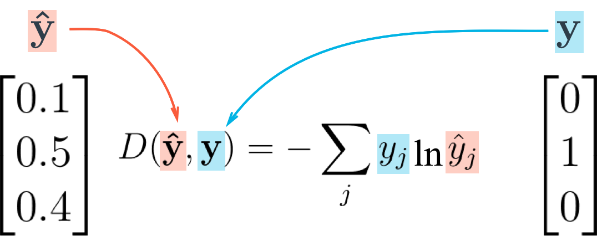

# TF.Learn

##tf的高级api:TF.Learn

```python
import tensorflow as tf
from tensorflow.examples.tutorials.mnist import input_data
mnist = input_data.read_data_sets('tmp/data/')
X_train = mnist.train.images
print(X_train.shape)
X_test = mnist.test.images
y_train = mnist.train.labels.astype("int")
y_test = mnist.test.labels.astype("int")
from sklearn.preprocessing import StandardScaler
scaler = StandardScaler()
X_train = scaler.fit_transform(X_train)
X_test = scaler.transform(X_test)
feature_columns = tf.contrib.learn.infer_real_valued_columns_from_input(X_train)
dnn_clf = tf.contrib.learn.DNNClassifier(hidden_units=[300, 100],n_classes=10,feature_columns=feature_columns)
# dnn_clf = tf.contrib.learn.SKCompat(dnn_clf)
dnn_clf.fit(X_train, y_train, batch_size=50, steps=40000)
from sklearn.metrics import accuracy_score
y_pred = list(dnn_clf.predict(X_test))
"""y_pre"""
accuracy_score(y_test,y_pred)
dnn_clf.evaluate(X_test, y_test)
```

## tf的低级api

底下两个链接非常清晰地说明了softmax和cross entropy的关系。**<u>先输出softmax，然后计算cross entropy的损失。</u>**

###softmax

The softmax function takes an N-dimensional vector of arbitrary real values and produces another N-dimensional vector with real values in the range (0, 1) that add up to 1.0. It maps :

And the actual per-element formula is:

It's easy to see that  is always positive (because of the exponents); moreover, since the numerator appears in the denominator summed up with some other positive numbers, . Therefore, it's in the range (0, 1).

For example, the 3-element vector `[1.0, 2.0, 3.0]` gets transformed into `[0.09, 0.24, 0.67]`. The order of elements by relative size is preserved, and they add up to 1.0. Let's tweak this vector slightly into:`[1.0, 2.0, 5.0]`. We get the output `[0.02, 0.05, 0.93]`, which still preserves these properties. Note that as the last element is farther away from the first two, it's softmax value is dominating the overall slice of size 1.0 in the output. Intuitively, the softmax function is a "soft" version of the maximum function. Instead of just selecting one maximal element, softmax breaks the vector up into parts of a whole (1.0) with the maximal input element getting a proportionally larger chunk, but the other elements getting some of it as well.

#### Probabilistic interpretation

The properties of softmax (all output values in the range (0, 1) and sum up to 1.0) make it suitable for a probabilistic interpretation that's very useful in machine learning. In particular, in multiclass classification tasks, we often want to assign probabilities that our input belongs to one of a set of output classes.

If we have N output classes, we're looking for an N-vector of probabilities that sum up to 1; sounds familiar?

We can interpret softmax as follows:

Where *y* is the output class numbered . *a* is any N-vector. The most basic example is [multiclass logistic regression](http://eli.thegreenplace.net/2016/logistic-regression/), where an input vector *x* is multiplied by a weight matrix *W*, and the result of this dot product is fed into a softmax function to produce probabilities. This architecture is explored in detail later in the post.

It turns out that - from a probabilistic point of view - softmax is optimal for [maximum-likelihood estimation](https://en.wikipedia.org/wiki/Maximum_likelihood_estimation) of the model's parameters. This is beyond the scope of this post, though. See chapter 5 of the ["Deep Learning" book](http://www.deeplearningbook.org/) for more details.

#### Some preliminaries from vector calculus

Before diving into computing the derivative of softmax, let's start with some preliminaries from vector calculus.

Softmax is fundamentally a vector function. It takes a vector as input and produces a vector as output; in other words, it has multiple inputs and multiple outputs. Therefore, we cannot just ask for "the derivative of softmax"; We should instead specify:

1. Which component (output element) of softmax we're seeking to find the derivative of.
2. Since softmax has multiple inputs, with respect to which input element the partial derivative is computed.

If this sounds complicated, don't worry. This is exactly why the notation of vector calculus was developed. What we're looking for is the partial derivatives:

This is the partial derivative of the i-th output w.r.t. the j-th input. A shorter way to write it that we'll be using going forward is: .

Since softmax is a  function, the most general derivative we compute for it is the Jacobian matrix:

In ML literature, the term "gradient" is commonly used to stand in for the derivative. Strictly speaking, gradients are only defined for scalar functions (such as loss functions in ML); for vector functions like softmax it's imprecise to talk about a "gradient"; the Jacobian is the fully general derivate of a vector function, but in most places I'll just be saying "derivative".

#### Derivative of softmax

Let's compute  for arbitrary *i* and *j*:

We'll be using the quotient rule of derivatives. For :

In our case, we have:

Note that no matter which  we compute the derivative of  for, the answer will always be . This is not the case for , howewer. The derivative of  w.r.t.  is  only if , because only then  has  anywhere in it. Otherwise, the derivative is 0.

Going back to our ; we'll start with the  case. Then, using the quotient rule we have:

For simplicity  stands for . Reordering a bit:

The final formula expresses the derivative in terms of  itself - a common trick when functions with exponents are involved.

Similarly, we can do the  case:

To summarize:

I like seeing this explicit breakdown by cases, but if anyone is taking more pride in being concise and clever than programmers, it's mathematicians. This is why you'll find various "condensed" formulations of the same equation in the literature. One of the most common ones is using the Kronecker delta function:

To write:

Which is, of course, the same thing. There are a couple of other formulations one sees in the literature:

1. Using the matrix formulation of the Jacobian directly to replace  with  - the identity matrix, whose elements are expressing  in matrix form.
2. Using "1" as the function name instead of the Kroneker delta, as follows: . Here  means the value 1 when  and the value 0 otherwise.

The condensed notation comes useful when we want to compute more complex derivatives that depend on the softmax derivative; otherwise we'd have to propagate the condition everywhere.

#### Computing softmax and numerical stability

A simple way of computing the softmax function on a given vector in Python is:

```
def softmax(x):
    """Compute the softmax of vector x."""
    exps = np.exp(x)
    return exps / np.sum(exps)

```

Let's try it with the sample 3-element vector we've used as an example earlier:

```
In [146]: softmax([1, 2, 3])
Out[146]: array([ 0.09003057,  0.24472847,  0.66524096])

```

However, if we run this function with larger numbers (or large negative numbers) we have a problem:

```
In [148]: softmax([1000, 2000, 3000])
Out[148]: array([ nan,  nan,  nan])

```

The numerical range of the floating-point numbers used by Numpy is limited. For `float64`, the maximal representable number is on the order of . Exponentiation in the softmax function makes it possible to easily overshoot this number, even for fairly modest-sized inputs.

A nice way to avoid this problem is by normalizing the inputs to be not too large or too small, by observing that we can use an arbitrary constant *C* as follows:

And then pushing the constant into the exponent, we get:

Since *C* is just an arbitrary constant, we can instead write:

Where *D* is also an arbitrary constant. This formula is equivalent to the original  for any *D*, so we're free to choose a *D* that will make our computation better numerically. A good choice is the maximum between all inputs, negated:

This will shift the inputs to a range close to zero, assuming the inputs themselves are not too far from each other. Crucially, it shifts them all to be negative (except the maximal  which turns into a zero). Negatives with large exponents "saturate" to zero rather than infinity, so we have a better chance of avoiding NaNs.

```
def stablesoftmax(x):
    """Compute the softmax of vector x in a numerically stable way."""
    shiftx = x - np.max(x)
    exps = np.exp(shiftx)
    return exps / np.sum(exps)

```

And now:

```
In [150]: stablesoftmax([1000, 2000, 3000])
Out[150]: array([ 0.,  0.,  1.])

```

Note that this is still imperfect, since mathematically softmax would never really produce a zero, but this is much better than NaNs, and since the distance between the inputs is very large it's expected to get a result extremely close to zero anyway.


### 交叉熵

交叉熵计算公式




```python
import tensorflow as tf
import numpy as np
from tensorflow.examples.tutorials.mnist import input_data
mnist = input_data.read_data_sets('tmp/data/')

"""先声明输入输出还有隐层个数"""
n_inputs = 28 * 28 # MNIST
n_hidden1 = 300
n_hidden2 = 100
n_outputs = 10

"""X的shape是(None,n_inputs)，None是不知道的每次训练实例个数"""
"""y是1D的tensor，但是我们不知道训练实例是多少，所以shape=(None)"""

X = tf.placeholder(tf.float32, shape=(None, n_inputs), name="X")
y = tf.placeholder(tf.int64, shape=(None), name="y")

"""X作为输入层，而且一个train batch里的实例同时被DNN处理"""
"""隐层间的不一样是他们所连接的神经元还有隐层各自包含的神经元数目"""

"""X是输入，n_neurons是神经元个数，name是该层的名字，还有用在该层的激活函数"""
def neuron_layer(X, n_neurons, name, activation=None):
    with tf.name_scope(name):
        n_inputs = int(X.get_shape()[1])
        stddev = 2 / np.sqrt(n_inputs)
        """用截断正太分布初始化保证了不会出现过大的W值从而避免了训练时GD缓慢"""
        init = tf.truncated_normal((n_inputs, n_neurons), stddev=stddev)
        """初始化该层的权重W"""
        W = tf.Variable(init,name="weights")
        b = tf.Variable(tf.zeros([n_neurons]), name="biases")
        z = tf.matmul(X,W) + b
        if activation=="relu":
            return tf.nn.relu(z)
        else:
            return z
        
"""创建一个Dnn"""
with tf.name_scope('dnn'):
    hidden1 = neuron_layer(X, n_hidden1, "hidden1", activation="relu")
    hidden2 = neuron_layer(hidden1, n_hidden2, "hidden2", activation="relu")
    logits = neuron_layer(hidden2, n_outputs,"outputs")
    
"""平均交叉熵作为损失函数的计算值"""
with tf.name_scope("loss"):
    xentropy = tf.nn.sparse_softmax_cross_entropy_with_logits(labels=y,logits=logits)
    loss = tf.reduce_mean(xentropy, name="loss")
    
learning_rate = 0.01

with tf.name_scope("train"):
    optimizer = tf.train.GradientDescentOptimizer(learning_rate)
    training_op = optimizer.minimize(loss)
    
with tf.name_scope("eval"):
    correct = tf.nn.in_top_k(logits, y, 1)
    accuracy = tf.reduce_mean(tf.cast(correct,tf.float32))

init = tf.global_variables_initializer()
saver = tf.train.Saver()

n_epochs = 40
batch_size = 50   
with tf.Session() as sess:
    init.run()
    for epoch in range(n_epochs):
        for iteration in range(mnist.train.num_examples// batch_size):
            X_batch, y_batch = mnist.train.next_batch(batch_size)
            sess.run(training_op, feed_dict={X:X_batch,y:y_batch})
        acc_train = accuracy.eval(feed_dict={X:X_batch, y:y_batch})
        acc_val = accuracy.eval(feed_dict={X:mnist.validation.images,
                                          y:mnist.validation.labels})
        print(epoch,  " Train accuracy:", acc_train," Val accuracy:", acc_val)
    save_path = saver.save(sess,"./my_model_final.ckpt")

    
"""调出模型进行测试"""
with tf.Session() as sess:
    saver.restore(sess, "./my_model_final.ckpt") # or better, use save_path
    X_new_scaled = mnist.test.images[:20]
    Z = logits.eval(feed_dict={X: X_new_scaled})
    y_pred = np.argmax(Z, axis=1)

print("Predicted classes:", y_pred)
print("Actual classes:   ", mnist.test.labels[:20])
```


# Reference

- [10_introduction_to_artificial_neural_networks](https://blog.csdn.net/NockinOnHeavensDoor/article/details/78984413)
- [The Softmax function and its derivative](https://eli.thegreenplace.net/2016/the-softmax-function-and-its-derivative/)
- [Classification and Loss Evaluation - Softmax and Cross Entropy Loss](https://deepnotes.io/softmax-crossentropy)

