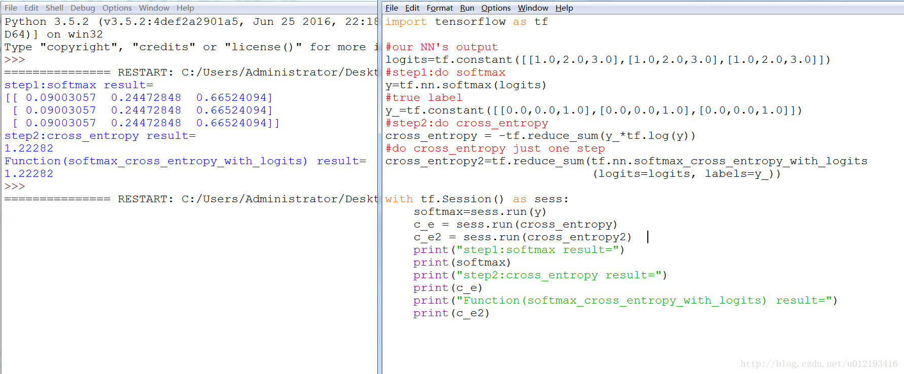
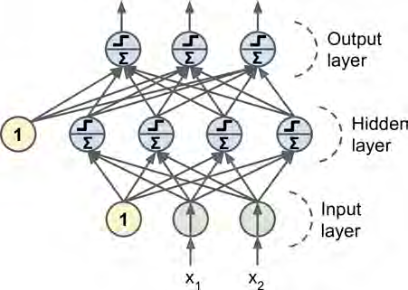
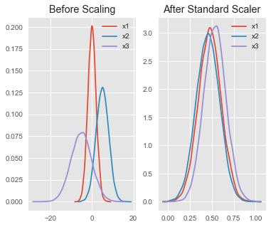
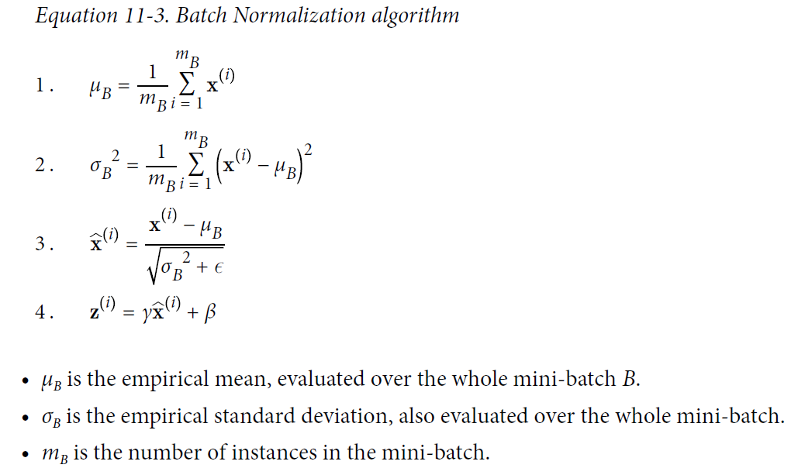
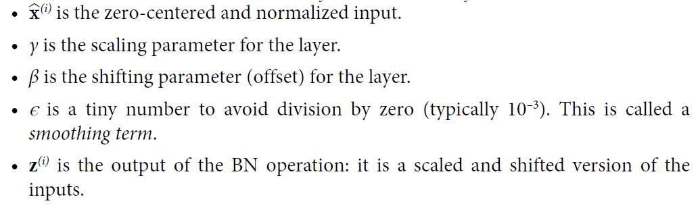
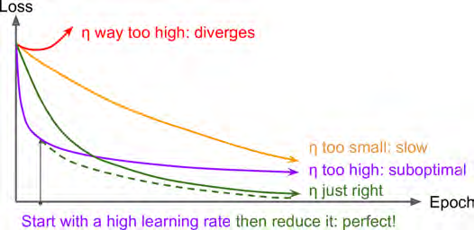
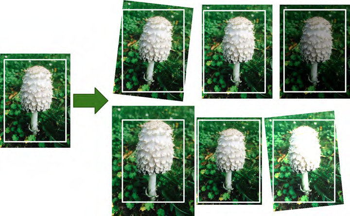

# Tensorflow

**<u>所有的数学计算</u>**：


先使用得到损失值 $$ C $$ 对输入的导数，这里的输入可以看做是下面的 $$ y_4 $$ ，其实下面可以当做是计算 $$ \frac{\partial C}{\partial y_4} $$ ，涉及到交叉熵损失和softmax进行求导（见下方常用函数中softmax的讲解），只不过举了逻辑回归的例子（下面这个公式可以见machine learning中logistic regression的讲解）。

 $$ \frac{\partial}{\partial{\theta_j}}l(\theta)=\sum_{i=1}^{m}(y^{(i)}-h_\theta(x^{(i)}))x^{(i)}_j $$ 

然后逐步返回计算网络中C对各个参数的导数（可结合“梯度消失和梯度爆炸章节的推导”），<u>**注意，只对一个参数，就看这一路，不用管其他支路**</u>。
$$
\begin{align}
&\frac{\partial C}{\partial b_1}=\frac{\partial C}{\partial y_4}\frac{\partial y_4}{\partial z_4}\frac{\partial z_4}{\partial x_4}\frac{\partial x_4}{\partial z_3}\frac{\partial z_3}{\partial x_3}\frac{\partial x_3}{\partial z_2}\frac{\partial z_2}{\partial x_2}\frac{\partial x_2}{\partial z_1}\frac{\partial z_1}{\partial b_1}\\
&=\frac{\partial C}{\partial y_4}\sigma'\left(z_4\right)w_4\sigma'\left(z_3\right)w_3\sigma'\left(z_2\right)w_2\sigma'\left(z_1\right)
\end{align}
$$
再进行移动，这就是反向传播的精髓，这里是举了逻辑回归的例子，**注意最后的公式中代入的值，其实就是训练数据输入和输出的值，如下面的 $$ x^{(i)} $$ 和 $$ y^{(i)} $$ 。**（下面这个公式可以见machine learning中logistic regression的讲解）

 $$ \theta_j=\theta_j+\alpha\sum_{i=1}^{m}(y^{(i)}-h_\theta(x^{(i)}))x^{(i)}_j=\theta_j+\alpha\sum_{i=1}^{m}(y^{(i)}-\frac{1}{1+e^{-{\theta^T}{x^{(i)}}}})x^{(i)}_j $$ 

J总结版：以分类为例。

- **<u>根据输入，经过激活函数，最后输出，然后会根据softmax和交叉熵损失函数计算出损失函数。</u>**
- **<u>然后计算损失函数对于softmax输入的求导，见tflearn.md中对于softmax的解释，其中第二张图片讲得很好，方便弄懂，只不过最后存在i写成了1这个错误。</u>**
- **<u>然后再利用上面第二个公式进行反向传播到具体的参数。上面的第一个第三个公式只是以激活函数为sigmoid作为例子来讲解一些具体情况，可以忽略。</u>**


**<u>整体的流程</u>**：

- 可以后面统一用with tf.Session() as sess，但是也可以先定义，这样后面按需要调用sess.run；
- 先构建图；
- 然后根据最后一层的输出，计算loss值；
  - 在定义计算图的时候，在适当的位置加上一些 [summary 操作](https://www.tensorflow.org/api_guides/python/summary) ；
- 接着进行train_op = optimizer.minimize；
- 接着初始化一些初始化变量的操作，比如global_variables_initializer，sess.run；
- 可能已经加了很多 summary 操作，我们需要使用 `tf.summary.merge_all` 来将这些 summary 操作聚合成一个操作，由它来产生所有 summary 数据，之后会在sess.run中被执行，才能保存下来这些量，放在这个位置的意图是清晰，前面额外加summary都没有关系。

```python
merged = tf.summary.merge_all()
```

- 通过 `tf.summary.FileWriter()` 指定一个目录来告诉程序把产生的文件放到哪。
- 保存模型，新建Savor对象，需要在构建完之后，常在上面的init后，这里因为临时多加了summary，也不会影响此语句位置，因为一直在后面。**Jsaver表示的就是最终保存在文件夹内的一个文件。**

```python
saver = tf.train.Saver(max_to_keep=100)
```

- (optional) 区分是否需要载入已有模型，从而继续训练。这段代码只运行一遍，因为sess.run并不会运行到这个位置。J注意其实每个模型都是不断迭代出来的结果。**表示的是使用saver对象的restore方法，将模型中的变量加载到sess中去。**

```python
ckpt = tf.train.get_checkpoint_state(model_path) #查看model下的checkpoint文件
if ckpt and ckpt.model_checkpoint_path: #查看是否已有模型存在，存在的话考虑重新读取，然后继续训练
    new_saver.restore(sess, ckpt.model_checkpoint_path) #表示的是使用saver对象的restore方法，将模型中的变量加载到sess中去。
    print("restore and continue training!")
else:
    pass
```

- 开始执行：有两种，一种是占位符的自己执行循环，另一种则是queuerunner的隐式循环
```python
# Start input enqueue threads.
coord = tf.train.Coordinator()
threads = tf.train.start_queue_runners(sess=sess, coord=coord)
try:
    step = sess.run(global_step) #初始化一次step值方便后面的第一次summary
    start_time = time.time()
    while not coord.should_stop(): #在此循环，等待是否有任何队列所关联的线程发出停止的消息，因为需要不断对批量数据进行迭代，之前设置的allow_smaller_final_batch=False也是这个道理保证只有最后批次才不满足batch，直到末尾触发了outofrange的error，才会退出while
        _, summary = sess.run([train_op, merged], {train_mode: True})
        train_writer.add_summary(summary, step)
        if step % 100 == 0: #因为一开始就是0，所以会对第一次进行统计
            duration = time.time() - start_time
            print('%.3f sec' % duration)
            start_time = time.time()
        if step % 1000 == 0:
            save_path = new_saver.save(sess, os.path.join(model_path, "model.ckpt"), global_step=global_step)
            print("Model saved in file: %s" % save_path)
        step = sess.run(global_step)
except tf.errors.OutOfRangeError:#到了末尾后，就会到这里
    print('Done training for %d epochs, %d steps.' % (epoch, step))
finally:#最后退出try模块，就会执行此步骤
    # When done, ask the threads to stop.
    save_path = new_saver.save(sess, os.path.join(model_path, "model.ckpt"), global_step=global_step)
    print("Model saved in file: %s" % save_path)
    coord.request_stop() #要求停止所有队列
# Wait for threads to finish.
coord.join(threads) #等待队列全部停止
sess.close() #关闭sess即可
```


- 在运行的时候使用 `add_summary()` 来将某一步的 summary 数据记录到文件中。其中step表示第几步的信息。

```python
#两种方式记录step，表示的是批次的第几批（考虑外部的epoch）
#一种是让optimizer.minimize自动加一
global_step = tf.Variable(0, name="global_step", trainable=False)
_, summary = sess.run([train_op, merged], {train_mode: True}) #注意因为要查询两个量的值，所以返回两个量，summary对应merged
train_writer.add_summary(summary, step) #注意这里的summary表示内容，step表示第几步
#还有一种就是自行计算
for batch_index in range(n_batches):
    X_batch, y_batch = fetch_batch(epoch, batch_index, batch_size)
    if batch_index % 10 == 0:
        summary_str = mse_summary.eval(feed_dict={X: X_batch, y: y_batch})
        step = epoch * n_batches + batch_index
        file_writer.add_summary(summary_str, step)
        sess.run(training_op, feed_dict={X: X_batch, y: y_batch})
```

- 在运行的时候，到了一定的步数，保存模型

```python
save_path = new_saver.save(sess, os.path.join(model_path, "model.ckpt"), global_step=global_step)
print("Model saved in file: %s" % save_path)
```

##安装（CPU版本，windows和linux都是这么安装）
```linux
conda create -n tf35 python=3.5
source activate tf35
pip install --upgrade jupyter matplotlib numpy pandas scipy scikit-learn
pip install --upgrade --ignore-installed tensorflow
```

##概念

### 在图的构建阶段，设置初始值，利用`tf.variable`设置更新哪些变量，然后设置梯度更新方法，最后设置`training_op`。然后在执行阶段，利用循环执行`sess.run(training_op)`就可以不断更新迭代了，此时不用考虑图中的初始值。最后用`best_theta.eval`把参数取出来即可。此外还有一个measure model的指标比如mse，因为这个指标是对所有样本而言的，常和tf.reduce_mean搭配使用

### 构造阶段和执行阶段
A TensorFlow program is typically split into two parts: the first part builds a computation graph (this is called the construction phase), and the second part runs it (this is the execution phase).

`Tensor`和`Operation`都是`Graph`中的对象。`Operation`是图的节点，`Tensor`是图的边上流动的数据。 

可以通过 graph.get_operation_by_name，或者 x.op 的方式获得该 OP 的详细信息

`tf.get_default_graph().get_operations()`可以得到图内所有的op。

```python
tf.reset_default_graph()
A = tf.placeholder(tf.float32, shape=(None, 3))
B = 5
# B = tf.constant(5) #注意此时表示标量5，而上面那种加法会让数组每个量都加上5
C = A + B
tf.get_default_graph().get_operations()
output:
[<tf.Operation 'Placeholder' type=Placeholder>,
 <tf.Operation 'add/y' type=Const>,
 <tf.Operation 'add' type=Add>]
```

### 构造阶段：常量，变量，计算都会生成op，也就是图中的node。
####**<u>所有的常量、变量和计算的操作都是  OP；变量包含的 OP 更加复杂（包括了它的初始值，变量类型，赋值，读取四个 OP ）。</u>**

An `Operation` is a node in a TensorFlow `Graph` that takes zero or more `Tensor` objects as input, and produces zero or more `Tensor` objects as output. Objects of type `Operation` are created by calling a Python op constructor (such as `tf.matmul`) or `tf.Graph.create_op`.

For example `c = tf.matmul(a, b)` creates an `Operation` of type "MatMul" that takes tensors `a`and `b` as input, and produces `c` as output.

After the graph has been launched in a session, an `Operation` can be executed by passing it to`tf.Session.run`. `op.run()` is a shortcut for calling `tf.get_default_session().run(op)`.

```python
import tensorflow as tf
with tf.device("/cpu:0"):
    a = tf.Variable(3.0, name='a1')
    b = tf.constant(4.0, name='b1')

c = tf.multiply(a, b, name="mul_c") #等同于 c = a*b
d = tf.multiply(c, 2, name="mul_d")
```

#### 利用[print(n) for n in tf.get_default_graph().get_operations()]去查看具体的node信息

#####查看节点，要么通过`python中的变量名.op`，要么通过`tf.get_default_graph().get_operation_by_name('节点名')`

```python
[print(n) for n in tf.get_default_graph().get_operations()]
[print(n.name) for n in tf.get_default_graph().get_operations()]

>>> [print(n.name) for n in tf.get_default_graph().get_operations()]
a1/initial_value
a1
a1/Assign
a1/read
b1
mul_c
mul_d/y
mul_d
```

#####对于计算只是计算本身会形成节点，而结果不会；此外如果计算中涉及到常数，也会生成节点

就如同`mul_d/y`

###张量就是多维数组
每一个op使用0个或多个Tensor, 执行一些计算，并生成0个或多个Tensor. 一个tensor就是一种多维数组。

```python
inputs = Input(shape=(784,))
inputs
#<tf.Tensor 'input_1:0' shape=(?, 784) dtype=float32>
#此表示It means that first dimension is not fixed in the graph and it can vary between run calls
```


###placeholder node占位符节点也是一种op，<u>先占位后赋值</u>（<u>注意无论是eval还是run都需要将参数feed_dict送入；另外eval只能对tensor对象解析，而其他list等需要用run</u>）
`tf.placeholder()` 操作(operation)允许你定义一种必须提供值的 tensor。

<u>To create a placeholder node, you must call the placeholder() function and specify the output tensor’s data type. Optionally, you can also specify its shape, if you want to enforce it. If you specify None for a dimension, it means “any size.”</u>

```linux
>>> A = tf.placeholder(tf.float32, shape=(None, 3))
>>> B = A + 5
>>> with tf.Session() as sess:
... B_val_1 = B.eval(feed_dict={A: [[1, 2, 3]]})
... B_val_2 = B.eval(feed_dict={A: [[4, 5, 6], [7, 8, 9]]})
...
>>> print(B_val_1)
[[ 6. 7. 8.]]
>>> print(B_val_2)
[[ 9. 10. 11.]
[ 12. 13. 14.]]
```

```python
X_batch, y_batch = fetch_batch(epoch, batch_index, batch_size)
sess.run(training_op,feed_dict={X:X_batch,y:y_batch}) #每次的训练数据X和y都不一样，所以需要用placeholder进行先占位，后赋值
```

###执行阶段（creates a session, initializes the variables,and evaluates）

`f.eval()` is equivalent to calling `tf.get_default_session().run(f)`或`sess.run(f)`。

```python
with tf.Session() as sess:
    x.initializer.run()
    y.initializer.run()
    result = f.eval()
```

#### 常用于进行调试使用：

```python
import tensorflow as tf
a = tf.constant(5.0)
b = tf.constant(6.0)
c = a * b
with tf.Session():
  # We can also use 'c.eval()' here.
  print(c.eval())
```


### 初始化（常用global_variables_initializer来代替每个变量.initializer）注意：只有变量才需要初始化Variable

Calling `x.initializer.run()` is equivalent to calling `tf.get_default_session().run(x.initializer)`

Instead of manually running the initializer for every single variable, you can use the
`global_variables_initializer()` function.

```python
init = tf.global_variables_initializer() # prepare an init node
with tf.Session() as sess:
    init.run() # actually initialize all the variables
    result = f.eval()
```

另外一种情况是：

**在使用string_input_producer来读记录的时候，如果设置了num_epochs的值，一定还要使用local_variables_initializer初始化一次（仅仅用global_variables_initializer会报错）**

```python
init_op = tf.group(tf.global_variables_initializer(), tf.local_variables_initializer())
sess.run(init_op)
```

`tf.initialize_all_variables()` is a shortcut to `tf.initialize_variables(tf.all_variables())`, `tf.initialize_local_variables()` is a shortcut to `tf.initialize_variables(tf.local_variables())`, which initializes variables in `GraphKeys.VARIABLES` and `GraphKeys.LOCAL_VARIABLE` collections, respectively.

Variables in `GraphKeys.LOCAL_VARIABLES` collection are variables that are added to the graph, but not saved or restored.

`tf.Variable()` by default adds a new variable to `GraphKeys.VARIABLE` collection, which can be controlled by collections= argument.

A local variable in TF is any variable which was created with `collections=[tf.GraphKeys.LOCAL_VARIABLES]`. For example:

```
e = tf.Variable(6, name='var_e', collections=[tf.GraphKeys.LOCAL_VARIABLES])
```

##常用函数

### `functools.partial`

当函数的参数个数太多，需要简化时，使用`functools.partial`可以创建一个新的函数，这个新函数可以固定住原函数的部分参数，从而在调用时更简单。

Python的`functools`模块提供了很多有用的功能，其中一个就是偏函数（Partial function）。要注意，这里的偏函数和数学意义上的偏函数不一样。

在介绍函数参数的时候，我们讲到，通过设定参数的默认值，可以降低函数调用的难度。而偏函数也可以做到这一点。举例如下：

`int()`函数可以把字符串转换为整数，当仅传入字符串时，`int()`函数默认按十进制转换：

```
>>> int('12345')
12345

```

但`int()`函数还提供额外的`base`参数，默认值为`10`。如果传入`base`参数，就可以做N进制的转换：

```
>>> int('12345', base=8)
5349
>>> int('12345', 16)
74565

```

假设要转换大量的二进制字符串，每次都传入`int(x, base=2)`非常麻烦，于是，我们想到，可以定义一个`int2()`的函数，默认把`base=2`传进去：

```
def int2(x, base=2):
    return int(x, base)

```

这样，我们转换二进制就非常方便了：

```
>>> int2('1000000')
64
>>> int2('1010101')
85

```

`functools.partial`就是帮助我们创建一个偏函数的，不需要我们自己定义`int2()`，可以直接使用下面的代码创建一个新的函数`int2`：

```
>>> import functools
>>> int2 = functools.partial(int, base=2)
>>> int2('1000000')
64
>>> int2('1010101')
85

```

所以，简单总结`functools.partial`的作用就是，把一个函数的某些参数给固定住（也就是设置默认值），返回一个新的函数，调用这个新函数会更简单。

### `np.random.randint`
low、high、size三个参数。默认high是None,如果只有low，那范围就是[0,low)。如果有high，范围就是[low,high)。
```linux
>>> np.random.randint(2, size=10)
array([1, 0, 0, 0, 1, 1, 0, 0, 1, 0])
```

### `np.random.rand`

`numpy.random.rand`(*d0*, *d1*, *...*, *dn*)

Random values in a given shape.

Create an array of the given shape and populate it with random samples from a uniform distribution over `[0, 1)`.

```linux
>>> np.random.rand(3,2)
array([[ 0.14022471,  0.96360618],  #random
       [ 0.37601032,  0.25528411],  #random
       [ 0.49313049,  0.94909878]]) #random
```

### `np.ceil`

ceil [siːl] 向正无穷取整 朝正无穷大方向取整
```linux
>>> a = np.array([-1.7, -1.5, -0.2, 0.2, 1.5, 1.7, 2.0])
>>> np.ceil(a)
array([-1., -1., -0.,  1.,  2.,  2.,  2.])
```

### `np.c_`
将切片对象沿第二个轴（按列）转换为连接。
```python
np.c_[np.array([1,2,3]), np.array([4,5,6])]  
Out[96]:   
array([[1, 4],  
       [2, 5],  
       [3, 6]])  
  
np.c_[np.array([[1,2,3]]), 0, 0, np.array([[4,5,6]])]  
Out[97]: array([[1, 2, 3, 0, 0, 4, 5, 6]])  
```

### `np.reshape`
新数组的shape属性应该要与原来数组的一致，即新数组元素数量与原数组元素数量要相等。**<u>一个参数为-1时，那么reshape函数会根据另一个参数的维度计算出数组的另外一个shape属性值。</u>**
```python
>>> z = np.array([[1, 2, 3, 4],[5, 6, 7, 8],[9, 10, 11, 12],[13, 14, 15, 16]])
>>> print(z)
[[ 1  2  3  4]
 [ 5  6  7  8]
 [ 9 10 11 12]
 [13 14 15 16]]
>>> print(z.shape)
(4, 4)
>>> print(z.reshape(-1)) #因为另一个参数为0，所以等于就是这个参数代表了全部数量
[ 1  2  3  4  5  6  7  8  9 10 11 12 13 14 15 16]
>>> print(z.reshape(-1,1))  #我们不知道z的shape属性是多少，
                            #但是想让z变成只有一列，行数不知道多少，
                            #通过`z.reshape(-1,1)`，Numpy自动计算出有16行，
                            #新的数组shape属性为(16, 1)，与原来的(4, 4)配套。
[[ 1]
 [ 2]
 [ 3]
 [ 4]
 [ 5]
 [ 6]
 [ 7]
 [ 8]
 [ 9]
 [10]
 [11]
 [12]
 [13]
 [14]
 [15]
 [16]]
>>> print(z.reshape(2,-1))
[[ 1  2  3  4  5  6  7  8]
 [ 9 10 11 12 13 14 15 16]]
```

### `np.argmax`
Returns the indices of the maximum values along an axis.

注意axis是与平时的0,1对应的x，y轴垂直的

```
>>> a = np.arange(6).reshape(2,3)
>>> a
array([[0, 1, 2],
       [3, 4, 5]])
>>> np.argmax(a)
5
>>> np.argmax(a, axis=0)
array([1, 1, 1])
>>> np.argmax(a, axis=1)
array([2, 2])
```

###`np.random.permutation`

Randomly permute a sequence, or return a permuted range.

```
>>> np.random.permutation(10)
array([1, 7, 4, 3, 0, 9, 2, 5, 8, 6])

>>> np.random.permutation([1, 4, 9, 12, 15])
array([15,  1,  9,  4, 12])
```

###`np.array_split`
Split an array into multiple sub-arrays.
```python
>>> x = np.arange(8.0)
>>> np.array_split(x, 3)
    [array([ 0.,  1.,  2.]), array([ 3.,  4.,  5.]), array([ 6.,  7.])]
```
###`np.linspace`

`numpy.linspace`(*start*, *stop*, *num=50*, *endpoint=True*, *retstep=False*, *dtype=None*)

Returns *num* evenly spaced samples, calculated over the interval [*start*, *stop*]. 

返回由num个数字分割点组成的一个array。<u>J常用于作图中。</u>

```linux
>>> np.linspace(2.0, 3.0, num=5)
array([ 2.  ,  2.25,  2.5 ,  2.75,  3.  ])
>>> np.linspace(2.0, 3.0, num=5, endpoint=False)
array([ 2. ,  2.2,  2.4,  2.6,  2.8])
```

### `tf.matmul`

Multiplies matrix `a` by matrix `b`, producing `a` * `b`.

`transpose_a`和`transpose_b`表示是否相乘前进行转置矩阵。

### `tf.matrix_inverse`
Computes the inverse of one or more square invertible matrices or their

### `tf.reduce_mean`
Computes the mean of elements across dimensions of a tensor.

### `tf.assign`
变量更新，将值赋给变量。
```python
training_op = tf.assign(theta, theta - learning_rate * gradients)

import tensorflow as tf

# We define a Variable
x = tf.Variable(0, dtype=tf.int32)

# We use a simple assign operation
assign_op = tf.assign(x, x + 1)

with tf.Session() as sess:
  sess.run(tf.global_variables_initializer())
  
  for i in range(5):
    print('x:', sess.run(x))
    sess.run(assign_op)
    
# outputs:
# x: 0
# x: 1
# x: 2
# x: 3
# x: 4
```

###`tf.maximum`


### `tf.add_n`

###`tf.nn.sparse_softmax_cross_entropy_with_logits`
该函数是将softmax和cross_entropy放在一起计算，对于分类问题而言，最后一般都是一个单层全连接神经网络，比如softmax分类器居多，对这个函数而言，tensorflow神经网络中是没有softmax层，而是在这个函数中进行softmax函数的计算。这里的logits通常是最后的全连接层的输出结果，labels是具体哪一类的标签，这个函数是直接使用标签数据的，而不是采用one-hot编码形式。

**J注意下面不是sparse开头，而是全部分量，所以spase开头就是一个label，其他都是0，下面都是围绕非sparse进行讨论！**




交叉熵刻画的是两个概率分布之间的距离，是分类问题中使用比较广泛的损失函数之一。给定两个概率分布p和q，通过交叉熵计算的两个概率分布之间的距离为：

 $$ {\displaystyle H(X=x)=-\sum_x{p(x)logq(x)}} $$ 

```python
def softmax_cross_entropy_with_logits(_sentinel=None,  # pylint: disable=invalid-name
                                      labels=None, logits=None,
                                      dim=-1, name=None):
    """Computes softmax cross entropy between `logits` and `labels`."""
```

- logits: 神经网络的最后一层输出，如果有batch的话，它的大小为[batch_size, num_classes], 单样本的话大小就是num_classes
- labels: 样本的实际标签，大小与logits相同。且必须采用labels=y_，logits=y的形式将参数传入。

具体的执行流程大概分为两步，第一步首先是对网络最后一层的输出做一个softmax，这一步通常是求取输出属于某一类的概率，对于单样本而言，就是输出一个num_classes大小的向量 $$ [Y1,Y2,Y3,....] $$ , 其中 $$ Y1,Y2,Y3 $$ 分别表示属于该类别的概率， softmax的公式为：

 $$ {\displaystyle softmax(x_i)={exp(x_i)\over{\sum_jexp(x_j)}}} $$ 

第二步是对softmax输出的向量 $$ [Y1,Y2,Y3,....] $$ 和样本的实际标签做一个交叉熵，公式如下：

 $$ H_{y'}(y)=-\sum_i{y_i'}log(y_i) $$ 

其中 $$ y_i' $$ 指代实际标签向量中的第i个值， $$ y_i $$ 就是softmax的输出向量 $$ [Y1,Y2,Y3,....] $$ 中的第i个元素的值。
显而易见。预测 $$ y_i $$ 越准确，结果的值就越小（前面有负号），最后求一个平均，就得到我们想要的loss了

**这里需要注意的是，这个函数返回值不是一个数，而是一个向量，如果要求交叉熵，我们要在做一步tf.resuce_sum操作，就是对向量里面的所有元素求和, 最后就能得到 $$ H_{y'}(y) $$ ,如果要求loss，则需要做一步tf.reduce_mean操作，对向量求均值.**

###`tf.nn.softmax`

此函数就等于计算到了上面的这一步，等于是算到了各个类的概率值：

 $$ softmax(x)_i={exp(x_i)\over{\sum_jexp(x_j)}} $$ 


###`tf.nn.in_top_k`

tf.nn.in_top_k组要是用于计算预测的结果和实际结果的是否相等，返回一个bool类型的张量，tf.nn.in_top_k(prediction, target, K):prediction就是表示你预测的结果，大小就是预测样本的数量乘以输出的维度，类型是tf.float32等。target就是实际样本类别的标签，大小就是样本数量的个数。K表示每个样本的预测结果的前K个最大的数里面是否含有target中的值。一般都是取1。

例如：
```python
import tensorflow as tf;  

A = [[0.8,0.6,0.3], [0.1,0.6,0.4]]  
B = [1, 1]  
out = tf.nn.in_top_k(A, B, 1)  
with tf.Session() as sess:  
	sess.run(tf.initialize_all_variables())  
	print sess.run(out)  
```

输出：
[False  True]

解释：因为A张量里面的第一个元素的最大值的标签是0，第二个元素的最大值的标签是1.。但是实际的确是1和1.所以输出就是False 和True。如果把K改成2，那么第一个元素的前面2个最大的元素的位置是0，1，第二个的就是1，2。实际结果是1和1。包含在里面，所以输出结果就是True 和True.如果K的值大于张量A的列，那就表示输出结果都是true

###`tf.layers.dense`

构建一个密集的图层。以神经元数量和激活函数作为参数。**J注意其中units表示输出的张量中的最后一个维度的大小。**

This layer implements the operation: `outputs = activation(inputs.kernel + bias)` Where `activation` is the activation function passed as the `activation` argument (if not `None`), `kernel`is a weights matrix created by the layer, and `bias` is a bias vector created by the layer (only if `use_bias` is `True`).

**<u>J常用来控制输出的个数，其形状如下图所示，每一个输入都对该层中的输出单元有输入，所以叫全连接。</u>**



### `tf.placeholder`和`tf.placeholder_with_default`

`tf.placeholder`插入一个坐等 **被feed_dict** 的 `tensor占位符` 。

> tf.placeholder (dtype, shape=None, name=None)

```
import tensorflow as tf

x = tf.placeholder(dtype=tf.int32)
print x
with tf.Session() as sess:
    print sess.run(x, feed_dict={x:[10, 20]})123456
```

```
Tensor("Placeholder:0", dtype=int32)

[10 20]
```

`tf.placeholder_with_default`与 `tf.placeholder` 不同的是，这里如果 未 被feed_dict，并不会 打印报错，而是打印出 默认数据。

> tf.placeholder_with_default (input, shape, name=None)

```
import tensorflow as tf

x = tf.placeholder_with_default(input=[3, 3], shape=(2,))
print x
with tf.Session() as sess:
    print sess.run(x)
    print sess.run(x, feed_dict={x:[10, 20]})
# 占位符 未 被feed_dict，打印默认输出
[3 3]

# 占位符 被feed_dict 了，打印 所被feed_dict 的内容
[10 20]
```

### `tf.layers.batch_normalization`

在网络中加入batch normalization的功能。

注意在tf.layers.dense之后使用，因为需要使用`tf.layers.batch_normalization`函数归一化层的输出，传递归一化后的值给激活函数。

### `tf.nn.elu`

Computes exponential linear: `exp(features) - 1` if < 0,`features` otherwise.

### `tf.control_dependencies`

**<u>执行某些`op,tensor`之前，某些`op,tensor`得首先被运行。</u>**

```python
with tf.name_scope("train"):
    optimizer = tf.train.GradientDescentOptimizer(learning_rate)
    extra_update_ops = tf.get_collection(tf.GraphKeys.UPDATE_OPS)
    with tf.control_dependencies(extra_update_ops):
        training_op = optimizer.minimize(loss)
sess.run(training_op, feed_dict={training: True, X: X_batch, y: y_batch})
```

**Note:** when training, the moving_mean and moving_variance need to be updated. By default the update ops are placed in `tf.GraphKeys.UPDATE_OPS`, so they need to be added as a dependency to the `train_op`. For example:

```python
update_ops = tf.get_collection(tf.GraphKeys.UPDATE_OPS)
with tf.control_dependencies(update_ops):
    train_op = optimizer.minimize(loss)
```

###`tf.get_collection`
从一个集合中取出全部变量，返回的是一个列表。
The list of values in the collection with the given name, or an empty list if no value has been added to that collection. The list contains the values in the order under which they were collected.

### `tf.clip_by_value`

tf.clip_by_value(A, min, max)：输入一个张量A，把A中的每一个元素的值都压缩在min和max之间。小于min的让它等于min，大于max的元素的值等于max。

###`tf.train.exponential_decay`

Applies exponential decay to the learning rate.

When training a model, it is often recommended to lower the learning rate as the training progresses. This function applies an exponential decay function to a provided initial learning rate. It requires a `global_step` value to compute the decayed learning rate. You can just pass a TensorFlow variable that you increment at each training step.

接着调用minimize函数，则会将global_step自动加一: Optional `Variable` to increment by one after the variables have been updated.

即在minimize中设置好global_step，那么程序就会将其不断加一。

###`tf.add_n`

Adds all input tensors element-wise. 就是将tensor进行一一相加。

```python
import tensorflow as tf;  
import numpy as np;  
  
input1 = tf.constant([1.0, 2.0, 3.0])  
input2 = tf.Variable(tf.random_uniform([3]))  
output = tf.add_n([input1, input2])  
  
with tf.Session() as sess:  
    sess.run(tf.initialize_all_variables())  
    print sess.run(input1 + input2)  
    print sess.run(output)  

输出：[ 1.68921876  2.73008633  3.04061747]
[ 1.68921876  2.73008633  3.04061747]
```

###`tf.layers.dropout`

**<u>J在构建阶段来看，就像是多加了一层，套在需要dropout的层上。</u>**

Applies Dropout to the input.

Dropout consists in randomly setting a fraction `rate` of input units to 0 at each update during training time, which helps prevent overfitting. The units that are kept are scaled by `1 / (1 - rate)`, so that their sum is unchanged at training time and inference time.

###`tf.nn.conv2d`

Computes a 2-D convolution given 4-D `input` and `filter` tensors.

返回一个 `Tensor`. Has the same type as `input`

### `tf.layer.conv2d`

与上面相同，只是the default `activation` is now `None` instead of `tf.nn.relu`

- **filters**: Integer, the dimensionality of the output space (i.e. the number of filters in the convolution).
- **kernel_size**: An integer or tuple/list of 2 integers, specifying the height and width of the 2D convolution window. Can be a single integer to specify the same value for all spatial dimensions.

###`tf.nn.max_pool`

Performs the max pooling on the input.

The ksize argument contains the kernel shape along all four dimensions of the input tensor: [batch size, height, width, channels]. TensorFlow currently does not support pooling over multiple instances, so the first element of ksize must be equal to 1. Moreover, it does not support pooling over both the spatial dimensions (height and width) and the depth dimension, so either ksize[1] and ksize[2] must both be equal to 1, or ksize[3] must be equal to 1.

### `tf.reshape`

**<u>tensor的形状都是从末尾开始堆积的，也就是表示最内侧。</u>**比如下面的3表示最内侧，2表示最外侧。-1 can also be used to infer the shape。

```python
# tensor 't' is [1, 2, 3, 4, 5, 6, 7, 8, 9]
# -1 is inferred to be 3:
reshape(t, [ 2, -1, 3]) ==> [[[1, 1, 1],
                              [2, 2, 2],
                              [3, 3, 3]],
                             [[4, 4, 4],
                              [5, 5, 5],
                              [6, 6, 6]]]

# tensor 't' is [[[1, 1, 1],
#                 [2, 2, 2]],
#                [[3, 3, 3],
#                 [4, 4, 4]],
#                [[5, 5, 5],
#                 [6, 6, 6]]]
# tensor 't' has shape [3, 2, 3]
# pass '[-1]' to flatten 't'
reshape(t, [-1]) ==> [1, 1, 1, 2, 2, 2, 3, 3, 3, 4, 4, 4, 5, 5, 5, 6, 6, 6]
```

### `tf.transpose`

Transposes `a`. Permutes the dimensions according to `perm` .

```python
X_batch = np.array([
        # t = 0      t = 1 
        [[0, 1, 2], [9, 8, 7]], # instance 1  #最内是3，即input
        [[3, 4, 5], [0, 0, 0]], # instance 2  #次内是2，即n_step
        [[6, 7, 8], [6, 5, 4]], # instance 3  #最外是4，即mini batch size
        [[9, 0, 1], [3, 2, 1]], # instance 4
    ])
X_test = tf.transpose(X, perm=[1, 0, 2])
[[[0. 1. 2.]
  [3. 4. 5.]
  [6. 7. 8.]
  [9. 0. 1.]]
 [[9. 8. 7.]
  [0. 0. 0.]
  [6. 5. 4.]
  [3. 2. 1.]]]

具体计算时是这么计算的，先将各个元素的坐标写出来，然后根据transpose的规则，对各个元素坐标进行变化，然后组合起来：
[[[0, 1, 2], 
 [9, 8, 7]], 
[[3, 4, 5], 
 [0, 0, 0]], 
[[6, 7, 8],
 [6, 5, 4]], 
[[9, 0, 1],
 [3, 2, 1]]]
比如上面的4*2*3,那么左上角是0*0*0，而倒数第二行的9是3*0*0。
那么经过transpose后，就会变成2*4*3，意味着第一个维度和第二个维度进行互换，变成了0*0*0和0*3*0。

```

###`tf.unstack`

Unpacks the given dimension of a rank-`R` tensor into rank-`(R-1)` tensors. 降一个维度。

```pyhon
[array([[0., 1., 2.],
       [3., 4., 5.],
       [6., 7., 8.],
       [9., 0., 1.]], dtype=float32), 
array([[9., 8., 7.],
       [0., 0., 0.],
       [6., 5., 4.],
       [3., 2., 1.]], dtype=float32)]
```

###`tf.reverse_v2`
Reverses specific dimensions of a tensor.对特定的维度，反转，也就是逆序。

```python
# tensor 't' is [[[[ 0,  1,  2,  3],
#                  [ 4,  5,  6,  7],
#                  [ 8,  9, 10, 11]],
#                 [[12, 13, 14, 15],
#                  [16, 17, 18, 19],
#                  [20, 21, 22, 23]]]]
# tensor 't' shape is [1, 2, 3, 4]

# 'dims' is [3] or 'dims' is [-1]
reverse(t, dims) ==> [[[[ 3,  2,  1,  0],
                        [ 7,  6,  5,  4],
                        [ 11, 10, 9, 8]],
                       [[15, 14, 13, 12],
                        [19, 18, 17, 16],
                        [23, 22, 21, 20]]]]
```

### `tf.truncated_normal_initializer`
Initializer that generates a truncated normal distribution.
相比起正态分布，此截断正太分布将会剔除两个标准差以外的区域。
These values are similar to values from a random_normal_initializer except that values more than two standard deviations from the mean are discarded and re-drawn. **This is the recommended initializer for neural network weights and filters.**

### `tf.multiply`

Returns x * y element-wise. 

但是如果没有相同尺寸的话，会补齐，见下面实例。


```python
import tensorflow as tf  
 
#两个矩阵相乘
x=tf.constant([[1.0,2.0,3.0],[1.0,2.0,3.0],[1.0,2.0,3.0]])  
y=tf.constant([[0,0,1.0],[0,0,1.0],[0,0,1.0]])
z=tf.multiply(x,y)
 
#两个数相乘
x1=tf.constant(1)
y1=tf.constant(2)
z1=tf.multiply(x1,y1)
 
#数和矩阵相乘
x2=tf.constant([[1.0,2.0,3.0],[2.0,4.0,6.0],[3.0,5.0,7.0]])
y2=tf.constant([2.0,2.0,1.0])
z2=tf.multiply(x2,y2)
 
with tf.Session() as sess:  
    print(sess.run(z))
    print(sess.run(z1))
    print(sess.run(z2))

[[ 0.  0.  3.]
 [ 0.  0.  3.]
 [ 0.  0.  3.]]
2
[[  2.   4.   3.]
 [  4.   8.   6.]
 [  6.  10.   7.]]
```

###`tf.losses.absolute_difference`
Adds an Absolute Difference loss to the training procedure.
 $$ {\displaystyle D_{i}=|x_{i}-m(X)|} $$ 

###`tf.argmax`
Returns the index with the largest value across axes of a tensor. (deprecated arguments)
```python
import tensorflow as tf
a=tf.get_variable(name='a',
                  shape=[3,4],
                  dtype=tf.float32,
                  initializer=tf.random_uniform_initializer(minval=-1,maxval=1))
b=tf.argmax(input=a,axis=0)
c=tf.argmax(input=a,dimension=1)   #此处用dimesion或用axis是一样的
sess = tf.InteractiveSession()
sess.run(tf.initialize_all_variables())
print(sess.run(a))
#[[ 0.04261756 -0.34297419 -0.87816691 -0.15430689]
# [ 0.18663144  0.86972666 -0.06103253  0.38307118]
# [ 0.84588599 -0.45432305 -0.39736366  0.38526249]]
print(sess.run(b))
#[2 1 1 2]
print(sess.run(c))
#[0 1 0]
```

### `tf.map_fn`

```
map_fn(
    fn,
    elems,
    dtype=None,
    parallel_iterations=10,
    back_prop=True,
    swap_memory=False,
    infer_shape=True,
    name=None
)
```

map_fn 的最简单版本反复地将可调用的 fn 应用于从第一个到最后一个的元素序列。这些元素由 elems 解压缩的张量构成。dtype 是 fn 的返回值的数据类型。如果与elems 的数据类型不同，用户必须提供 dtype。 

从0维度的 elems 中解压的张量列表上的映射。  

```python
elems = np.array([1, 2, 3, 4, 5, 6])
squares = map_fn(lambda x: x * x, elems)
# squares == [1, 4, 9, 16, 25, 36]
```

###`tf.image.per_image_standardization`

This op computes `(x - mean) / adjusted_stddev`, where `mean` is the average of all values in image, and `adjusted_stddev = max(stddev, 1.0/sqrt(image.NumElements()))`.

`stddev` is the standard deviation of all values in `image`. It is capped away from zero to protect against division by 0 when handling uniform images.

### `tf.gather`

类似于数组的索引，可以把向量中某些索引值提取出来，得到新的向量，适用于要提取的索引为不连续的情况。这个函数似乎只适合在一维的情况下使用。 

```python
import tensorflow as tf 

a = tf.Variable([[1,2,3,4,5], [6,7,8,9,10], [11,12,13,14,15]])
index_a = tf.Variable([0,2])

b = tf.Variable([1,2,3,4,5,6,7,8,9,10])
index_b = tf.Variable([2,4,6,8])

with tf.Session() as sess:
    sess.run(tf.global_variables_initializer())
    print(sess.run(tf.gather(a, index_a)))
    print(sess.run(tf.gather(b, index_b)))

#  [[ 1  2  3  4  5]
#   [11 12 13 14 15]]

#  [3 5 7 9]
```

###`tf.nn.bias_add`

Adds `bias` to `value`. 
一个叫bias的向量加到一个叫value的矩阵上，是向量与矩阵的每一行进行相加，得到的结果和value矩阵大小相同。
```python
import tensorflow as tf
 
a=tf.constant([[1,1],[2,2],[3,3]],dtype=tf.float32)
b=tf.constant([1,-1],dtype=tf.float32)
c=tf.constant([1],dtype=tf.float32)
 
with tf.Session() as sess:
    print('bias_add:')
    print(sess.run(tf.nn.bias_add(a, b)))
    #执行下面语句错误
    #print(sess.run(tf.nn.bias_add(a, c)))
```

输出结果：

```
bias_add:
[[ 2. 0.]
[ 3. 1.]
[ 4. 2.]]
```

###`tf.nn.log_softmax`

就是对softmax的结果，进行log计算。计算公式为：`logsoftmax = logits - log(reduce_sum(exp(logits), axis)) `，前者是因为与log抵消了，所以提取出来。

由于softmax输出都是0-1之间的，因此logsofmax输出的是小于0的数，

###`tf.one_hot`

Returns a one-hot tensor. 

tf.one_hot()函数规定输入的元素indices从0开始，最大的元素值不能超过（depth - 1），因此能够表示（depth + 1）个单位的输入。若输入的元素值超出范围，输出的编码均为 [0, 0 … 0, 0]。

indices = 0 对应的输出是[1, 0 … 0, 0], indices = 1 对应的输出是[0, 1 … 0, 0], 依次类推，最大可能值的输出是[0, 0 … 0, 1].
```python
indices = [0, 1, 1, 2]
depth = 3
tf.one_hot(indices, depth)  # output: [4 x 3]
//[[1. 0. 0.]
// [0. 1. 0.]
// [0. 1. 0.]
// [0. 0. 1.]]
```

###`tf.reduce_sum`
```python
reduce_sum应该理解为压缩求和，用于降维

# 'x' is [[1, 1, 1]

#         [1, 1, 1]]

#求和

tf.reduce_sum(x) ==> 6

#按列求和

tf.reduce_sum(x, 0) ==> [2, 2, 2]

#按行求和

tf.reduce_sum(x, 1) ==> [3, 3]

#按照行的维度求和

tf.reduce_sum(x, 1, keep_dims=True) ==> [[3], [3]]

#行列求和

tf.reduce_sum(x, [0, 1]) ==> 6
```

###`tf.metrics.accuracy`

**J这个例子告诉了我们为什么对于大数据不能全部读取时，需要用两个tensorflow的操作：一个更新`update_op`，一个最终计算：`accuracy`**

Calculates how often `predictions` matches `labels`.

 ```
tf.metrics.accuracy(
    labels,
    predictions,
    weights=None,
    metrics_collections=None,
    updates_collections=None,
    name=None
)
 ```

- 会同样地创建两个变量（变量会加入`tf.GraphKeys.LOCAL_VARIABLES`集合中），并将其放入幕后的计算图中：
- `total`（相当于`N_CORRECT`）
- `count`（相当于`N_ITEMS_SEEN`）
- 返回两个tensorflow操作。
- `accuracy`（相当于`calculate_accuracy()`）
- `update_op`（相当于`update_running_variables()`）

```python
#原理示例：
# Create running variables
N_CORRECT = 0
N_ITEMS_SEEN = 0

def reset_running_variables():
    """ Resets the previous values of running variables to zero     """
    global N_CORRECT, N_ITEMS_SEEN
    N_CORRECT = 0
    N_ITEMS_SEEN = 0

def update_running_variables(labs, preds):
    global N_CORRECT, N_ITEMS_SEEN
    N_CORRECT += (labs == preds).sum()
    N_ITEMS_SEEN += labs.size

def calculate_accuracy():
    global N_CORRECT, N_ITEMS_SEEN
    return float(N_CORRECT) / N_ITEMS_SEEN

reset_running_variables()

for i in range(n_batches):
    update_running_variables(labs=labels[i], preds=predictions[i])

accuracy = calculate_accuracy()
print("[NP] SCORE: ", accuracy)

[OUTPUT]
[NP] SCORE:  0.6875
```

### `tf.nn.embedding_lookup` 

tf.nn.embedding_lookup函数的用法主要是选取一个张量里面索引对应的元素。tf.nn.embedding_lookup（tensor, id）:tensor就是输入张量，id就是张量对应的索引，其他的参数不介绍。 

```python
import tensorflow as tf;
import numpy as np;
 
c = np.random.random([10,1])
b = tf.nn.embedding_lookup(c, [1, 3])
 
with tf.Session() as sess:
	sess.run(tf.initialize_all_variables())
	print sess.run(b)
	print c
```

```
[[ 0.77505197]
 [ 0.20635818]]
[[ 0.23976515]
 [ 0.77505197]
 [ 0.08798201]
 [ 0.20635818]
 [ 0.37183035]
 [ 0.24753178]
 [ 0.17718483]
 [ 0.38533808]
 [ 0.93345168]
 [ 0.02634772]]

分析：输出为张量的第一和第三个元素。
```

### `tf.expand_dims`

 Inserts a dimension of 1 into a tensor's shape. 

```python
# 't' is a tensor of shape [2]
tf.shape(tf.expand_dims(t, 0))  # [1, 2]
tf.shape(tf.expand_dims(t, 1))  # [2, 1]
tf.shape(tf.expand_dims(t, -1))  # [2, 1]
```

###`tf.slice`

begin的意思是起始位置，size的意思是每个维度的大小，也就是每个维度取几个元素。size的应该是最后输出的tensor的shape。如果size中输入值是-1的话，在那个维度剩下的数都会slice走。 

```python
t = tf.constant([
    [
        [1, 1, 1], 
        [2, 2, 2]
    ], 
    [
        [3, 3, 3], 
        [4, 4, 4]
    ], 
    [
        [5, 5, 5], 
        [6, 6, 6]
    ]
])

tf.slice(t, [1, 0, 0], [1, 1, 3])
```

咱们把这个t分解一下看就好理解了。那一大堆有括号的t，只看它最外面的括号的话，可以看成是：

> t = [A, B, C]   #这是第一维度

然后每一个里面有两个东西，可以写成：

> A = [i, j]， B = [k, l]， C = [m, n]  #这是第二维度

最后，这i, j, k, l, m, n里面分别是：

> i = [1, 1, 1], j = [2, 2, 2], k = [3, 3 ,3], l = [4, 4, 4], m = [5, 5, 5], n = [6, 6, 6]  # 这是第三维度

所以shape就是中括号 [ ] 的层级里单位的数量。

对于t来说，最外面括号里有3个东西，分别是A, B, C。这三个东西每个里面有两个玩意儿, i和j, k和l, m和n。

他们里面每一个又有3个数字。所以t的shape是**[3,2,3]**。

这里根据顺序我们知道，begin是[1, 0, 0], size是[1, 1, 3].  他们两个数组的意义是从左至右，每一个数字代表一个维度。上面说了**begin的意思是起始位置**，那么[1, 0, 0]的意思是在3个维度中，每个维度从哪里算起。

第一维度是[A, B, C]。 begin里[1, 0, 0]是1，也就是从B算起。其次第二维度里B = [k, l]（注意啊，我这里只写了B = [k, l]，可不代表只有B有用，如果size里第一个数字是2的话，B和C都会被取的），begin里第二个数是0，也就是从k算起。第三维度k = [3, 3 ,3]，begin里第三个数是0，就是从第一个3算起。

到现在都能看懂吧？知道了这三个起始点之后，再来看size。

**size的意思是每个维度的大小，也就是每个维度取几个元素。size的应该是最后输出的tensor的shape**。

例子里面：

> tf.slice(t, [1, 0, 0], [1, 1, 3])  # size = [1, 1, 3]

size里第一个是1，意思是在第一个维度取1个元素。t = [A, B, C] begin是起算是B，取一个那就是B了呗。那么第一维度结果就是**[B]**

size第二个也是1，第二维度B = [k, l]， begin里起算是k，取一个是k。那么第二维度结果是**[[k]]**。

size第三个是3,第三维度k = [3, 3 ,3]，begin里起算是第一个3。三个3取3个数，那就要把三个3都取了，所以是

> [[[3, 3, 3]]]

看懂了吗？是不是有点像代数？[B]里把B换成[k]， 再把k换成[3, 3 ,3]。最后注意中括号的数量，和size一样是[1, 1, 3].

 ```python
t = tf.constant([[[1, 1, 1], [2, 2, 2]], [[3, 3, 3], [4, 4, 4]], [[5, 5, 5], [6, 6, 6]]])

tf.slice(t, [1, 0, 0], [1, 2, 3])

[[[3, 3, 3], [4, 4, 4]]]
 ```

```python
t = tf.constant([[[1, 1, 1], [2, 2, 2]], [[3, 3, 3], [4, 4, 4]], [[5, 5, 5], [6, 6, 6]]])

tf.slice(t, [1, 0, 0], [-1, -1, -1])

[[[3,3,3], [4,4,4]], [[5,5,5], [6,6,6]]]
```

### `tf.cast`

tf.cast：用于改变某个张量的数据类型

例如：

import tensorflow as tf;
import numpy as np;

A = tf.convert_to_tensor(np.array([[1,1,2,4], [3,4,8,5]]))

with tf.Session() as sess:
	print A.dtype
	b = tf.cast(A, tf.float32)
	print b.dtype
输出：
<dtype: 'int64'>
<dtype: 'float32'>

开始的时候定义A没有给出类型，采用默认类型，整形。利用tf.cast函数就改为float类型
### tensorflow算术运算中的Broadcasting 

当两个数组进行算术运算时，**NumPy 从后向前，逐元素比较两个数组的形状**。当逐个比较的元素值满足以下条件时，认为满足 Broadcasting 的条件：

1. **相等**
2. **其中一个是1**

当不相同的维度时，会将1拉长复制到另一个数组的维度。

```python
to_mask = tf.cast(
  tf.reshape(to_mask, [batch_size, 1, to_seq_length]), tf.float32)

# We don't assume that `from_tensor` is a mask (although it could be). We
# don't actually care if we attend *from* padding tokens (only *to* padding)
# tokens so we create a tensor of all ones.
#
# `broadcast_ones` = [batch_size, from_seq_length, 1]
broadcast_ones = tf.ones(
  shape=[batch_size, from_seq_length, 1], dtype=tf.float32)

# Here we broadcast along two dimensions to create the mask.
mask = broadcast_ones * to_mask

[[[1. 1. 1. 0. 0.]]

 [[1. 1. 1. 1. 1.]]]

[[[1.]
  [1.]
  [1.]
  [1.]
  [1.]]

 [[1.]
  [1.]
  [1.]
  [1.]
  [1.]]]

[[[1. 1. 1. 0. 0.]
  [1. 1. 1. 0. 0.]
  [1. 1. 1. 0. 0.]
  [1. 1. 1. 0. 0.]
  [1. 1. 1. 0. 0.]]

 [[1. 1. 1. 1. 1.]
  [1. 1. 1. 1. 1.]
  [1. 1. 1. 1. 1.]
  [1. 1. 1. 1. 1.]
  [1. 1. 1. 1. 1.]]]
```


## 数据标准化

### Standard Scaler

The `StandardScaler` assumes your data is normally distributed within each feature and will scale them such that the distribution is now centred around 0, with a standard deviation of 1.

The mean and standard deviation are calculated for the feature and then the feature is scaled based on:

 $$ \dfrac{x_i – mean(x)}{stdev(x)} $$ 

**<u>If data is not normally distributed, this is not the best scaler to use.</u>**

但是不是根据值得到百分位数，所以可以转换。

**<u>1) Just keep in mind that the distribution of z-scores will mirror the original distribution. Since your distribution is skewed left, the distribution of z-scores will be skewed left.</u>**

**<u> 2)Regardless of whether it's normal or not.The issue of normality or not is what it will be used for. If you're going to compute their income percentile off a Gaussian distribution table than it's invalid. If you're going to do some other transformation with the z-score, then it's fine.</u>**

Let’s take a look at it in action:

In [1]:

```
import pandas as pd
import numpy as np
from sklearn import preprocessing
import matplotlib
import matplotlib.pyplot as plt
import seaborn as sns
%matplotlib inline
matplotlib.style.use('ggplot')
```

In [2]:

```
np.random.seed(1)
df = pd.DataFrame({
    'x1': np.random.normal(0, 2, 10000),
    'x2': np.random.normal(5, 3, 10000),
    'x3': np.random.normal(-5, 5, 10000)
})

scaler = preprocessing.StandardScaler()
scaled_df = scaler.fit_transform(df)
scaled_df = pd.DataFrame(scaled_df, columns=['x1', 'x2', 'x3'])

fig, (ax1, ax2) = plt.subplots(ncols=2, figsize=(6, 5))

ax1.set_title('Before Scaling')
sns.kdeplot(df['x1'], ax=ax1)
sns.kdeplot(df['x2'], ax=ax1)
sns.kdeplot(df['x3'], ax=ax1)
ax2.set_title('After Standard Scaler')
sns.kdeplot(scaled_df['x1'], ax=ax2)
sns.kdeplot(scaled_df['x2'], ax=ax2)
sns.kdeplot(scaled_df['x3'], ax=ax2)
plt.show()
```



All features are now on the same scale relative to one another.

### fit_transform区别：对训练数据fit得到参数均值和方差，从而对测试数据transform

To center the data (make it have zero mean and unit standard error), you subtract the mean and then divide the result by the standard deviation.

 $$ x' = \frac{x-\mu}{\sigma} $$ 

You do that on the training set of data. But then you have to apply the same transformation to your testing set (e.g. in cross-validation), or to newly obtained examples before forecast. But you have to use the same two parameters  $$ \mu $$  and  $$ \sigma $$  (values) that you used for centering the training set.

Hence, every sklearn's transform's `fit()` just calculates the parameters (e.g.  $$ \mu $$  and  $$ \sigma $$  in case of StandardScaler and saves them as an internal objects state. Afterwards, you can call its `transform()` method to apply the transformation to a particular set of examples.

`fit_transform()` joins these two steps and is used for the initial fitting of parameters on the training set xx, but it also returns a transformed x′x′. Internally, it just calls first `fit()` and then `transform()`on the same data.

## 自动微分

`tf.gradients`：`gradients = tf.gradients(mse, [theta])[0] `

The gradients() function takes an op (in this case mse) and a list of variables (in this case just theta), and it creates a list of ops (one per variable) to compute the gradients of the op with regards to each variable. So the gradients node will compute the gradient vector of the MSE with regards to theta.

```python
#Manually Computing the Gradients
n_epochs = 1000
learning_rate = 0.01
X = tf.constant(scaled_housing_data_plus_bias, dtype=tf.float32, name="X")
y = tf.constant(housing.target.reshape(-1, 1), dtype=tf.float32, name="y")
theta = tf.Variable(tf.random_uniform([n + 1, 1], -1.0, 1.0), name="theta")
y_pred = tf.matmul(X, theta, name="predictions")
error = y_pred - y
mse = tf.reduce_mean(tf.square(error), name="mse")
gradients = 2/m * tf.matmul(tf.transpose(X), error) #calculate the gradient
#注意这里实际上的结果应该是error*X。但是由于我们要得到的gradients是n+1行1列，因此需要根据结果来调整相乘的方法，这就是加入转置的原因！！！！
training_op = tf.assign(theta, theta - learning_rate * gradients) #assign the new value to variable
init = tf.global_variables_initializer()
with tf.Session() as sess:
    sess.run(init)
    for epoch in range(n_epochs): #一共1000次迭代，每一次都要全部计算所有样本的误差从而更新梯度
        if epoch % 100 == 0:
            print("Epoch", epoch, "MSE =", mse.eval())
        sess.run(training_op)
    best_theta = theta.eval()
#autodiff
gradients = tf.gradients(mse, [theta])[0] #calculate the gradient
#optimizer：用此二句代替gradients和tf.assign的这两句
optimizer = tf.train.GradientDescentOptimizer(learning_rate=learning_rate) #calculate the gradient
training_op = optimizer.minimize(mse)  #assign the new value to variable
```

### <u>使用optimizer及其minimize无需指定赋值新量</u>

`optimizer.minimize`：Add operations to minimize `loss` by updating `var_list`.

 **var_list**: Optional list or tuple of `Variable` objects to update to minimize `loss`. Defaults to the list of variables collected in the graph under the key `GraphKeys.TRAINABLE_VARIABLES`.

注意对于`tf.variable`来说，其参数**trainable**: If `True`, the default, also adds the variable to the graph collection `GraphKeys.TRAINABLE_VARIABLES`. This collection is used as the default list of variables to use by the `Optimizer` classes.

**J就是说用`tf.variable`就是设置需要优化的变量了。可用`tf.trainable_variables`召回所有的训练的变量。**

## 优化算法

深度学习的优化算法，说白了就是梯度下降。每次的参数更新有两种方式。

第一种，遍历全部数据集算一次损失函数，然后算函数对各个参数的梯度，更新梯度。这种方法每更新一次参数都要把数据集里的所有样本都看一遍，计算量开销大，计算速度慢，不支持在线学习，这称为**Batch gradient descent，批梯度下降**。

另一种，每看一个数据就算一下损失函数，然后求梯度更新参数，这个称为**随机梯度下降，stochastic gradient descent**。这个方法速度比较快，但是收敛性能不太好，可能在最优点附近晃来晃去，hit不到最优点。两次参数的更新也有可能互相抵消掉，造成目标函数震荡的比较剧烈。

为了克服两种方法的缺点，现在一般采用的是一种折中手段，**mini-batch gradient decent，小批的梯度下降**，这种方法把数据分为若干个批，按批来更新参数，这样，一个批中的一组数据共同决定了本次梯度的方向，下降起来就不容易跑偏，减少了随机性。另一方面因为批的样本数与整个数据集相比小了很多，计算量也不是很大。

```python
import tensorflow as tf
import numpy as np
from sklearn.datasets import fetch_california_housing
from sklearn.preprocessing import StandardScaler

tf.reset_default_graph()
housing = fetch_california_housing()
m, n = housing.data.shape
housing_data_plus_bias = np.c_[np.ones((m, 1)), housing.data]
scaler = StandardScaler().fit(housing_data_plus_bias)
scaled_housing_data_plus_bias = scaler.transform(housing_data_plus_bias) #standard the data, m * n+1
# 而y是m行1列
""" mini-batch GD """
n_epochs = 1000
learning_rate = 0.01
X = tf.placeholder(dtype=tf.float32, shape=(None,n +1), name="X") #因为不知道多少行，多少个样本，所以设置为None
y = tf.placeholder(dtype=tf.float32, shape=(None,1), name ="y")

theta = tf.Variable(tf.random_uniform([n+1 ,1],-1, 1,seed=42), name="theta")
y_pred = tf.matmul(X, theta, name="predictions")
error = y_pred - y
mse = tf.reduce_mean(tf.square(error),name="mse")
optimizer = tf.train.GradientDescentOptimizer(learning_rate=learning_rate)
training_op = optimizer.minimize(mse)

"""重写了n_epochs的大小，因为批量大小100，所以10轮就可以训练完成"""
n_epochs = 10 #一共迭代10次，每次都进行n_batches批次的更新
batch_size = 100 #即不进行全量计算梯度了，只对该batch进行计算
"""n_batches数量的小批量样本"""
n_batches = int(np.ceil(m/batch_size)) #得到batch的总批次
def fetch_batch(epoch, batch_index, batch_size):
    np.random.seed(epoch * n_batches + batch_index) #batch_index是记录批次的，也用来记录random的seed
    indices = np.random.randint(m,size=batch_size) #从[0, m)中取batch_size个序号
    X_batch = scaled_housing_data_plus_bias[indices] #根据indices取数据
    y_batch = housing.target.reshape(-1,1)[indices]
    return X_batch, y_batch

init = tf.global_variables_initializer()
saver = tf.train.Saver()
with tf.Session() as sess:
    sess.run(init)
    """一共10轮"""
    for epoch in range(n_epochs):
        """每轮需要n_batches才能完成"""
        for batch_index in range(n_batches):
            X_batch, y_batch = fetch_batch(epoch, batch_index, batch_size)
            sess.run(training_op,feed_dict={X:X_batch,y:y_batch}) #每次的训练数据X和y都不一样，所以需要用placeholder进行先占位，后赋值
    best_theta = theta.eval()
    save_path = saver.save(sess,"/home/jimmy/Desktop/tf/my_model_final.ckpt")
print("best_theta : \n", best_theta)
```

## 模型保存和恢复
### 模型保存
**<u>等于是先在构建阶段的最后定义一个saver保存恢复器，然后在需要保存的地方调用保存器保存或恢复。</u>**
Just create a Saver node at the end of the construction phase (after all variable nodes are created); then, in the execution phase, just call its save() method whenever you want to save the model, passing it the session and path of the checkpoint file
```python
#常放在init = tf.global_variables_initializer()之后
saver = tf.train.Saver()
#可以放在任何地方，单没有必要每一次更新就保存，比如print打印状态的位置
save_path = saver.save(sess,"/home/jimmy/Desktop/tf/my_model_final.ckpt")
```

可以存储指定的变量并赋予不同的名字: 

```python
saver = tf.train.Saver({"weights": theta})
```

### 模型恢复

如果是想继续运行模型，那么就把saver也添加进去，然后再如下恢复模型，继续进行迭代更新。

```python
with tf.Session() as sess:
    saver.restore(sess,"/home/jimmy/Desktop/tf/my_model_final.ckpt") #这里只是恢复，并没有运行该模型
    best_theta_restored = theta.eval()
print(best_theta_restored)
```


##可视化
见tensorboard即可

在定义计算图的时候，在适当的位置加上一些summary 操作 。
```python
mse_summary = tf.summary.scalar('MSE', mse)
```

在没有运行的时候这些操作是不会执行任何东西的，仅仅是定义了一下而已。在运行（开始训练）的时候，我们需要通过 tf.summary.FileWriter() 指定一个目录来告诉程序把产生的文件放到哪。然后在运行的时候使用 add_summary() 来将某一步的 summary 数据记录到文件中。

```python
file_writer = tf.summary.FileWriter(logdir, tf.get_default_graph())
```

```python
for batch_index in range(n_batches):
    X_batch, y_batch = fetch_batch(epoch, batch_index, batch_size)
    if batch_index % 10 == 0:
        summary_str = mse_summary.eval(feed_dict={X: X_batch, y: y_batch})
        step = epoch * n_batches + batch_index
        file_writer.add_summary(summary_str, step)
        sess.run(training_op, feed_dict={X: X_batch, y: y_batch})
```

最后关闭filewriter

```python
file_writer.close()
```

打开可视化界面。
```linux
tensorboard --logdir tf_logs/
```


**<u>J若在程序最后只有这两句，那么就是会只保存图。J我认为这是一个挺好的方法</u>**
```python
file_writer = tf.summary.FileWriter("logs/relu6", tf.get_default_graph())
file_writer.close()
```
```linux
tensorboard --logdir logs/
```

## 命名空间
```python
# error = y_pred - y
# mse = tf.reduce_mean(tf.square(error),name="mse")
with tf.name_scope("loss") as scope:
    error = y_pred - y
    mse = tf.reduce_mean(tf.square(error), name="mse")
```

## 模块化

**<u>减少代码，用函数（没啥特别的，函数模块化而已）。可以利用namescope让图更简洁。</u>**

```python
"""比较重复的写法"""
reset_graph()

n_features = 3
X = tf.placeholder(tf.float32, shape=(None, n_features), name="X")

w1 = tf.Variable(tf.random_normal((n_features, 1)), name="weights1")
w2 = tf.Variable(tf.random_normal((n_features, 1)), name="weights2")
b1 = tf.Variable(0.0, name="bias1")
b2 = tf.Variable(0.0, name="bias2")

z1 = tf.add(tf.matmul(X, w1), b1, name="z1")
z2 = tf.add(tf.matmul(X, w2), b2, name="z2")

relu1 = tf.add(tf.matmul(X, w1), b1, name="relu1")
relu2 = tf.add(tf.matmul(X, w2), b2, name="relu2")

output = tf.add(relu1,relu2, name="output")

"""用函数定义"""
reset_graph()

def relu(X):
    w_shape = (int(X.get_shape()[1]), 1)
    w = tf.Variable(tf.random_normal(w_shape), name="weights")
    b = tf.Variable(0.0, name="bias")
    z = tf.add(tf.matmul(X, w), b, name="z")
    return tf.maximum(z, 0., name="relu")

n_features = 3
X = tf.placeholder(tf.float32, shape=(None, n_features), name="X")
relus = [relu(X) for i in range(5)]
output = tf.add_n(relus, name="output")
file_writer = tf.summary.FileWriter("logs/relu1", tf.get_default_graph())

"""用namescope是更好的方式"""
#reset_graph()
def relu(X):
    with tf.name_scope("relu"):
        w_shape = (int(X.get_shape()[1]), 1)
        w = tf.Variable(tf.random_normal(w_shape), name ="weights")
        b = tf.Variable(0.0, name="bias")
        z = tf.add(tf.matmul(X, w), b, name="z")
        return tf.maximum(z, 0., name="relu")

n_features = 3
X = tf.placeholder(tf.float32, shape=(None, n_features), name="X")
"""这里tensorflow会自动的检测节点名是否存在，已经存在的话，创捷节点名的时候会自动加上后缀_1（第一个重复节点名）"""
relus = [relu(X) for i in range(5)]
output = tf.add_n(relus,name="output")
file_writer = tf.summary.FileWriter("logs/relu1", tf.get_default_graph())
```

##共享变量

**variable_scope用于变量，name_scope用于op。**

Variables created using get_variable() are always named using the name of their variable_scope as a prefix (e.g., "relu/thres
hold"), but for all other nodes (including variables created with tf.Variable()) **<u>the variable scope acts like a new name scope.</u>**

**<u>也就是说variable_scope在图上也像name_scope一样显示为一个命名空间图标，里面的名字都是以variable_scope开头。</u>**

**<u>get_variable生成一个共享变量。在需要使用的地方，加上reuse或reuse_variables进行使用。</u>**注意一旦reuse设置为true了，那就不能更改回来了，子空间也会继承。

```python
with tf.variable_scope("relu"):
    threshold = tf.get_variable("threshold", shape=(),initializer=tf.constant_initializer(0.0))
```

```python
#两种方式都可以
with tf.variable_scope("relu", reuse=True):
    threshold = tf.get_variable("threshold")
with tf.variable_scope("relu") as scope:
    scope.reuse_variables()
    threshold = tf.get_variable("threshold")
```


```python
#将共享变量作为函数的参数
def relu(X, threshold):
    with tf.name_scope("relu"):
        w_shape = (X.get_shape()[1],1)
        w = tf.Variable(w_shape, name="weights")
        b = tf.Variable(0.0, name="bias")
        z = tf.add(tf.matmul(X, w),b, name="z")
        return  tf.maximum(z, threshold, name="max")

threshold = tf.Variable(0.0 , name="threshold")
X = tf.placeholder(tf.float32, shape=(None, n_features), name="X")
relus = [relu(X, threshold) for i in range(5)]
output = tf.add_n(relus, name="output")

#将共享变量作为函数的属性
def relu(X):
    with tf.name_scope("relu"):
        """把threshold作为了relu函数的属性"""
        if not hasattr(relu, "threshold"):#在第一次时候进行判断
            relu.threshold = tf.Variable(0.0, name="threshold")
        w_shape = int(X.get_shape()[1]), 1                       
        w = tf.Variable(tf.random_normal(w_shape), name="weights")  
        b = tf.Variable(0.0, name="bias")                           
        z = tf.add(tf.matmul(X, w), b, name="z")                  
        return tf.maximum(z, relu.threshold, name="max")

X = tf.placeholder(tf.float32, shape=(None, n_features), name="X")
relus = [relu(X) for i in range(5)]
output = tf.add_n(relus, name="output")

#在python中一切皆对象。函数属性以字典的形式存储的，键为属性名，值为属性内容。
#函数的属性可以在定义函数时同时定义函数属性, 也可以在函数声明外定义函数属性。
#可以通过句点标识符和直接赋值的方法为一个函数添加属性。
#函数对象的 __dict__ 特殊属性包含了函数对象的属性和属性值。
#print_header.category = 1和print_header.text = "some info"定义了两个函数属性。
#通过print_header.__dict__可以查看函数属性。{'category': 1, 'text': 'some info'}

#使用get_variable创建共享变量
#只使用tf.summary.filewriter则可以使得只画图graph
#此段程序threshold在外面，不在那五个relu里面，因为是在relu外面创建的共享变量。
n_features = 3
def relu(X):
    """重用后"""
    with tf.variable_scope("relu", reuse=True):
        threshold = tf.get_variable("threshold")
        w_shape = int(X.get_shape()[1]), 1                         
        w = tf.Variable(tf.random_normal(w_shape), name="weights")  
        b = tf.Variable(0.0, name="bias")                          
        z = tf.add(tf.matmul(X, w), b, name="z")                    
        return tf.maximum(z, threshold, name="max")

X = tf.placeholder(tf.float32, shape=(None, n_features), name="X")
with tf.variable_scope("relu"):
    threshold = tf.get_variable("threshold", shape=(),
                                initializer=tf.constant_initializer(0.0))
relus = [relu(X) for relu_index in range(5)]
output = tf.add_n(relus, name="output")
file_writer = tf.summary.FileWriter("logs/relu6", tf.get_default_graph())
file_writer.close()

"""把threshold定义在relu函数中。"""
#其实就是用了一个for循环的小技巧，更改了之前get_variable的参数无法修改的问题。
reset_graph()
def relu(X):
    threshold = tf.get_variable("threshold", shape=(),
                                initializer=tf.constant_initializer(0.0))
    w_shape = (int(X.get_shape()[1]), 1)
    w = tf.Variable(tf.random_normal(w_shape), name="weights")  
    b = tf.Variable(0.0, name="bias")                           
    z = tf.add(tf.matmul(X, w), b, name="z")                    
    return tf.maximum(z, threshold, name="max")

X = tf.placeholder(tf.float32, shape=(None, n_features), name="X")
relus = []
for relu_index in range(5):
    """使用reuse的条件让命名作用域第一次创建时不重用，之后的relu创建时得到重用，这使得所有的共享变量都在第一个relu内"""
    with tf.variable_scope("relu", reuse=(relu_index >= 1)) as scope:
        relus.append(relu(X))
output = tf.add_n(relus, name="output")

file_writer = tf.summary.FileWriter("logs/relu9", tf.get_default_graph())
file_writer.close()
```

## 优化器(optimizer)

###Adam Optimization

加快训练的技巧之一是使用更快的优化器。**<u>建议采用Adam Optimization</u>**。

```python
optimizer = tf.train.AdamOptimizer(learning_rate=learning_rate)
```

除此之外，还有四种方式：

So far we have seen four ways to speed up training (and reach a better solution):

- applying a good initialization strategy for the connection weights
- using a good activation function
- using Batch Normalization
- reusing parts of a pretrained network

### Batch Normalization
####原理

Batch normalization 是一种解决深度神经网络层数太多, 而没办法有效前向传递(forward propagate)的问题. 因为每一层的输出值都会有不同的 均值(mean) 和 方差(deviation), 所以输出数据的分布也不一样。

我们可以把 “每层输出的值” 都看成 “后面一层所接收的数据”. 对每层都进行一次 normalization 会不会更好呢? 这就是 Batch normalization 方法的由来.

**BN中唯一需要学习的两个参数，y=gamma*x+beta。而μ和σ，在训练的时候，使用的是batch内的统计值，测试/预测的时候，采用的是训练时计算出的滑动平均值。 **




####代码实现

训练的时候需要注意两点，(1)输入参数`training=True`,(2)计算loss时，要添加以下代码（即添加update_ops到最后的train_op中）。这样才能计算μ和σ的滑动平均（测试时会用到） <u>J因为打算让这两者的滑动平均都保存在`UPDATE_OPS`的原位中，而不是所有的滑动平均都保存，那么就需要先计算完一次`update_ops`后，然后再计算下一次的更新，这样再会继续计算`update_ops`。</u>

```python
# Add to the Graph operations that train the model.
global_step = tf.Variable(0, name="global_step", trainable=False)
lr = tf.train.exponential_decay(start_lr, global_step=global_step, decay_steps=3000, decay_rate=0.9,staircase=True)
optimizer = tf.train.AdamOptimizer(lr)
tf.summary.scalar("lr", lr)
update_ops = tf.get_collection(tf.GraphKeys.UPDATE_OPS)  # update batch normalization layer
with tf.control_dependencies(update_ops):
    train_op = optimizer.minimize(total_loss, global_step)
```

而在测试中，需要设置好模式即可，这样给`slim.conv2d`和`slim.fully_connected`准备了默认参数。 

```python
def _inference(images, keep_probability, phase_train=True,
               bottleneck_layer_size=128, weight_decay=0.0, reuse=None):
    batch_norm_params = {
        # Decay for the moving averages.
        'decay': 0.995,
        # epsilon to prevent 0s in variance.
        'epsilon': 0.001,
        # force in-place updates of mean and variance estimates
        'updates_collections': None, #默认就为None，表示在原位更新值
        # Moving averages ends up in the trainable variables collection
        'variables_collections': [tf.GraphKeys.TRAINABLE_VARIABLES],
    }

    with slim.arg_scope([slim.conv2d, slim.fully_connected],
                        weights_initializer=tf.truncated_normal_initializer(stddev=0.1),
                        weights_regularizer=slim.l2_regularizer(weight_decay),
                        normalizer_fn=slim.batch_norm,
                        normalizer_params=batch_norm_params):
        return inception_resnet_v1(images, is_training=phase_train, #此处设置为test即可
                                   dropout_keep_prob=keep_probability, bottleneck_layer_size=bottleneck_layer_size,
                                   reuse=reuse)
```


### Learning Rate Scheduling

####意义
However, you can do better than a constant learning rate: if you start with a high learning rate and then reduce it once it stops making fast progress, you can reach a good solution faster than with the optimal constant learning rate.



####注意事项

- 推荐使用Exponential scheduling，因为易于实现：`decayed_learning_rate = learning_rate *                        decay_rate ^ (global_step / decay_steps)`
- 对于一些优化器，本身已经自带衰减学习速率的效果。Since AdaGrad, RMSProp, and Adam optimization automatically reduce the learning rate during training, it is not necessary to add an extra learning schedule. For other optimization algorithms, using exponential decay or performance scheduling can
  considerably speed up convergence.
  
####代码

核心代码如下：

```python
with tf.name_scope("train"):       # not shown in the book
    initial_learning_rate = 0.1
    decay_steps = 10000
    decay_rate = 1/10
    global_step = tf.Variable(0, trainable=False, name="global_step")
    learning_rate = tf.train.exponential_decay(initial_learning_rate, global_step,
                                               decay_steps, decay_rate)
    optimizer = tf.train.MomentumOptimizer(learning_rate, momentum=0.9)
    training_op = optimizer.minimize(loss, global_step=global_step)
```

```python
reset_graph()

n_inputs = 28 * 28  # MNIST
n_hidden1 = 300
n_hidden2 = 50
n_outputs = 10

X = tf.placeholder(tf.float32, shape=(None, n_inputs), name="X")
y = tf.placeholder(tf.int64, shape=(None), name="y")

with tf.name_scope("dnn"):
    hidden1 = tf.layers.dense(X, n_hidden1, activation=tf.nn.relu, name="hidden1")
    hidden2 = tf.layers.dense(hidden1, n_hidden2, activation=tf.nn.relu, name="hidden2")
    logits = tf.layers.dense(hidden2, n_outputs, name="outputs")

with tf.name_scope("loss"):
    xentropy = tf.nn.sparse_softmax_cross_entropy_with_logits(labels=y, logits=logits)
    loss = tf.reduce_mean(xentropy, name="loss")

with tf.name_scope("eval"):
    correct = tf.nn.in_top_k(logits, y, 1)
    accuracy = tf.reduce_mean(tf.cast(correct, tf.float32), name="accuracy")
    
with tf.name_scope("train"):       # not shown in the book
    initial_learning_rate = 0.1
    decay_steps = 10000
    decay_rate = 1/10
    global_step = tf.Variable(0, trainable=False, name="global_step")
    learning_rate = tf.train.exponential_decay(initial_learning_rate, global_step,
                                               decay_steps, decay_rate)
    optimizer = tf.train.MomentumOptimizer(learning_rate, momentum=0.9)
    training_op = optimizer.minimize(loss, global_step=global_step)
    
init = tf.global_variables_initializer()
saver = tf.train.Saver()

n_epochs = 5
batch_size = 50

with tf.Session() as sess:
    init.run()
    for epoch in range(n_epochs):
        for iteration in range(mnist.train.num_examples // batch_size):
            X_batch, y_batch = mnist.train.next_batch(batch_size)
            sess.run(training_op, feed_dict={X: X_batch, y: y_batch})
        accuracy_val = accuracy.eval(feed_dict={X: mnist.test.images,
                                                y: mnist.test.labels})
        print(epoch, "Test accuracy:", accuracy_val)

    save_path = saver.save(sess, "./my_model_final.ckpt")
```

## Avoiding Overfitting Through Regularization

一共介绍了五种方法。

### Early Stopping

One way to implement this with TensorFlow is to evaluate the model on a validation set at regular intervals (e.g., every 50 steps), and save a “winner” snapshot if it outperforms previous “winner” snapshots. Count the number of steps since the last “winner” snapshot was saved, and interrupt training when this number reaches some limit (e.g., 2,000 steps). Then restore the last “winner” snapshot.

### ℓ1 and ℓ2 Regularization

####原理

原理方面具体可参加machine learning中的关于L1，L2范数的笔记。

**解决过拟合可以从两个方面入手，一是减少模型复杂度，一是增加训练集个数**。而正则化就是减少模型复杂度的一个方法。

**由于模型的参数个数一般是由人为指定和调节的，所以正则化常常是用来限制模型参数值不要过大，也被称为惩罚项。一般是在目标函数(经验风险)中加上一个正则化项**。**而这个正则化项一般会采用L1范数或者L2范数。**

 $$ J(\theta) = \frac{1}{2m} \left( \sum_{i=1}^{m}  (h(x^{(i)}) – y^{(i)})^2 + \lambda \sum_{j=1}^{n} \theta_j^2 \right) $$ 

**注意这里并没有指定是逻辑回归的正则化情况，给出的是一个一般情况下的正则化**，根据惯例，**我们不对** $$ \theta_0 $$ **进行惩罚,所以最后一项 $$ j $$ 从1开始。**其中 $$ \lambda $$ 叫正则化参数（Regularization Parameter）。如果正则化参数太大，则会把所有参数最小化，导致近似直线，造成欠拟合。

**L1会趋向于产生少量的特征，而其他的特征都是0，而L2会选择更多的特征，这些特征都会接近于0。L1在特征选择时候非常有用，而L2就只是一种规则化而已**。

**<u>L1范数：表示为向量中各个元素绝对值之和。</u>**

**<u>L2范数：表示为向量中各个元素的平方和然后求平方根。</u>**

#### 代码

Tensorflow提供了代码，帮助计算正则化，此外需要将正则化的loss与原本的loss进行汇总，才能进一步更新，核心代码如下：

```python
my_dense_layer = partial(
    tf.layers.dense, activation=tf.nn.relu,
    kernel_regularizer=tf.contrib.layers.l1_regularizer(scale))

with tf.name_scope("loss"):                                     # not shown in the book
    xentropy = tf.nn.sparse_softmax_cross_entropy_with_logits(  # not shown
        labels=y, logits=logits)                                # not shown
    base_loss = tf.reduce_mean(xentropy, name="avg_xentropy")   # not shown
    reg_losses = tf.get_collection(tf.GraphKeys.REGULARIZATION_LOSSES)
    loss = tf.add_n([base_loss] + reg_losses, name="loss")
```

```python
from functools import partial
reset_graph()

n_inputs = 28 * 28  # MNIST
n_hidden1 = 300
n_hidden2 = 50
n_outputs = 10

X = tf.placeholder(tf.float32, shape=(None, n_inputs), name="X")
y = tf.placeholder(tf.int64, shape=(None), name="y")

scale = 0.001

my_dense_layer = partial(
    tf.layers.dense, activation=tf.nn.relu,
    kernel_regularizer=tf.contrib.layers.l1_regularizer(scale))

with tf.name_scope("dnn"):
    hidden1 = my_dense_layer(X, n_hidden1, name="hidden1")
    hidden2 = my_dense_layer(hidden1, n_hidden2, name="hidden2")
    logits = my_dense_layer(hidden2, n_outputs, activation=None,
                            name="outputs")

with tf.name_scope("loss"):                                     # not shown in the book
    xentropy = tf.nn.sparse_softmax_cross_entropy_with_logits(  # not shown
        labels=y, logits=logits)                                # not shown
    base_loss = tf.reduce_mean(xentropy, name="avg_xentropy")   # not shown
    reg_losses = tf.get_collection(tf.GraphKeys.REGULARIZATION_LOSSES)
    loss = tf.add_n([base_loss] + reg_losses, name="loss")


with tf.name_scope("eval"):
    correct = tf.nn.in_top_k(logits, y, 1)
    accuracy = tf.reduce_mean(tf.cast(correct, tf.float32), name="accuracy")

learning_rate = 0.01

with tf.name_scope("train"):
    optimizer = tf.train.GradientDescentOptimizer(learning_rate)
    training_op = optimizer.minimize(loss)

init = tf.global_variables_initializer()
saver = tf.train.Saver()

n_epochs = 20
batch_size = 200

with tf.Session() as sess:
    init.run()
    for epoch in range(n_epochs):
        for iteration in range(mnist.train.num_examples // batch_size):
            X_batch, y_batch = mnist.train.next_batch(batch_size)
            sess.run(training_op, feed_dict={X: X_batch, y: y_batch})
        accuracy_val = accuracy.eval(feed_dict={X: mnist.test.images,
                                                y: mnist.test.labels})
        print(epoch, "Test accuracy:", accuracy_val)

    save_path = saver.save(sess, "./my_model_final.ckpt")

```

### Dropout

####原理

除了输出层的神经元，其他神经元都有50%的机会被丢弃。

It is a fairly simple algorithm: at every training step, **<u>every neuron (including the input neurons but excluding the output neurons) has a probability p of being temporarily “dropped out,”</u>** meaning it will be entirely ignored during this training step, but it may be active during the next step. **<u>The hyperparameter p is called the dropout rate, and it is typically set to 50%.</u>** After training, neurons don’t get dropped anymore. 

涉及到权值的修正：<u>More generally, we need to multiply each input connection weight by the keep probability (1 – p) after training. Alternatively, we can divide each neuron’s output by the keep probability during training (these alternatives are not perfectly equivalent, but they work equally well).</u>

####代码

Tensorflow实现的是后一种就是对每次的训练进行除以保存率，放大每个神经元的输出。<u>就像是在需要dropout的层上，外加一层，然后设置训练时是training，而测试时会关闭为false。</u>核心代码如下：

```python
training = tf.placeholder_with_default(False, shape=(), name='training')

dropout_rate = 0.5  # == 1 - keep_prob
X_drop = tf.layers.dropout(X, dropout_rate, training=training)

with tf.name_scope("dnn"):
    hidden1 = tf.layers.dense(X_drop, n_hidden1, activation=tf.nn.relu,
                              name="hidden1")
    hidden1_drop = tf.layers.dropout(hidden1, dropout_rate, training=training)
    hidden2 = tf.layers.dense(hidden1_drop, n_hidden2, activation=tf.nn.relu,
                              name="hidden2")
    hidden2_drop = tf.layers.dropout(hidden2, dropout_rate, training=training)
    logits = tf.layers.dense(hidden2_drop, n_outputs, name="outputs")
```

```python

reset_graph()

X = tf.placeholder(tf.float32, shape=(None, n_inputs), name="X")
y = tf.placeholder(tf.int64, shape=(None), name="y")

training = tf.placeholder_with_default(False, shape=(), name='training')

dropout_rate = 0.5  # == 1 - keep_prob
X_drop = tf.layers.dropout(X, dropout_rate, training=training)

with tf.name_scope("dnn"):
    hidden1 = tf.layers.dense(X_drop, n_hidden1, activation=tf.nn.relu,
                              name="hidden1")
    hidden1_drop = tf.layers.dropout(hidden1, dropout_rate, training=training)
    hidden2 = tf.layers.dense(hidden1_drop, n_hidden2, activation=tf.nn.relu,
                              name="hidden2")
    hidden2_drop = tf.layers.dropout(hidden2, dropout_rate, training=training)
    logits = tf.layers.dense(hidden2_drop, n_outputs, name="outputs")
    
with tf.name_scope("loss"):
    xentropy = tf.nn.sparse_softmax_cross_entropy_with_logits(labels=y, logits=logits)
    loss = tf.reduce_mean(xentropy, name="loss")

with tf.name_scope("train"):
    optimizer = tf.train.MomentumOptimizer(learning_rate, momentum=0.9)
    training_op = optimizer.minimize(loss)    

with tf.name_scope("eval"):
    correct = tf.nn.in_top_k(logits, y, 1)
    accuracy = tf.reduce_mean(tf.cast(correct, tf.float32))
    
init = tf.global_variables_initializer()
saver = tf.train.Saver()

n_epochs = 20
batch_size = 50

with tf.Session() as sess:
    init.run()
    for epoch in range(n_epochs):
        for iteration in range(mnist.train.num_examples // batch_size):
            X_batch, y_batch = mnist.train.next_batch(batch_size)
            sess.run(training_op, feed_dict={training: True, X: X_batch, y: y_batch})
        acc_test = accuracy.eval(feed_dict={X: mnist.test.images, y: mnist.test.labels})
        print(epoch, "Test accuracy:", acc_test)

    save_path = saver.save(sess, "./my_model_final.ckpt")
```

### Max-Norm Regularization

####原理

**在每一次的training step之后，计算权值，使得每个神经元的权值满足 $$ \Vert w \Vert_2 < r $$ 。**

因为书中写的有点复杂，节约时间就不看代码了。需要用到的时候，再返回去细看。

### Data Augmentation

通过现有的数据，修改生成新的数据。



## 推荐的常用配置

**<u>大多数情况下，该优化配置都表现良好。</u>**


##教程

Hands-On Machine Learning with Scikit-Learn and TensorFlow （按照此书进行学习）

# References

- [Feature Scaling with scikit-learn](http://benalexkeen.com/feature-scaling-with-scikit-learn/)
- [Can z-scores be used for data that is not Normally distributed](https://www.reddit.com/r/math/comments/zqcei/can_zscores_be_used_for_data_that_is_not_normally/)
- [配套代码](https://github.com/ageron/handson-ml)
- [Tensorflow基础知识---损失函数详解 ](https://sthsf.github.io/wiki/Algorithm/DeepLearning/Tensorflow%E5%AD%A6%E4%B9%A0%E7%AC%94%E8%AE%B0/Tensorflow%E5%9F%BA%E7%A1%80%E7%9F%A5%E8%AF%86---%E6%8D%9F%E5%A4%B1%E5%87%BD%E6%95%B0%E8%AF%A6%E8%A7%A3.html)
