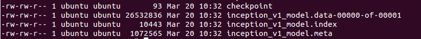
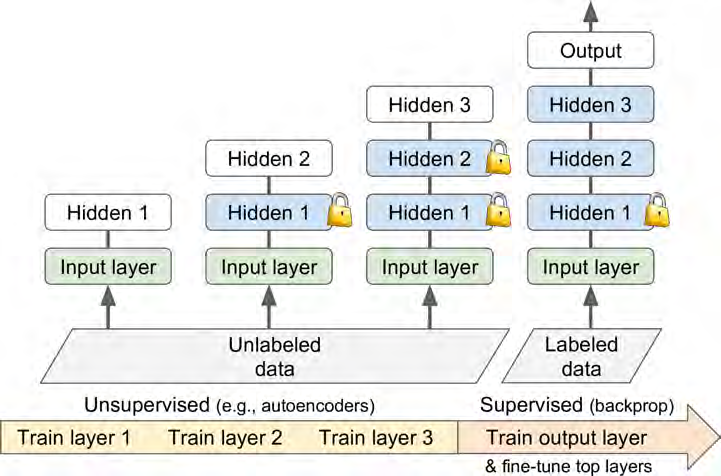

# Transfer learning

## 原因

**<u>迁移学习(*Transfer learning*) 顾名思义就是就是把已学训练好的模型参数迁移到新的模型来帮助新模型训练。</u>**
好处是避免再次花费特别长的时间重复训练大型模型，以及只需很少的训练数据。

要尽量与原模型保持同样尺寸的input
If the input pictures of your new task don’t have the same size as the ones used in the original task, you will have to add a preprocessing step to resize them to the size expected by the original model. More generally, transfer learning will work only well if the inputs have similar low-level features.

实用建议：<u>For very similar tasks, you can try keeping all the hidden layers and just replace the output layer.</u>

## 使用TF的模型

### 基本介绍

#### 保存文件介绍

Tensorflow 模型有两个主要的文件：

1. meta graph
   This is a protocol buffer which saves the complete Tensorflow graph; i.e. all variables, operations, collections etc. This file has .meta extension.
   这是一个 protocol buffer（不会翻译）保存了完整的 Tensorflow 图，即所有变量、操作和集合等。拥有一个`.meta`的扩展名。
2. checkpoint file
   This is a binary file which contains all the values of the weights, biases, gradients and all the other variables saved. This file has an extension .ckpt. However, Tensorflow has changed this from version 0.11. Now, instead of single .ckpt file, we have two files:
   这是一个二进制文件包含了所有权重、偏置、梯度和其他变量的值。这个文件有一个`.ckpt`的扩展名。在0.11版本以前只有一个文件，现在有两个。

```
mymodel.data-00000-of-00001
mymodel.index

```

`.data` file is the file that contains our training variables and we shall go after it.
`.data`文件包含了我们所有训练的变量。

Along with this, Tensorflow also has a file named checkpoint which simply keeps a record of latest checkpoint files saved.
于此一起的，Tensorflow 还有一个文件叫做**checkpoint**只是单纯记录了最近的保存的ckeckpoint file

所以，保存的模型像下图类似。




#### 导入预训练好的模型

If you want to use someone else’s pre-trained model for fine-tuning, there are two things you need to do:
如果你想用别人预训练好的模型进行fine-tuning，有两件事情需要做。

1. 创造网络
   you can create the network by writing python code to create each and every layer manually as the original model. However, if you think about it, we had saved the network in .meta file which we can use to recreate the network using tf.train.import() function like this: saver = tf.train.import_meta_graph('my_test_model-1000.meta')
   你可以通过python写好和原来模型一样的每一层代码来创造网络，可是，仔细一想，我们已经通过`.metaa`把网络存储起来，我们可以用来再创造网络使用`tf.train.import()`语句。

   <u>**之前需要自己进行定义图，但是现在提供了函数`import_meta_graph()` 可以节省时间操作，其返回 `Saver`进行下一步的恢复操作。**</u>


```
 saver = tf.train.import_meta_graph('my_test_model-1000.meta')

```

Remember, import_meta_graph appends the network defined in .meta file to the current graph. So, this will create the graph/network for you but we still need to load the value of the parameters that we had trained on this graph.
记住，`import_meta_graph`将定义在`.meta`的网络导入到当前图中。所以，这会替你创造图/网络，但我们仍然需要导入在这张图上训练好的参数。

2. 加载参数
   We can restore the parameters of the network by calling restore on this saver which is an instance of tf.train.Saver() class.
   我们可以恢复网络的参数，通过使用saver，它是`tf.train.Saver()`类的一个实例。

```
with tf.Session() as sess:
  new_saver = tf.train.import_meta_graph('my_test_model-1000.meta')
  new_saver.restore(sess, tf.train.latest_checkpoint('./'))
```

### 全部使用的代码

#### 用`import_meta_graph`

**<u>用`import_meta_graph()`导入图进入现在默认的图中，然后通过返回的`Saver`来恢复参数。此外，可以使用`get_operation_by_name()` or `get_tensor_by_name()`来调取相应的操作在下一步的运行中进行运算（比如`training_op`）。最后在运行阶段，使用`saver.restore(sess, "./my_model_final.ckpt")`来对参数进行恢复。</u>**

First you need to load the graph's structure. The `import_meta_graph()` function does just that, loading the graph's operations into the default graph, and returning a `Saver` that you can then use to restore the model's state. Note that by default, a `Saver` saves the structure of the graph into a `.meta` file

Once you know which operations you need, you can get a handle on them using the graph's `get_operation_by_name()` or `get_tensor_by_name()` methods:

```python
import tensorflow as tf
from tensorflow.examples.tutorials.mnist import input_data
mnist = input_data.read_data_sets("/tmp/data/")
saver = tf.train.import_meta_graph("./my_model_final.ckpt.meta")

n_epochs = 20
batch_size = 200
X = tf.get_default_graph().get_tensor_by_name("X:0")
y = tf.get_default_graph().get_tensor_by_name("y:0")

accuracy = tf.get_default_graph().get_tensor_by_name("eval/accuracy:0")

training_op = tf.get_default_graph().get_operation_by_name("GradientDescent")

with tf.Session() as sess:
    saver.restore(sess, "./my_model_final.ckpt")

    for epoch in range(n_epochs):
        for iteration in range(mnist.train.num_examples // batch_size):
            X_batch, y_batch = mnist.train.next_batch(batch_size)
            sess.run(training_op, feed_dict={X: X_batch, y: y_batch})
        accuracy_val = accuracy.eval(feed_dict={X: mnist.test.images,
                                                y: mnist.test.labels})
        print(epoch, "Test accuracy:", accuracy_val)

    save_path = saver.save(sess, "./my_new_model_final.ckpt")   
```

#### 直接用原来代码

**<u>直接用原来代码粘贴过来构建，然后在运行阶段，恢复参数`saver.restore(sess, "./my_model_final.ckpt")`</u>**

```python
import tensorflow as tf
from tensorflow.examples.tutorials.mnist import input_data
mnist = input_data.read_data_sets("/tmp/data/")
saver = tf.train.import_meta_graph("./my_model_final.ckpt.meta")

n_epochs = 20
batch_size = 200

n_inputs = 28 * 28  # MNIST
n_hidden1 = 300
n_hidden2 = 50
n_hidden3 = 50
n_hidden4 = 50
n_outputs = 10

X = tf.placeholder(tf.float32, shape=(None, n_inputs), name="X")
y = tf.placeholder(tf.int64, shape=(None), name="y")

with tf.name_scope("dnn"):
    hidden1 = tf.layers.dense(X, n_hidden1, activation=tf.nn.relu, name="hidden1")
    hidden2 = tf.layers.dense(hidden1, n_hidden2, activation=tf.nn.relu, name="hidden2")
    hidden3 = tf.layers.dense(hidden2, n_hidden3, activation=tf.nn.relu, name="hidden3")
    hidden4 = tf.layers.dense(hidden3, n_hidden4, activation=tf.nn.relu, name="hidden4")
    hidden5 = tf.layers.dense(hidden4, n_hidden5, activation=tf.nn.relu, name="hidden5")
    logits = tf.layers.dense(hidden5, n_outputs, name="outputs")

with tf.name_scope("loss"):
    xentropy = tf.nn.sparse_softmax_cross_entropy_with_logits(labels=y, logits=logits)
    loss = tf.reduce_mean(xentropy, name="loss")

with tf.name_scope("eval"):
    correct = tf.nn.in_top_k(logits, y, 1)
    accuracy = tf.reduce_mean(tf.cast(correct, tf.float32), name="accuracy")

learning_rate = 0.01
threshold = 1.0

optimizer = tf.train.GradientDescentOptimizer(learning_rate)
grads_and_vars = optimizer.compute_gradients(loss)
capped_gvs = [(tf.clip_by_value(grad, -threshold, threshold), var)
              for grad, var in grads_and_vars]
training_op = optimizer.apply_gradients(capped_gvs)

init = tf.global_variables_initializer()
saver = tf.train.Saver()

with tf.Session() as sess:
    saver.restore(sess, "./my_model_final.ckpt")

    for epoch in range(n_epochs):
        for iteration in range(mnist.train.num_examples // batch_size):
            X_batch, y_batch = mnist.train.next_batch(batch_size)
            sess.run(training_op, feed_dict={X: X_batch, y: y_batch})
        accuracy_val = accuracy.eval(feed_dict={X: mnist.test.images,
                                                y: mnist.test.labels})
        print(epoch, "Test accuracy:", accuracy_val)

    save_path = saver.save(sess, "./my_new_model_final.ckpt")

```

### 部分使用的代码

#### 用`import_meta_graph`

**<u>同上述操作，只是重新定义了一些新的量，然后从之前的图中派生出新的分支。</u>**

```python
n_hidden4 = 20  # new layer
n_outputs = 10  # new layer

saver = tf.train.import_meta_graph("./my_model_final.ckpt.meta")

X = tf.get_default_graph().get_tensor_by_name("X:0")
y = tf.get_default_graph().get_tensor_by_name("y:0")

hidden3 = tf.get_default_graph().get_tensor_by_name("dnn/hidden4/Relu:0")

new_hidden4 = tf.layers.dense(hidden3, n_hidden4, activation=tf.nn.relu, name="new_hidden4")
new_logits = tf.layers.dense(new_hidden4, n_outputs, name="new_outputs")

with tf.name_scope("new_loss"):
    xentropy = tf.nn.sparse_softmax_cross_entropy_with_logits(labels=y, logits=new_logits)
    loss = tf.reduce_mean(xentropy, name="loss")

with tf.name_scope("new_eval"):
    correct = tf.nn.in_top_k(new_logits, y, 1)
    accuracy = tf.reduce_mean(tf.cast(correct, tf.float32), name="accuracy")

with tf.name_scope("new_train"):
    optimizer = tf.train.GradientDescentOptimizer(learning_rate)
    training_op = optimizer.minimize(loss)

init = tf.global_variables_initializer()
new_saver = tf.train.Saver()
with tf.Session() as sess:
    init.run()
    saver.restore(sess, "./my_model_final.ckpt")

    for epoch in range(n_epochs):
        for iteration in range(mnist.train.num_examples // batch_size):
            X_batch, y_batch = mnist.train.next_batch(batch_size)
            sess.run(training_op, feed_dict={X: X_batch, y: y_batch})
        accuracy_val = accuracy.eval(feed_dict={X: mnist.test.images,
                                                y: mnist.test.labels})
        print(epoch, "Test accuracy:", accuracy_val)

    save_path = new_saver.save(sess, "./my_new_model_final.ckpt")
```

#### 直接用原来代码

**<u>将需要复用的和新建的都建立好后，然后先利用`reuse_vars = tf.get_collection(tf.GraphKeys.GLOBAL_VARIABLES,scope="hidden[123]")`的正则式过滤得到需要复用的部分，从而扔掉其他。然后新建一个`Saver`恢复这些复用部分的参数。最后在执行阶段，`restore_saver.restore(sess, "./my_model_final.ckpt")`恢复复用部分的参数即可。</u>**

GLOBAL_VARIABLES：使用tf.get_variable()时，默认会将vairable放入这个集合。我们熟悉的tf.global_variables_initializer()就是初始化这个集合内的Variables。

```python
reset_graph()

n_inputs = 28 * 28  # MNIST
n_hidden1 = 300 # reused
n_hidden2 = 50  # reused
n_hidden3 = 50  # reused
n_hidden4 = 20  # new!
n_outputs = 10  # new!

X = tf.placeholder(tf.float32, shape=(None, n_inputs), name="X")
y = tf.placeholder(tf.int64, shape=(None), name="y")

with tf.name_scope("dnn"):
    hidden1 = tf.layers.dense(X, n_hidden1, activation=tf.nn.relu, name="hidden1")       # reused
    hidden2 = tf.layers.dense(hidden1, n_hidden2, activation=tf.nn.relu, name="hidden2") # reused
    hidden3 = tf.layers.dense(hidden2, n_hidden3, activation=tf.nn.relu, name="hidden3") # reused
    hidden4 = tf.layers.dense(hidden3, n_hidden4, activation=tf.nn.relu, name="hidden4") # new!
    logits = tf.layers.dense(hidden4, n_outputs, name="outputs")                         # new!

with tf.name_scope("loss"):
    xentropy = tf.nn.sparse_softmax_cross_entropy_with_logits(labels=y, logits=logits)
    loss = tf.reduce_mean(xentropy, name="loss")

with tf.name_scope("eval"):
    correct = tf.nn.in_top_k(logits, y, 1)
    accuracy = tf.reduce_mean(tf.cast(correct, tf.float32), name="accuracy")

with tf.name_scope("train"):
    optimizer = tf.train.GradientDescentOptimizer(learning_rate)
    training_op = optimizer.minimize(loss)
    
reuse_vars = tf.get_collection(tf.GraphKeys.GLOBAL_VARIABLES,
                               scope="hidden[123]") # regular expression
restore_saver = tf.train.Saver(reuse_vars) # to restore layers 1-3

init = tf.global_variables_initializer()
saver = tf.train.Saver()

with tf.Session() as sess:
    init.run()
    restore_saver.restore(sess, "./my_model_final.ckpt")

    for epoch in range(n_epochs):                                      # not shown in the book
        for iteration in range(mnist.train.num_examples // batch_size): # not shown
            X_batch, y_batch = mnist.train.next_batch(batch_size)      # not shown
            sess.run(training_op, feed_dict={X: X_batch, y: y_batch})  # not shown
        accuracy_val = accuracy.eval(feed_dict={X: mnist.test.images,  # not shown
                                                y: mnist.test.labels}) # not shown
        print(epoch, "Test accuracy:", accuracy_val)                   # not shown

    save_path = saver.save(sess, "./my_new_model_final.ckpt")    
```

### 冻结部分权值的使用的代码

#### 基本概念

Tensorflow中并没有一个官方的定义说 collection 是什么。简单的理解，它就是为了方别用户对图中的操作和变量进行管理，而创建的一个概念。它可以说是一种“集合”，通过一个 key（string类型）来对一组 Python 对象进行命名的集合。这个key既可以是tensorflow在内部定义的一些key，也可以是用户自己定义的名字（string）。Tensorflow 内部定义了许多标准 Key，全部定义在了 tf.GraphKeys 这个类中。其中有一些常用的，tf.GraphKeys.TRAINABLE_VARIABLES, tf.GraphKeys.GLOBAL_VARIABLES 等等。<u>**tf.trainable_variables() 与 tf.get_collection(tf.GraphKeys.TRAINABLE_VARIABLES) 是等价的；tf.global_variables() 与 tf.get_collection(tf.GraphKeys.GLOBAL_VARIABLES) 是等价的**</u>。

J默认这两者是相等的"TRAINABLE_VARIABLES" "GLOBAL_VARIABLES"。

#### 使用optimizer.minimize中的var_list参数剔除需要冻结的训练变量

```python
train_vars = tf.get_collection(tf.GraphKeys.TRAINABLE_VARIABLES,scope="hidden[34]|outputs")
training_op = optimizer.minimize(loss, var_list=train_vars)
```

```python
reset_graph()
n_epochs = 20
batch_size = 200
n_inputs = 28 * 28  # MNIST
n_hidden1 = 300 # reused
n_hidden2 = 50  # reused
n_hidden3 = 50  # reused
n_hidden4 = 20  # new!
n_outputs = 10  # new!
learning_rate = 0.01

X = tf.placeholder(tf.float32, shape=(None, n_inputs), name="X")
y = tf.placeholder(tf.int64, shape=(None), name="y")

with tf.name_scope("dnn"):
    hidden1 = tf.layers.dense(X, n_hidden1, activation=tf.nn.relu, name="hidden1")       # reused
    hidden2 = tf.layers.dense(hidden1, n_hidden2, activation=tf.nn.relu, name="hidden2") # reused
    hidden3 = tf.layers.dense(hidden2, n_hidden3, activation=tf.nn.relu, name="hidden3") # reused
    hidden4 = tf.layers.dense(hidden3, n_hidden4, activation=tf.nn.relu, name="hidden4") # new!
    logits = tf.layers.dense(hidden4, n_outputs, name="outputs")                         # new!

with tf.name_scope("loss"):
    xentropy = tf.nn.sparse_softmax_cross_entropy_with_logits(labels=y, logits=logits)
    loss = tf.reduce_mean(xentropy, name="loss")

with tf.name_scope("eval"):
    correct = tf.nn.in_top_k(logits, y, 1)
    accuracy = tf.reduce_mean(tf.cast(correct, tf.float32), name="accuracy")
    
with tf.name_scope("train"):                                         # not shown in the book
    optimizer = tf.train.GradientDescentOptimizer(learning_rate)     # not shown
    train_vars = tf.get_collection(tf.GraphKeys.TRAINABLE_VARIABLES,
                                   scope="hidden[34]|outputs")
    training_op = optimizer.minimize(loss, var_list=train_vars)
    

init = tf.global_variables_initializer()
new_saver = tf.train.Saver()

reuse_vars = tf.get_collection(tf.GraphKeys.GLOBAL_VARIABLES,
                               scope="hidden[123]") # regular expression
restore_saver = tf.train.Saver(reuse_vars) # to restore layers 1-3

init = tf.global_variables_initializer()
saver = tf.train.Saver()

with tf.Session() as sess:
    init.run()
    restore_saver.restore(sess, "./my_model_final.ckpt")

    for epoch in range(n_epochs):
        for iteration in range(mnist.train.num_examples // batch_size):
            X_batch, y_batch = mnist.train.next_batch(batch_size)
            sess.run(training_op, feed_dict={X: X_batch, y: y_batch})
        accuracy_val = accuracy.eval(feed_dict={X: mnist.test.images,
                                                y: mnist.test.labels})
        print(epoch, "Test accuracy:", accuracy_val)

    save_path = saver.save(sess, "./my_new_model_final.ckpt")
```

#### 使用`stop_gradient`来进行冻结

阻止输入的节点的loss计入梯度计算；

- 必须使用新的被截断的节点名称去做运算才能达到截断某些路径梯度的目的
- 在任意一个节点截断它的梯度，都会导致和它相连的前面的所有节点的梯度消失， 但是如果它前面的节点有从其他节点回传的梯度，梯度仍然会存在

```python
reset_graph()

n_inputs = 28 * 28  # MNIST
n_hidden1 = 300 # reused
n_hidden2 = 50  # reused
n_hidden3 = 50  # reused
n_hidden4 = 20  # new!
n_outputs = 10  # new!

X = tf.placeholder(tf.float32, shape=(None, n_inputs), name="X")
y = tf.placeholder(tf.int64, shape=(None), name="y")

with tf.name_scope("dnn"):
    hidden1 = tf.layers.dense(X, n_hidden1, activation=tf.nn.relu,
                              name="hidden1") # reused frozen
    hidden2 = tf.layers.dense(hidden1, n_hidden2, activation=tf.nn.relu,
                              name="hidden2") # reused frozen
    hidden2_stop = tf.stop_gradient(hidden2)
    hidden3 = tf.layers.dense(hidden2_stop, n_hidden3, activation=tf.nn.relu,
                              name="hidden3") # reused, not frozen
    hidden4 = tf.layers.dense(hidden3, n_hidden4, activation=tf.nn.relu,
                              name="hidden4") # new!
    logits = tf.layers.dense(hidden4, n_outputs, name="outputs") # new!
    
with tf.name_scope("loss"):
    xentropy = tf.nn.sparse_softmax_cross_entropy_with_logits(labels=y, logits=logits)
    loss = tf.reduce_mean(xentropy, name="loss")

with tf.name_scope("eval"):
    correct = tf.nn.in_top_k(logits, y, 1)
    accuracy = tf.reduce_mean(tf.cast(correct, tf.float32), name="accuracy")

with tf.name_scope("train"):
    optimizer = tf.train.GradientDescentOptimizer(learning_rate)
    training_op = optimizer.minimize(loss)
    
reuse_vars = tf.get_collection(tf.GraphKeys.GLOBAL_VARIABLES,
                               scope="hidden[123]") # regular expression
restore_saver = tf.train.Saver(reuse_vars) # to restore layers 1-3

init = tf.global_variables_initializer()
saver = tf.train.Saver()

with tf.Session() as sess:
    init.run()
    restore_saver.restore(sess, "./my_model_final.ckpt")

    for epoch in range(n_epochs):
        for iteration in range(mnist.train.num_examples // batch_size):
            X_batch, y_batch = mnist.train.next_batch(batch_size)
            sess.run(training_op, feed_dict={X: X_batch, y: y_batch})
        accuracy_val = accuracy.eval(feed_dict={X: mnist.test.images,
                                                y: mnist.test.labels})
        print(epoch, "Test accuracy:", accuracy_val)

    save_path = saver.save(sess, "./my_new_model_final.ckpt")
```

### 缓存冻结层

为了避免每次输入与冻结层的权值重复计算，因此直接将冻结层的输出进行缓存。原理就是在循环外直接用sess.run计算出冻结层输出`h2_cache = sess.run(hidden2, feed_dict={X: mnist.train.images})`，然后在循环中继续计算即可，核心代码如下：

```python
for hidden2_batch, y_batch in zip(hidden2_batches, y_batches):
    sess.run(training_op,feed_dict{hidden2:hidden2_batch, y:y_batch})
```

```python
reset_graph()
n_epochs = 20
batch_size = 200
n_inputs = 28 * 28  # MNIST
n_hidden1 = 300 # reused
n_hidden2 = 50  # reused
n_hidden3 = 50  # reused
n_hidden4 = 20  # new!
n_outputs = 10  # new!
learning_rate = 0.01

X = tf.placeholder(tf.float32, shape=(None, n_inputs), name="X")
y = tf.placeholder(tf.int64, shape=(None), name="y")

with tf.name_scope("dnn"):
    hidden1 = tf.layers.dense(X, n_hidden1, activation=tf.nn.relu,
                              name="hidden1") # reused frozen
    hidden2 = tf.layers.dense(hidden1, n_hidden2, activation=tf.nn.relu,
                              name="hidden2") # reused frozen & cached
    hidden2_stop = tf.stop_gradient(hidden2)
    hidden3 = tf.layers.dense(hidden2_stop, n_hidden3, activation=tf.nn.relu,
                              name="hidden3") # reused, not frozen
    hidden4 = tf.layers.dense(hidden3, n_hidden4, activation=tf.nn.relu,
                              name="hidden4") # new!
    logits = tf.layers.dense(hidden4, n_outputs, name="outputs") # new!

with tf.name_scope("loss"):
    xentropy = tf.nn.sparse_softmax_cross_entropy_with_logits(labels=y, logits=logits)
    loss = tf.reduce_mean(xentropy, name="loss")

with tf.name_scope("eval"):
    correct = tf.nn.in_top_k(logits, y, 1)
    accuracy = tf.reduce_mean(tf.cast(correct, tf.float32), name="accuracy")

with tf.name_scope("train"):
    optimizer = tf.train.GradientDescentOptimizer(learning_rate)
    training_op = optimizer.minimize(loss)
    
reuse_vars = tf.get_collection(tf.GraphKeys.GLOBAL_VARIABLES,
                               scope="hidden[123]") # regular expression
restore_saver = tf.train.Saver(reuse_vars) # to restore layers 1-3

init = tf.global_variables_initializer()
saver = tf.train.Saver()

import numpy as np

n_batches = mnist.train.num_examples // batch_size

with tf.Session() as sess:
    init.run()
    restore_saver.restore(sess, "./my_model_final.ckpt")
    
    h2_cache = sess.run(hidden2, feed_dict={X: mnist.train.images}) #h2_cache.shape 为 55000,50
    h2_cache_test = sess.run(hidden2, feed_dict={X: mnist.test.images}) # not shown in the book

    for epoch in range(n_epochs):
        shuffled_idx = np.random.permutation(mnist.train.num_examples) #数量为55000
        hidden2_batches = np.array_split(h2_cache[shuffled_idx], n_batches)
        y_batches = np.array_split(mnist.train.labels[shuffled_idx], n_batches)
        for hidden2_batch, y_batch in zip(hidden2_batches, y_batches):
            sess.run(training_op, feed_dict={hidden2:hidden2_batch, y:y_batch})

        accuracy_val = accuracy.eval(feed_dict={hidden2: h2_cache_test, # not shown
                                                y: mnist.test.labels})  # not shown
        print(epoch, "Test accuracy:", accuracy_val)                    # not shown

    save_path = saver.save(sess, "./my_new_model_final.ckpt")
```

## **<u>经验总结：先冻结所有层看表现，然后逐个解冻上层（训练数据越多解冻越多），若还不行且数据少，则扔掉上层；若还不行且数据多，则替代上层或加层。</u>**

Try freezing all the copied layers first, then train your model and see how it performs. Then try unfreezing one or two of the top hidden layers to let backpropagation tweak them and see if performance improves. The more training data you have, the more layers you can unfreeze. If you still cannot get good performance, and you have little training data, try dropping
the top hidden layer(s) and freeze all remaining hidden layers again. You can iterate until you find the right number of layers to reuse. If you have plenty of training data, you may try replacing the top hidden layers instead of dropping them, and
even add more hidden layers.

## Model Zoo

[Tensorflow的Model Zoo](https://github.com/tensorflow/models)

## 缺乏标注的训练数据时的应对方法

只给了思路，没有给出代码。

### Unsupervised Pretraining



### Pretraining on an Auxiliary Task

One last option is to train a first neural network on an auxiliary task for which you can easily obtain or generate labeled training data, then reuse the lower layers of that network for your actual task. The first neural network’s lower layers will learn feature detectors that will likely be reusable by the second neural network.

It is often rather cheap to gather unlabeled training examples, but quite expensive to label them. In this situation, a common technique is to label all your training examples as “good,” then generate many new training instances by corrupting the good ones, and label these corrupted instances as “bad.” Then you can train a first neural network to classify instances as good or bad. For example, you could download millions of sentences, label them as “good,” then randomly change a word in each sentence and label the resulting sentences as “bad.” If a neural network can tell that “The dog sleeps” is a good sentence but “The dog they” is bad, it probably knows quite a lot about language. Reusing its lower layers will likely help in many language processing tasks.

## Reference

- [A quick complete tutorial to save and restore Tensorflow models](https://link.jianshu.com/?t=http://cv-tricks.com/tensorflow-tutorial/save-restore-tensorflow-models-quick-complete-tutorial/)