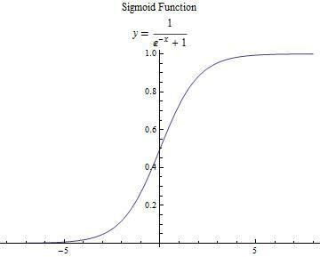
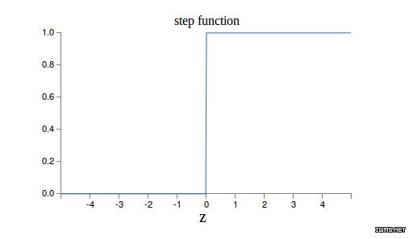

# 梯度消失和梯度爆炸

层数比较多的神经网络模型在训练时也是会出现一些问题的，其中就包括梯度消失问题（gradient vanishing problem）和梯度爆炸问题（gradient exploding problem）。梯度消失问题和梯度爆炸问题一般随着网络层数的增加会变得越来越明显。

例如，对于下图所示的含有3个隐藏层的神经网络，梯度消失问题发生时，接近于输出层的hidden layer 3等的权值更新相对正常，但前面的hidden layer 1的权值更新会变得很慢，导致前面的层权值几乎不变，仍接近于初始化的权值，这就导致hidden layer 1相当于只是一个映射层，对所有的输入做了一个同一映射，这是此深层网络的学习就等价于只有后几层的浅层网络的学习了。


而这种问题为何会产生呢？以下图的反向传播为例（假设每一层只有一个神经元且对于每一层$y_i=\sigma\left(z_i\right)=\sigma\left(w_ix_i+b_i\right)$，其中$\sigma$为sigmoid函数）


可以推导出
$$
\begin{align}
&\frac{\partial C}{\partial b_1}=\frac{\partial C}{\partial y_4}\frac{\partial y_4}{\partial z_4}\frac{\partial z_4}{\partial x_4}\frac{\partial x_4}{\partial z_3}\frac{\partial z_3}{\partial x_3}\frac{\partial x_3}{\partial z_2}\frac{\partial z_2}{\partial x_2}\frac{\partial x_2}{\partial z_1}\frac{\partial z_1}{\partial b_1}\\
&=\frac{\partial C}{\partial y_4}\sigma'\left(z_4\right)w_4\sigma'\left(z_3\right)w_3\sigma'\left(z_2\right)w_2\sigma'\left(z_1\right)
\end{align}
$$

而sigmoid的函数及其导数如下图


$$
\begin{aligned}
f'(z) &= (\frac{1}{1+e^{-z}})' 
\\
&= \frac{e^{-z}}{(1+e^{-z})^{2}} 
\\
&= \frac{1+e^{-z}-1}{(1+e^{-z})^{2}}  
\\
&= \frac{1}{(1+e^{-z})}(1-\frac{1}{(1+e^{-z})}) 
\\
&= f(z)(1-f(z))
\\
\end{aligned}
$$


~~可见，$\sigma'\left(x\right)$的最大值为$\frac{1}{4}$，而我们初始化的网络权值通常都小于1（正态分布，均匀分布，Xavier等的初始化一般大概率都是小于1的），因此$|\sigma'\left(z\right)w|\leq\frac{1}{4}$，因此对于上面的链式求导，层数越多，求导结果$\frac{\partial C}{\partial b_1}$越小，因而导致梯度消失的情况出现。~~

**J也可以理解为两端的导数接近为0，意味着$z$很大或很小时，$\frac{\partial y}{\partial z}$就接近于0，因此整个式子$\frac{\partial C}{\partial b_1}$就接近于0。**

这样，梯度爆炸问题的出现原因就显而易见了，即$|\sigma'\left(z\right)w|>1$，也就是$w$比较大的情况。但对于使用sigmoid激活函数来说，这种情况比较少。因为$\sigma'\left(z\right)$的大小也与$w$有关（$z=wx+b$），除非该层的输入值$x$一直在一个比较小的范围内。

**<u>J也可以理解由sigmoid图像可知，为z需要在很小的范围内（上图当中部分），才能保证导数值很大，在w，b固定情况下，需要x在一个比较小的变化范围内。因此，参数所在的范围是比较窄的。</u>**

## 应对方法

1. 使用Xavier或He参数初始化策略；
2. 使用ELU或ReLU及其变种激活函数。
3. batch normalization
4. gradient clipping

## Xavier and He initialization

## Relu

**<u>sigmoid的导数只有在0附近的时候有比较好的激活性，在正负饱和区的梯度都接近于0，所以这会造成梯度弥散，而relu函数在大于0的部分梯度为常数，所以不会产生梯度弥散现象。第二，relu函数在负半区的导数为0 ，所以一旦神经元激活值进入负半区，那么梯度就会为0，也就是说这个神经元不会经历训练，即所谓的稀疏性。第三，relu函数的导数计算更快，程序实现就是一个if-else语句，而sigmoid函数要进行浮点四则运算。</u>**但是会导致[dying Relus](https://datascience.stackexchange.com/questions/5706/what-is-the-dying-relu-problem-in-neural-networks)的问题。

A "dead" ReLU always outputs the same value (zero as it happens, but that is not important) for any input. Probably this is arrived at by learning a large negative bias term for its weights.

In turn, that means that it takes no role in discriminating between inputs. For classification, you could visualise this as a decision plane *outside* of all possible input data.

Once a ReLU ends up in this state, it is unlikely to recover, because the function gradient at 0 is also 0, so gradient descent learning will not alter the weights. "Leaky" ReLUs with a small positive gradient for negative inputs (`y=0.01x` when x < 0 say) are one attempt to address this issue and give a chance to recover.



**<u>简而言之，就是如果一旦inputs为负数。那么就会开始输出0，那么后面的梯度也为0，就无法更新离开了</u>**。

**<u>因此更新为新的变种，在负轴区域加一点点斜率。J我查下来的作用是保证稀疏性，加快收敛速度。因为若是直接-1的话，会造成收敛震荡。而如果直接1的话，那么就是线性了，达不到提取高级特征的效果。具体的斜率则是调试出来的！</u>**

## batch normalization

### 基础知识

The sample mean or empirical mean and the sample covariance are statistics computed from a collection (the sample) of data on one or more random variables. The sample mean and sample covariance are estimators of the population mean and population covariance, where the term population refers to the set from which the sample was taken.

**经验均值就是样本均值，指的是从总体中抽出的样本得到的均值。**

### 更新函数

Note: the book uses `tensorflow.contrib.layers.batch_norm()` rather than `tf.layers.batch_normalization()` (which did not exist when this chapter was written). It is now preferable to use `tf.layers.batch_normalization()`, because anything in the contrib module may change or be deleted without notice. Instead of using the `batch_norm()` function as a regularizer parameter to the `fully_connected()` function, we now use `batch_normalization()` and we explicitly create a distinct layer. The parameters are a bit different, in particular:

* `decay` is renamed to `momentum`,
* `is_training` is renamed to `training`,
* `updates_collections` is removed: the update operations needed by batch normalization are added to the `UPDATE_OPS` collection and you need to explicity run these operations during training (see the execution phase below),
* we don't need to specify `scale=True`, as that is the default.

Also note that in order to run batch norm just _before_ each hidden layer's activation function, we apply the ELU activation function manually, right after the batch norm layer.

Note: since the `tf.layers.dense()` function is incompatible with `tf.contrib.layers.arg_scope()` (which is used in the book), we now use python's `functools.partial()` function instead. It makes it easy to create a `my_dense_layer()` function that just calls `tf.layers.dense()` with the desired parameters automatically set (unless they are overridden when calling `my_dense_layer()`). As you can see, the code remains very similar.

Note: since we are using `tf.layers.batch_normalization()` rather than `tf.contrib.layers.batch_norm()` (as in the book), we need to explicitly run the extra update operations needed by batch normalization (`sess.run([training_op, extra_update_ops],...`).

### 代码

Note that you could also make the training operation depend on the update operations:

```python
with tf.name_scope("train"):
    optimizer = tf.train.GradientDescentOptimizer(learning_rate)
    extra_update_ops = tf.get_collection(tf.GraphKeys.UPDATE_OPS)
    with tf.control_dependencies(extra_update_ops):
        training_op = optimizer.minimize(loss)
```

This way, you would just have to evaluate the `training_op` during training, TensorFlow would automatically run the update operations as well:

```python
sess.run(training_op, feed_dict={training: True, X: X_batch, y: y_batch})
```
```python
import tensorflow as tf
from functools import partial

n_inputs = 28 * 28
n_hidden1 = 300
n_hidden2 = 100
n_outputs = 10

batch_norm_momentum = 0.9
# hidden1 = tf.layers.dense(X, n_hidden1, name="hidden1")
# bn1 = tf.layers.batch_normalization(hidden1, training=training, momentum=0.9)
# bn1_act = tf.nn.elu(bn1)

# hidden2 = tf.layers.dense(bn1_act, n_hidden2, name="hidden2")
# bn2 = tf.layers.batch_normalization(hidden2, training=training, momentum=0.9)
# bn2_act = tf.nn.elu(bn2)

# logits_before_bn = tf.layers.dense(bn2_act, n_outputs, name="outputs")
# logits = tf.layers.batch_normalization(logits_before_bn, training=training,
#                                        momentum=0.9)

#注意在tf.layers.dense之后使用tf.layers.batch_normalization，因为需要使用tf.layers.batch_normalization函数归一化层的输出，传递归一化后的值给激活函数。
#To avoid repeating the same parameters over and over again, we can use Python's `partial()` function:
#from functools import partial

#my_batch_norm_layer = partial(tf.layers.batch_normalization,
#                              training=training, momentum=0.9)

# hidden1 = tf.layers.dense(X, n_hidden1, name="hidden1")
# bn1 = my_batch_norm_layer(hidden1)
# bn1_act = tf.nn.elu(bn1)
# hidden2 = tf.layers.dense(bn1_act, n_hidden2, name="hidden2")
# bn2 = my_batch_norm_layer(hidden2)
# bn2_act = tf.nn.elu(bn2)
# logits_before_bn = tf.layers.dense(bn2_act, n_outputs, name="outputs")
# logits = my_batch_norm_layer(logits_before_bn)


from tensorflow.examples.tutorials.mnist import input_data
mnist = input_data.read_data_sets("/tmp/data/")

batch_norm_momentum = 0.9

X = tf.placeholder(tf.float32, shape=(None, n_inputs), name="X")
y = tf.placeholder(tf.int64, shape=(None), name="y")
training = tf.placeholder_with_default(False, shape=(), name='training')

with tf.name_scope("dnn"):
    he_init = tf.contrib.layers.variance_scaling_initializer()

    my_batch_norm_layer = partial(
            tf.layers.batch_normalization,
            training=training,
            momentum=batch_norm_momentum)

    my_dense_layer = partial(
            tf.layers.dense,
            kernel_initializer=he_init)

    hidden1 = my_dense_layer(X, n_hidden1, name="hidden1")
    bn1 = tf.nn.elu(my_batch_norm_layer(hidden1))
    hidden2 = my_dense_layer(bn1, n_hidden2, name="hidden2")
    bn2 = tf.nn.elu(my_batch_norm_layer(hidden2))
    logits_before_bn = my_dense_layer(bn2, n_outputs, name="outputs")
    logits = my_batch_norm_layer(logits_before_bn)

with tf.name_scope("loss"):
    xentropy = tf.nn.sparse_softmax_cross_entropy_with_logits(labels=y, logits=logits)
    loss = tf.reduce_mean(xentropy, name="loss")

learning_rate = 0.01
    
with tf.name_scope("train"):
    optimizer = tf.train.GradientDescentOptimizer(learning_rate)
    training_op = optimizer.minimize(loss)
#另一种写法
# with tf.name_scope("train"):
#     optimizer = tf.train.GradientDescentOptimizer(learning_rate)
#     extra_update_ops = tf.get_collection(tf.GraphKeys.UPDATE_OPS)
#     with tf.control_dependencies(extra_update_ops):
#         training_op = optimizer.minimize(loss)
    
with tf.name_scope("eval"):
    correct = tf.nn.in_top_k(logits, y, 1)
    accuracy = tf.reduce_mean(tf.cast(correct, tf.float32))
    
init = tf.global_variables_initializer()
saver = tf.train.Saver()

n_epochs = 20
batch_size = 200

#we need to explicitly run the extra update operations needed by batch normalization (sess.run([training_op, extra_update_ops],...).
#Note: when training, the moving_mean and moving_variance need to be updated. By default the update ops are placed in tf.GraphKeys.UPDATE_OPS.
extra_update_ops = tf.get_collection(tf.GraphKeys.UPDATE_OPS)

with tf.Session() as sess:
    init.run()
    for epoch in range(n_epochs):
        for iteration in range(mnist.train.num_examples // batch_size):
            X_batch, y_batch = mnist.train.next_batch(batch_size)
            sess.run([training_op, extra_update_ops],
                     feed_dict={training: True, X: X_batch, y: y_batch})
        accuracy_val = accuracy.eval(feed_dict={X: mnist.test.images,
                                                y: mnist.test.labels})
        print(epoch, "Test accuracy:", accuracy_val)

    save_path = saver.save(sess, "./my_model_final.ckpt")
```

## gradient clipping梯度裁剪

目前人们更希望使用batch normalization，但是我们可以了解下gradient clipping。

In TensorFlow, the optimizer’s minimize() function takes care of both computing the gradients and applying them, so you must instead call the optimizer’s compute_gradients() method first, then create an operation to clip the gradients using the clip_by_value() function, and finally create an operation to apply the clipped gradients using the optimizer’s apply_gradients() method.

```python
#核心代码
threshold = 1.0

optimizer = tf.train.GradientDescentOptimizer(learning_rate)
grads_and_vars = optimizer.compute_gradients(loss)
capped_gvs = [(tf.clip_by_value(grad, -threshold, threshold), var)
              for grad, var in grads_and_vars]
training_op = optimizer.apply_gradients(capped_gvs)
```

```python
import tensorflow as tf
from tensorflow.examples.tutorials.mnist import input_data
mnist = input_data.read_data_sets("/tmp/data/")

n_inputs = 28 * 28  # MNIST
n_hidden1 = 300
n_hidden2 = 50
n_hidden3 = 50
n_hidden4 = 50
n_hidden5 = 50
n_outputs = 10

X = tf.placeholder(tf.float32, shape=(None, n_inputs), name="X")
y = tf.placeholder(tf.int64, shape=(None), name="y")

with tf.name_scope("dnn"):
    hidden1 = tf.layers.dense(X, n_hidden1, activation=tf.nn.relu, name="hidden1")
    hidden2 = tf.layers.dense(hidden1, n_hidden2, activation=tf.nn.relu, name="hidden2")
    hidden3 = tf.layers.dense(hidden2, n_hidden3, activation=tf.nn.relu, name="hidden3")
    hidden4 = tf.layers.dense(hidden3, n_hidden4, activation=tf.nn.relu, name="hidden4")
    hidden5 = tf.layers.dense(hidden4, n_hidden5, activation=tf.nn.relu, name="hidden5")
    logits = tf.layers.dense(hidden5, n_outputs, name="outputs")

with tf.name_scope("loss"):
    xentropy = tf.nn.sparse_softmax_cross_entropy_with_logits(labels=y, logits=logits)
    loss = tf.reduce_mean(xentropy, name="loss")
    
learning_rate = 0.01
threshold = 1.0

optimizer = tf.train.GradientDescentOptimizer(learning_rate)
grads_and_vars = optimizer.compute_gradients(loss)
capped_gvs = [(tf.clip_by_value(grad, -threshold, threshold), var)
              for grad, var in grads_and_vars]
training_op = optimizer.apply_gradients(capped_gvs)

with tf.name_scope("eval"):
    correct = tf.nn.in_top_k(logits, y, 1)
    accuracy = tf.reduce_mean(tf.cast(correct, tf.float32), name="accuracy")
    
init = tf.global_variables_initializer()
saver = tf.train.Saver()

n_epochs = 20
batch_size = 200

with tf.Session() as sess:
    init.run()
    for epoch in range(n_epochs):
        for iteration in range(mnist.train.num_examples // batch_size):
            X_batch, y_batch = mnist.train.next_batch(batch_size)
            sess.run(training_op, feed_dict={X: X_batch, y: y_batch})
        accuracy_val = accuracy.eval(feed_dict={X: mnist.test.images,
                                                y: mnist.test.labels})
        print(epoch, "Test accuracy:", accuracy_val)

    save_path = saver.save(sess, "./my_model_final.ckpt")
```


# Reference

- [神经网络训练中的梯度消失与梯度爆炸](https://zhuanlan.zhihu.com/p/25631496)